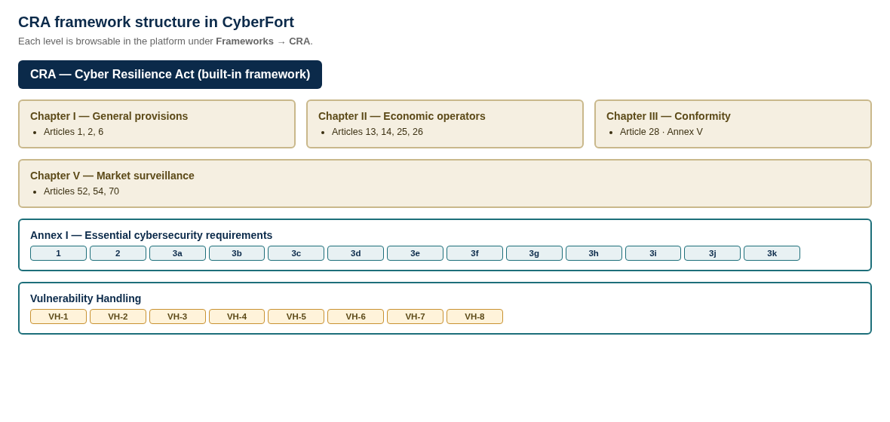
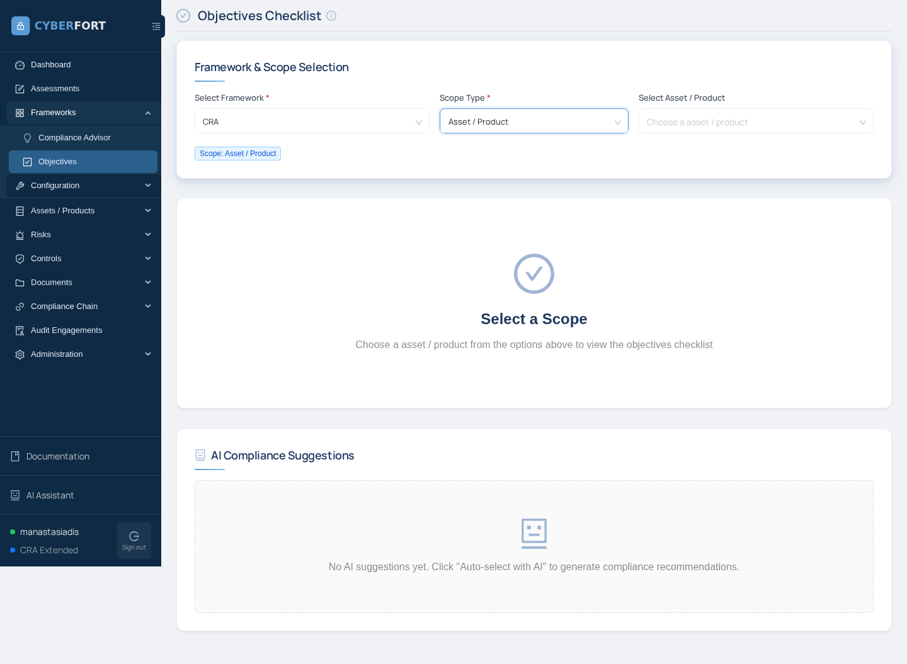

# Scenario 01 — CRA control mapping

The bridge between the **six seeded vulnerabilities in PortPilot** and the **CRA framework as it is actually represented in CyberFort**.

---

## How the CRA framework is structured in CyberFort

CyberFort ships the Cyber Resilience Act as a built-in framework with two assessment types (Conformity and Audit) and a hierarchy of Chapters → Articles → Annex I objectives (1, 2, 3a–3k) and Vulnerability Handling objectives (VH-1 — VH-8). This scenario uses the Conformity question pool (52 product-level questions).

The CRA framework's objective tree is browsable in the platform under **Frameworks → Objectives** — pick `CRA` as the framework and the asset (PortPilot) as the scope:

---

## Findings, one card per finding

Each finding card shows: where the vulnerability lives in the source, the Annex I objective(s) it maps to, and the exact CyberFort conformity question(s) the trainee answers `No` / `Partially` and attaches scan output to as evidence.

### Finding 1 — PostgreSQL exposed on `0.0.0.0:5432`

**Where:** `docker-compose.yml` (ports binding) + `db/init.sql` (weak password `PortPilot2024!`).

**Detected by:** Nmap (port discovery) + `psql` external connection.

| Annex I objective | Conformity question text the trainee answers |
|-------------------|-----------------------------------------------|
| **3a** *(secure by default configuration)* | "Are your products made available on the market with a secure by default configuration?" |
| **3h** *(limit attack surfaces, external interfaces)* | "Are your products designed, developed and produced to limit attack surfaces, including external interfaces?" |

---

### Finding 2 — SQL injection auth bypass on `/login`

**Where:** `app/portpilot/app.py`, function `login()` — user input concatenated into an f-string SQL query.

**Detected by:** ZAP active scan (`SQL Injection — Authentication Bypass`) + Semgrep `python.flask.security.audit.sqli`.

| Annex I objective | Conformity question text the trainee answers |
|-------------------|-----------------------------------------------|
| **3b** *(protection from unauthorised access)* | "Do you ensure protection from unauthorized access by appropriate control mechanisms?" |
| **3b** *(authentication & IAM)*               | "Do you implement authentication, identity or access management systems?" |
| **2**  *(no known exploitable vulnerabilities)* | "Are your products with digital elements delivered without any known exploitable vulnerabilities?" |

---

### Finding 3 — Reflected XSS on `/vessels`

**Where:** `app/portpilot/app.py`, function `vessels()` — wraps user input with `Markup()` so Jinja2 skips autoescape.

**Detected by:** ZAP `Cross Site Scripting (Reflected)` rule.

| Annex I objective | Conformity question text the trainee answers |
|-------------------|-----------------------------------------------|
| **3d** *(integrity of data, commands, configuration)* | "Do you protect the integrity of stored, transmitted or otherwise processed data, commands, programs and configuration?" |
| **2**  *(no known exploitable vulnerabilities)*       | "Are your products with digital elements delivered without any known exploitable vulnerabilities?" |

---

### Finding 4 — Broken access on `/admin/manifests`

**Where:** `app/portpilot/app.py`, function `admin_manifests()` — no `session` or `role` check.

**Detected by:** ZAP spider + manual `curl` (no cookie) confirms HTTP 200 + CLASSIFIED rows in response.

| Annex I objective | Conformity question text the trainee answers |
|-------------------|-----------------------------------------------|
| **3b** *(protection from unauthorised access)* | "Do you ensure protection from unauthorized access by appropriate control mechanisms?" |
| **3c** *(confidentiality of stored data)*      | "Do you protect the confidentiality of stored, transmitted or otherwise processed data through encryption?" |
| **3j** *(security-relevant info recording)*    | "Do you report on possible unauthorized access?" |

---

### Finding 5 — Hardcoded DB password & API key in source

**Where:** `app/portpilot/config.py` — `DB_PASSWORD` and `PORT_AUTHORITY_API_KEY` are plain string literals in the repo.

**Detected by:** Semgrep `hardcoded-password` rule.

| Annex I objective | Conformity question text the trainee answers |
|-------------------|-----------------------------------------------|
| **3d** *(integrity protection)*                | "Do you protect the integrity of stored, transmitted or otherwise processed data, commands, programs and configuration?" |
| **3a** *(secure by default)*                   | "Are your products made available on the market with a secure by default configuration?" |

---

### Finding 6 — Outdated dependencies

**Where:** `app/requirements.txt` — Flask 2.0.1, Werkzeug 2.0.1, Jinja2 3.0.0, requests 2.25.0 all have published CVEs at ship time.

**Detected by:** OSV scan.

| Annex I / Vuln-Handling objective | Conformity question text the trainee answers |
|-----------------------------------|-----------------------------------------------|
| **2**  *(no known exploitable vulnerabilities)* | "Are your products with digital elements delivered without any known exploitable vulnerabilities?" |
| **3k** *(updates can address vulnerabilities)*   | "Do you ensure that vulnerabilities can be addressed through security updates?" |
| **Vuln-Handling 1** *(SBOM and component inventory)* | "Do you identify and document vulnerabilities and components contained in your products with digital elements?" &middot; "Do you draw up a software bill of materials in a commonly used and machine-readable format?" |

---

## Annex I objective coverage matrix

The eleven conformity questions in Step 6 of the trainee handbook cover the Annex I objectives below. Objectives marked &nbsp;—&nbsp; are out of scope for this scenario (the application has no encryption-in-transit, no availability mitigations, no logging — they are *all* failures, but the trainee only needs to surface them for the assessment; they don't have to fix every one).

<table class="cov">
<thead><tr><th>Annex I obj.</th><th>Title (paraphrased)</th><th>Covered?</th><th>Trainee evidence</th></tr></thead>
<tbody>
<tr><td>1</td><td>Designed to ensure appropriate level of cybersecurity</td><td class="no">implicit</td><td>Fails by virtue of every other objective failing</td></tr>
<tr><td>2</td><td>Delivered without known exploitable vulnerabilities</td><td class="yes">✓</td><td>OSV scan + ZAP SQLi</td></tr>
<tr><td>3a</td><td>Secure by default configuration</td><td class="yes">✓</td><td>Nmap (5432 open) + Semgrep <code>flask-debug-true</code></td></tr>
<tr><td>3b</td><td>Protection from unauthorised access</td><td class="yes">✓</td><td>ZAP SQLi + broken-access on /admin</td></tr>
<tr><td>3c</td><td>Confidentiality (encryption)</td><td class="yes">✓</td><td>/admin/manifests leak + plaintext passwords in DB</td></tr>
<tr><td>3d</td><td>Integrity protection</td><td class="yes">✓</td><td>Semgrep hardcoded-secret + reflected XSS</td></tr>
<tr><td>3e</td><td>Data minimisation</td><td class="no">—</td><td>Not exercised in this scenario</td></tr>
<tr><td>3f</td><td>Availability / DoS resilience</td><td class="no">—</td><td>Not exercised in this scenario</td></tr>
<tr><td>3g</td><td>Limit impact on other devices / networks</td><td class="no">—</td><td>Not exercised in this scenario</td></tr>
<tr><td>3h</td><td>Limit attack surfaces / external interfaces</td><td class="yes">✓</td><td>Nmap (5432 open)</td></tr>
<tr><td>3i</td><td>Reduce impact of incident (exploit mitigation)</td><td class="no">—</td><td>Not exercised in this scenario</td></tr>
<tr><td>3j</td><td>Security-relevant info recording</td><td class="partial">partial</td><td>Trainee notes app has no auth-failure logs</td></tr>
<tr><td>3k</td><td>Updates can address vulnerabilities</td><td class="yes">✓</td><td>OSV scan + container has no update mechanism</td></tr>
<tr><td>VH-1</td><td>Component inventory + SBOM</td><td class="yes">✓</td><td>OSV scan + no SBOM ships with product</td></tr>
<tr><td>VH-2</td><td>Address &amp; remediate vulnerabilities without delay</td><td class="yes">✓</td><td>No remediation has happened — that is why the trainee is here</td></tr>
<tr><td>VH-3</td><td>Effective and regular security tests</td><td class="no">—</td><td>Trainee could note this is the first test the product has had</td></tr>
</tbody>
</table>

**Coverage summary:** 9 of 13 Annex I objectives plus 2 of 8 Vulnerability-Handling objectives are exercised end-to-end. This is a deliberately broad spread so the trainee experiences the full evidence-attachment flow in CyberFort — not so that every Annex I bullet gets a tick.

---

## What the trainee actually clicks (assessment flow)

1. **Assessments → + New Assessment** — Framework: `CRA`, Assessment Type: `Conformity`, Scope: `Asset / Product → PortPilot`.
2. **Click the new card** under *Active Assessments* — the questionnaire opens with 52 questions paginated 10-per-page.
3. **For each of the eleven target questions** (#13, 14, 16, 20, 21, 22, 23, 25, 32, 38, 39): pick `Yes` / `No` / `Partially` / `N/A`, write an Evidence Description, attach scan output, click **Save Answer**.
4. **Export PDF** from the top toolbar — that PDF is the trainee's deliverable.

The trainee does **not** see "Annex I objective 3b" next to question 20 — they see only the natural-language text *"Do you ensure protection from unauthorized access by appropriate control mechanisms?"*. The mapping in this document is for the **instructor** to verify the trainee picked the right questions.

The Annex I objectives (1, 2, 3a–3k) and the Vulnerability Handling objectives are visible elsewhere in the platform — under **Frameworks → Objectives** (with `CRA` as the framework) — and can be linked from a Risk Register entry through the "Linked objective" field.

---

## Why this matters in the proposal context

The CYBERFORT project proposal (DIGITAL-ECCC-2024-DEPLOY-CYBER-06) targets **micro and small enterprises in maritime and energy** who must demonstrate CRA compliance before placing products on the EU market. The conformity assessment that the trainee fills in is the document an SME will actually submit as part of their **Article 28 EU Declaration of Conformity** and **Annex V technical documentation**. Producing it end-to-end against a realistic vulnerable target is the entire point of this scenario.
