# Scenario 01 — PortPilot Maritime

## Trainee handbook

> ⏱ Estimated time: **2 hours** &middot; 🎯 Level: **Intermediate** &middot; 🧭 Sector: **Maritime**

---

## Scenario brief

You are the new cybersecurity officer at **Larnaca Port Authority**. Your team has just finished onboarding **PortPilot v0.9.2**, a small web application written in-house to track vessel arrivals and cargo manifests.

Before the application is rolled out fleet-wide, the board has asked you to perform a full security review using the **CyberFort** compliance platform and to prepare a **Cyber Resilience Act (CRA)** readiness report.

You have:

* A virtual machine running CyberFort (`https://<VM1-IP>:5173`).
* A virtual machine hosting PortPilot in Docker (`http://<VM2-IP>:8080`). You also have shell access to VM2.
* CyberFort credentials issued by your instructor.
* A copy of the PortPilot source code in `/srv/portpilot/app/` on VM2.

---

## Learning outcomes

By the end of this scenario you will be able to:

1. Register a product in CyberFort and prepare it for scanning.
2. Run an **Nmap** network scan and interpret the results.
3. Run an **OWASP ZAP** dynamic scan against a web application.
4. Run a **Semgrep** SAST scan against application source code.
5. Run an **OSV** dependency scan against a `requirements.txt`.
6. Map findings to **CRA Annex I** essential cybersecurity requirements.
7. Create entries in the **Risk Register** and assign mitigations.
8. Export a CRA readiness PDF report.

---

## Step 0 — Verify the lab is up

On VM2:

```bash
cd /srv/portpilot
docker compose ps
```

You should see two healthy containers, `portpilot_app` and `portpilot_db`.

Open `http://<VM2-IP>:8080/login` in a browser. You should land on the PortPilot sign-in page:


> 💡 Do **not** try to sign in yet. We will let CyberFort do the discovery for us.

### Platform access

CyberFort runs on VM1 in a standard cyber-range deployment. For sessions that use the **hosted reference instance** at `https://access.cyber-fort.eu/login`, sign in with the credentials issued by your instructor:

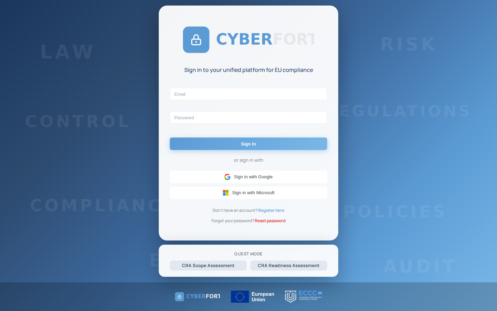

After signing in you land on the operations dashboard. The sidebar holds every module you will use: **Assessments**, **Frameworks**, **Assets / Products**, **Risks**, **Security Tools**, and the **AI Assistant**.

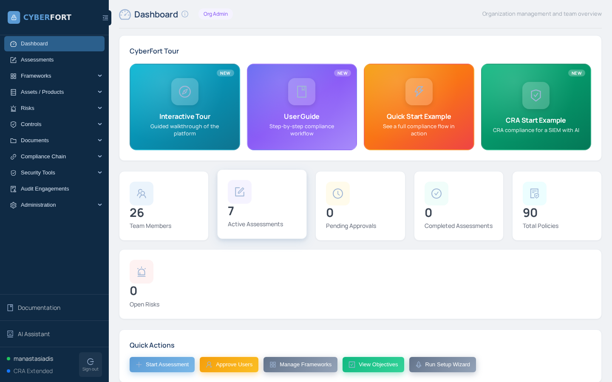

> ℹ️ The hosted reference instance cannot reach a private cyber-range subnet, so the scanner integrations cannot actively scan your VM2 from there. The walkthrough below shows the **exact UI steps** for each scan — and where the scanner cannot reach your target, you **replicate** the finding by adding it manually to the Risk Register (the platform handles both flows the same way once a finding exists).

---

## Step 1 — Register PortPilot as a product in CyberFort

1. From the left sidebar, expand **Assets / Products** and click **Manage Assets**. The page lists every asset / product already registered for your organisation.

   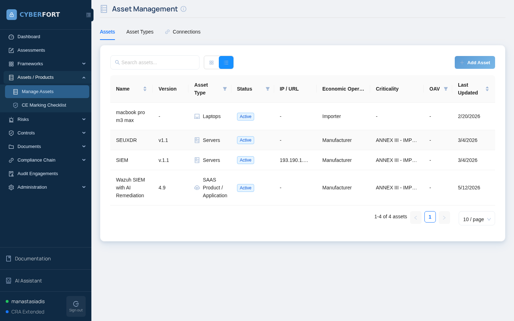

2. Click the green **+ Add Asset** button (top right). A modal opens with the *Details* tab pre-selected.

   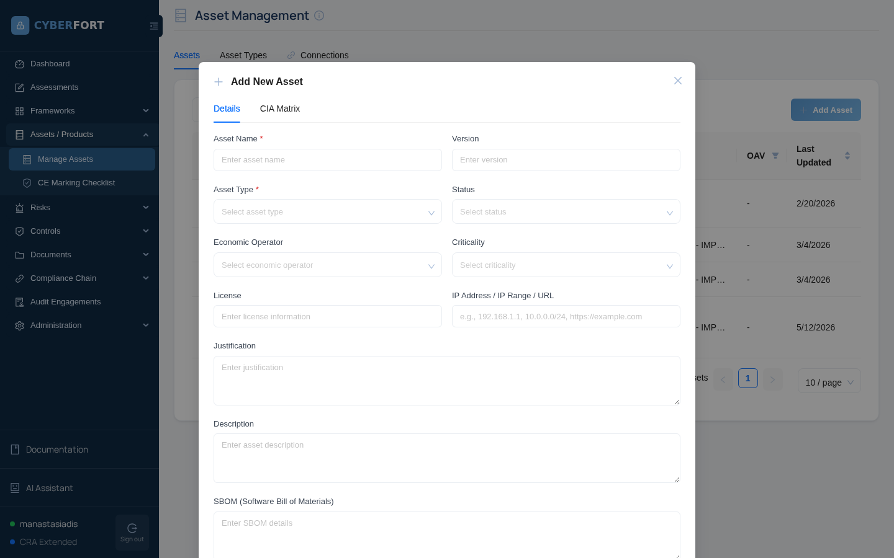

3. Fill in the fields:
   * **Asset Name:** `PortPilot`
   * **Version:** `0.9.2`
   * **Asset Type:** `SAAS Product / Application` (or `Application` if your tenant uses that label)
   * **Status:** `Active`
   * **Economic Operator:** `Manufacturer` (you are auditing the product on behalf of the manufacturing entity)
   * **Criticality:** `ANNEX III – IMPORTANT PRODUCTS WITH DIGITAL ELEMENTS` (the app handles cargo manifests subject to customs oversight)
   * **IP Address / URL:** the IP of your PortPilot host (e.g. `10.10.20.30`)
   * **Description:** "In-house Flask vessel and cargo manifest manager for Larnaca port operations."

   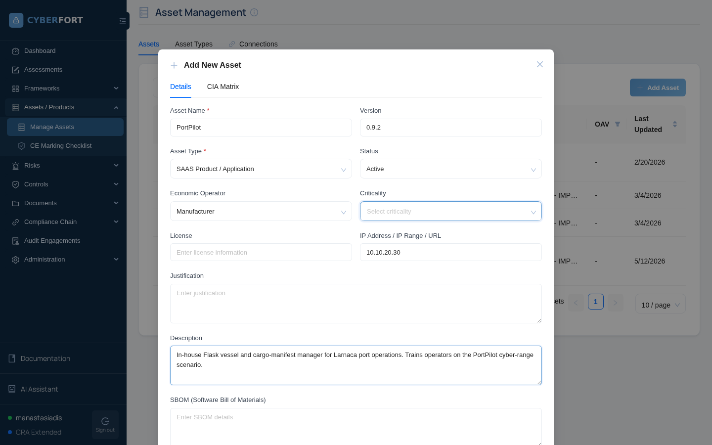

4. Click **Save**. The modal closes and PortPilot appears in the asset list.

   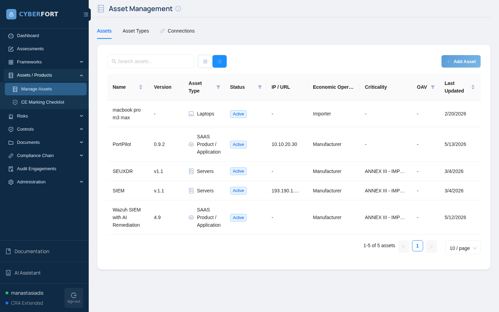

---

## Step 2 — Run an Nmap discovery scan

The first question a CRA-aware auditor asks is "what is even exposed?". CyberFort's Nmap integration is under **Security Tools → Security Scanners** (the *Network Vulnerability* tab).

1. Expand **Security Tools** in the sidebar and click **Security Scanners**.
2. Choose **Scan Type** = `Basic Scan - Top 1000 ports`.
3. Set **Target** to the IP of the PortPilot host (e.g. `10.10.20.30`).
4. Click **Run Scan**. The scan takes ~1 minute. (If you are using the hosted reference instance and it cannot reach your private target, see the note below the screenshot.)

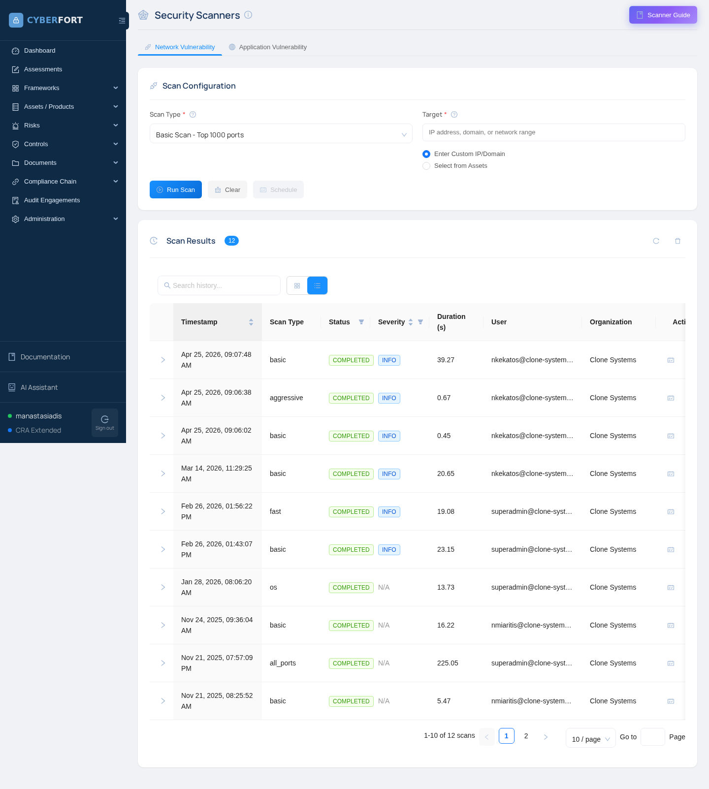

When the scan completes you should see at least:

| Port | Service    | Notes                                  |
|------|------------|----------------------------------------|
| 8080 | http       | PortPilot web UI                       |
| 5432 | postgresql | PostgreSQL 13 — **unexpected**         |

> 🛑 **Finding #1 — Exposed database.** PostgreSQL should never be reachable from outside the application host. CRA Annex I objectives **3a** (secure by default configuration) and **3h** (limit attack surfaces).

### Replicate the finding in the Risk Register

If the scanner couldn't actually reach your target (the network is private), open **Risks → Risk Register** and click **Add New Risk** (top-right or under *Quick Actions*).


Fill the form to record the exposed-database finding:

* **Code:** `PORTPILOT-RSK-01`
* **Status (Treatment):** `Reduce`
* **Likelihood:** `High` &middot; **Severity:** `High` &middot; **Residual Risk:** `Medium`
* **Risk Category:** `Network / Infrastructure`
* **Description:** "PortPilot ships docker-compose with PostgreSQL bound to 0.0.0.0:5432 and the default weak password 'PortPilot2024!'. Discovered via Nmap. CRA Annex I objectives 3a (secure by default), 3h (limit attack surfaces)."
* **Potential Impact:** "Customer-database compromise; full read/write to cargo manifests; GDPR Article 32 violation."
* **Controls:** "Remove ports:5432 mapping; rotate to strong password loaded from env; introduce network segmentation."

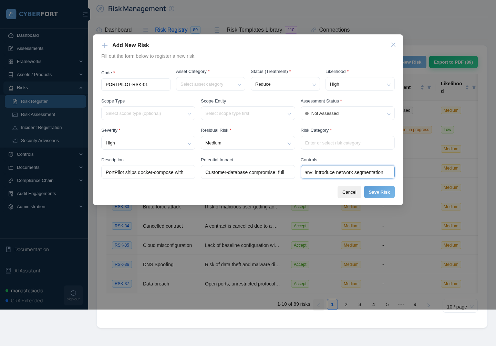

Click **Save Risk**. The new entry appears in the Risk Registry tab. We will come back to assign a mitigation owner once the full picture is captured.

---

## Step 3 — Run an OWASP ZAP dynamic scan

OWASP ZAP lives in **Security Tools → Security Scanners** under the *Application Vulnerability* tab (the same page as Nmap; switch tabs at the top).

1. Open **Security Tools → Security Scanners** and switch to the **Application Vulnerability** tab.
2. Target URL: `http://<VM2-IP>:8080`
3. Scan type: `Active scan` (full).
4. Click **Run Scan**. This takes 3–6 minutes.

While ZAP is running, do not refresh the page repeatedly — it is enumerating endpoints in the background. When the run completes, you should see several alerts. The ones to focus on:

### 3a. SQL Injection on `/login`

ZAP will tag this as **`SQL Injection — Authentication Bypass`** with risk `High`.

Verify it yourself in a browser:

1. Open `http://<VM2-IP>:8080/login`.
2. In **Username** type: `admin' OR '1'='1' -- `
3. In **Password** type anything, e.g. `x`.

   

4. Click **Sign in**.

You should land on the dashboard authenticated as **admin (admin)** — note the user pill in the top-right of the header:


> 🛑 **Finding #2 — Authentication bypass via SQL injection.** This is a critical break of CRA Annex I objective **3b** (protection from unauthorised access) and objective **2** (no known exploitable vulnerabilities at ship time).

### 3b. Reflected XSS on `/vessels`

ZAP will tag this as **`Cross Site Scripting (Reflected)`** with risk `Medium`.

Verify:

1. Still logged in, navigate to `http://<VM2-IP>:8080/vessels?q=<script>alert(1)</script>` — a JavaScript alert box pops up immediately on page load (proving JS execution).
2. For a *visible* demonstration that does not depend on the dialog, try a pure-HTML payload that the page renders unsanitised, e.g. `?q=<span style="background:red;color:white;padding:10px">XSS</span>`:

   

> 🛑 **Finding #3 — Reflected XSS in vessel search.** CRA Annex I objective **3d** (integrity of data/configuration) and objective **2** (no known exploitable vulnerabilities).

### 3c. Missing authentication on `/admin/manifests`

ZAP's spider will follow the link or you may need to add the URL manually under **Sites → Add URL**. Once scanned, ZAP flags **`Authentication Required — bypass`**.

Verify in a private/incognito window (no session cookie):

1. Open `http://<VM2-IP>:8080/admin/manifests`
2. The page loads and shows every manifest in the database — including rows marked `CLASSIFIED` (row 4 — *strategic fuel reserve for partner network*) and `CONFIDENTIAL` (row 6 — *offshore wind installation components*):

   

> 🛑 **Finding #4 — Confidentiality breach via broken access control.** CRA Annex I objectives **3b** (protection from unauthorised access) and **3c** (confidentiality of processed data); also relevant to NIS2 incident-reporting obligations if this were in production.

For each of the three ZAP findings, follow the same **Add New Risk** flow you used for the Nmap finding in Step 2 (Risks → Risk Register → *Add New Risk*). Use the scoring below; each row is one new entry in the Risk Register:

| Finding | Likelihood | Impact | Linked CRA objective (Annex I) |
|---------|-----------|--------|--------------------------------|
| SQL injection login bypass         | High   | High   | **3b** *(protection from unauthorised access)* &middot; **2** *(no known exploitable vulnerabilities)* |
| Reflected XSS on /vessels          | Medium | Medium | **3d** *(integrity of data/configuration)* &middot; **2** |
| Broken access on /admin/manifests  | High   | High   | **3b** *(protection from unauthorised access)* &middot; **3c** *(confidentiality)* |

---

## Step 4 — Run a Semgrep SAST scan

CyberFort's Semgrep integration lives at **Security Tools → Code Analysis**. It reads your application source code and finds vulnerabilities the running app cannot reveal — including secrets and dangerous patterns that are not yet reachable.

1. On VM2, package the source so CyberFort can read it:

```bash
cd /srv/portpilot
zip -r /tmp/portpilot-src.zip app/
```

2. In CyberFort, expand **Security Tools** in the sidebar and click **Code Analysis**.
3. Drop or browse to the ZIP under *Source Code → Click to select a ZIP file*. Pick the **Analysis Mode** (`Use Default` or `Fast Results`).
4. Click **Run Scan**.

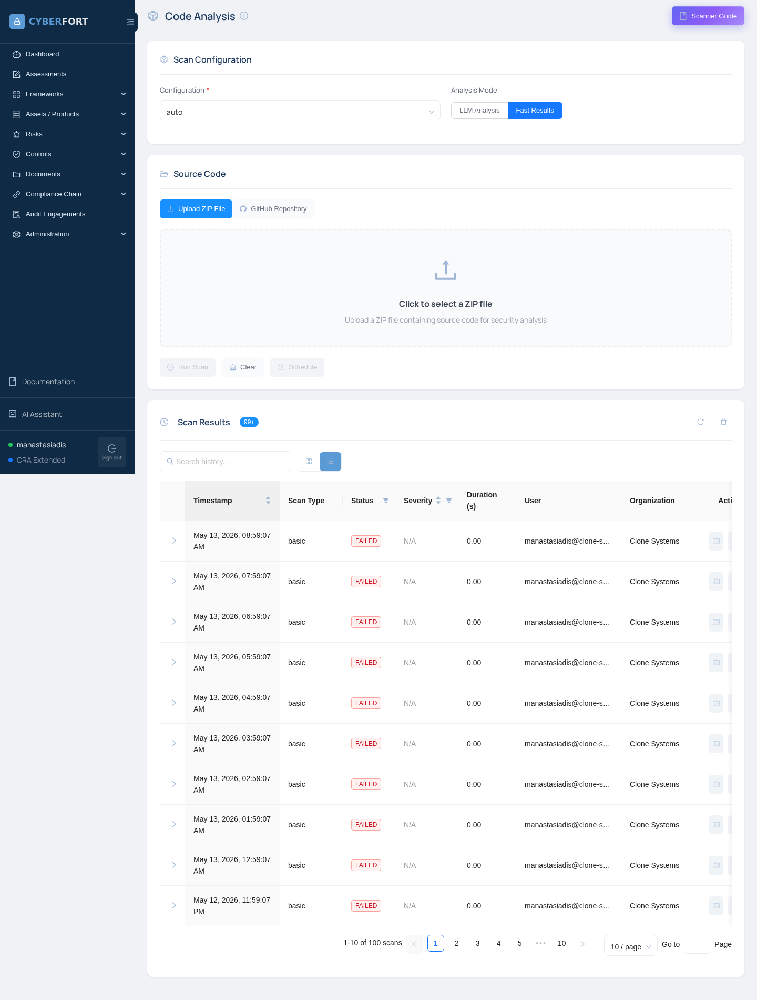

Expected findings:

| Severity | Rule                                | File                       |
|----------|-------------------------------------|----------------------------|
| High     | `hardcoded-password`                | `app/portpilot/config.py`  |
| High     | `python.flask.security.audit.sqli`  | `app/portpilot/app.py`     |
| Medium   | `flask-debug-true`                  | `app/portpilot/app.py`     |
| Medium   | `mark-safe-with-user-input`         | `app/portpilot/app.py`     |

> 🛑 **Finding #5 — Hardcoded secrets in source code.** `config.py` contains a database password and an API key in plaintext. CRA Annex I objective **3d** (integrity protection) — anyone who reads the source can manipulate stored data.

Open the Risk Register and click **Add New Risk** to file the hardcoded-password finding:

* **Title:** `Hardcoded credentials in application source`
* **Likelihood:** `Medium` (depends on who can read the repo)
* **Severity:** `High`
* **Linked objective:** CRA → Annex I → **3d** *(integrity of data, commands and configuration)* &mdash; anyone who can read the repo can read every secret and rewrite production data

---

## Step 5 — Run an OSV dependency scan

The CRA puts the burden of **known-exploited vulnerabilities in third-party components** squarely on the manufacturer. CyberFort's OSV integration lives at **Security Tools → Dependency Check**.

1. Expand **Security Tools** in the sidebar and click **Dependency Check**.
2. Upload the same ZIP you used for Semgrep — or just the `app/requirements.txt` — under *Source Code → Click to select a ZIP file*. Pick the **Scan Control** mode (`LLM Analysis` for richer remediation suggestions, `Fast Results` for a quicker pass).
3. Click **Run Scan**.

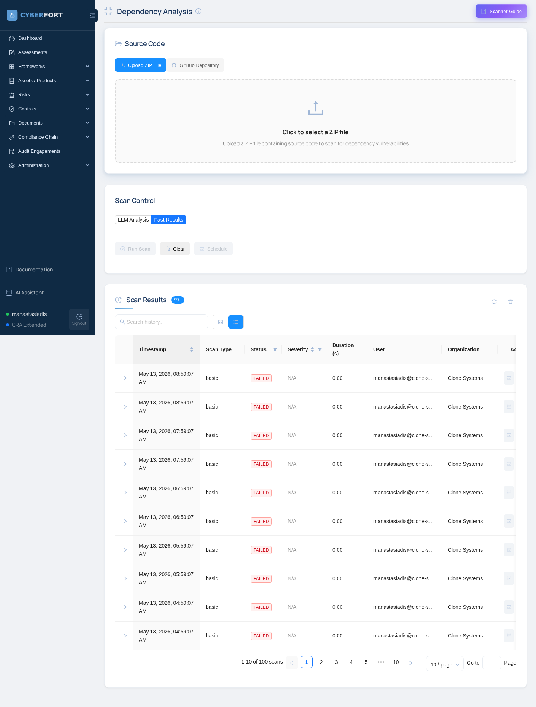

You should see at least these advisories:

| Package    | Version  | Advisory ID(s)                                                 |
|------------|----------|----------------------------------------------------------------|
| Flask      | 2.0.1    | GHSA-m2qf-hxjv-5gpq (session fixation)                         |
| Werkzeug   | 2.0.1    | GHSA-px8h-6qxv-m22q, GHSA-2g68-c3qc-8985, GHSA-xg9f-g7g7-2323  |
| Jinja2     | 3.0.0    | GHSA-h5c8-rqwp-cp95, GHSA-h75v-3vvj-5mfj                       |
| requests   | 2.25.0   | GHSA-j8r2-6x86-q33q (Proxy-Auth leak)                          |

> 🛑 **Finding #6 — Multiple high-severity advisories on transitive dependencies.** Links to CRA Vulnerability Handling objective **1** *(identify and document components, SBOM)* and Annex I **2** *(delivered without known exploitable vulnerabilities)*.

Convert the most severe (Werkzeug `GHSA-2g68-c3qc-8985`) into a Risk Register entry, linked to CRA → **Vulnerability Handling → 1**.

### Cross-check with Scan Findings

**Security Tools → Scan Findings** aggregates findings from every scanner (Nmap, ZAP, Semgrep, OSV) into one filterable table. Use it as the single pane of glass before you start the assessment.

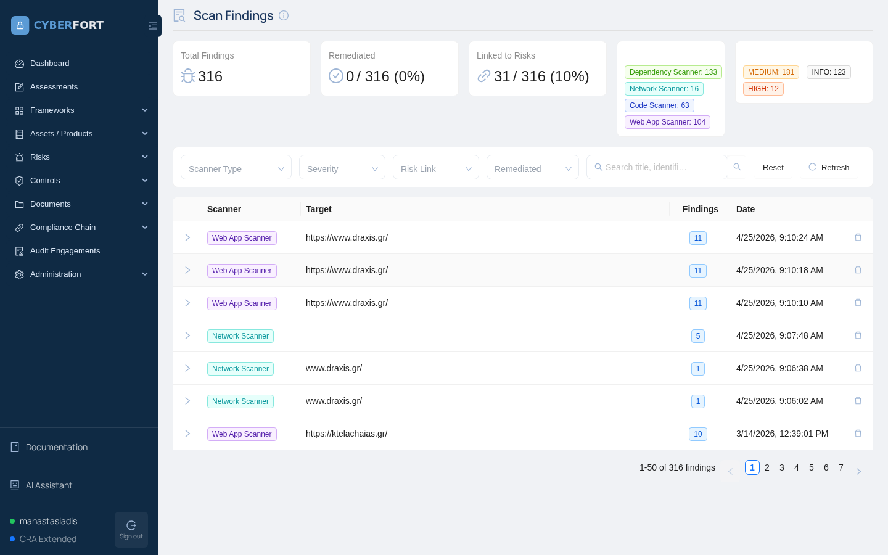

After filing all six risks for PortPilot, your **Risk Register** should look similar to this — the new PortPilot entries appear alongside any pre-existing risks for the organisation:

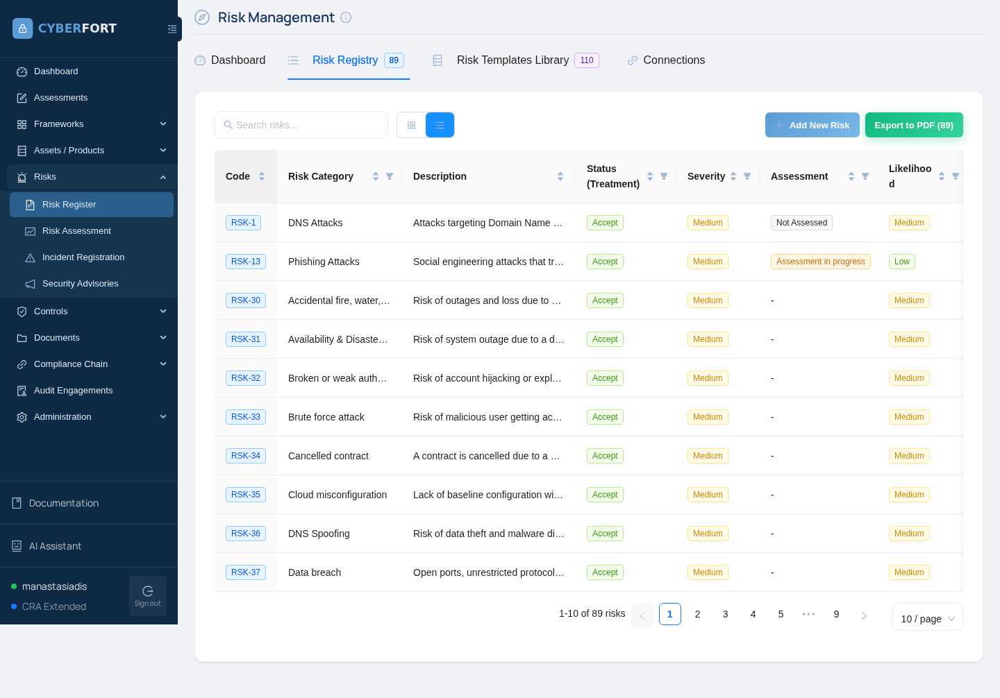

---

## Step 6 — Complete the CRA conformity assessment

CyberFort ships the **Cyber Resilience Act (CRA)** as a built-in framework. The assessment is a structured questionnaire of conformity questions; you mark each one as **Yes** / **No** / **Partially** / **N/A** and attach evidence.

1. Click **Assessments** in the sidebar. You see your current assessments and a *Create New Assessment* panel on the right.

   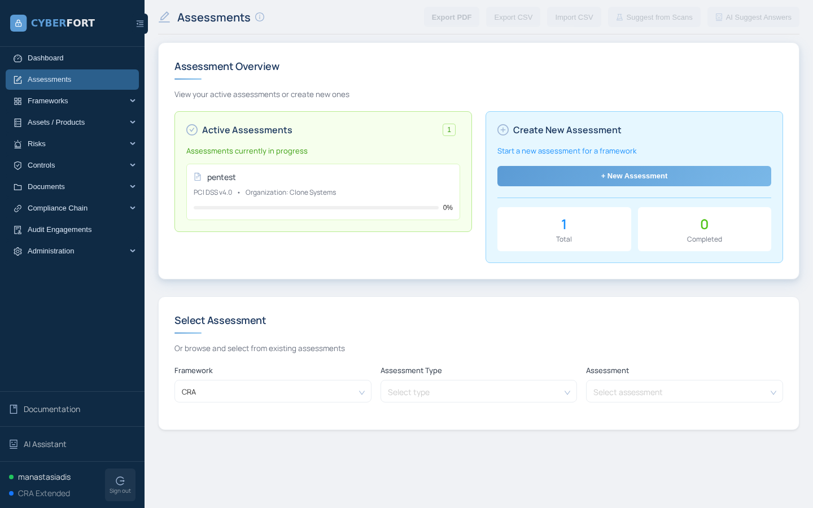

2. Click **+ New Assessment** and fill the form:
   * **Framework:** `CRA`
   * **Assessment Type:** `Conformity`
   * **Scope Type:** `Asset / Product`
   * **Asset / Product:** `PortPilot`
   * **Assessment Name:** `PortPilot CRA Conformity`

   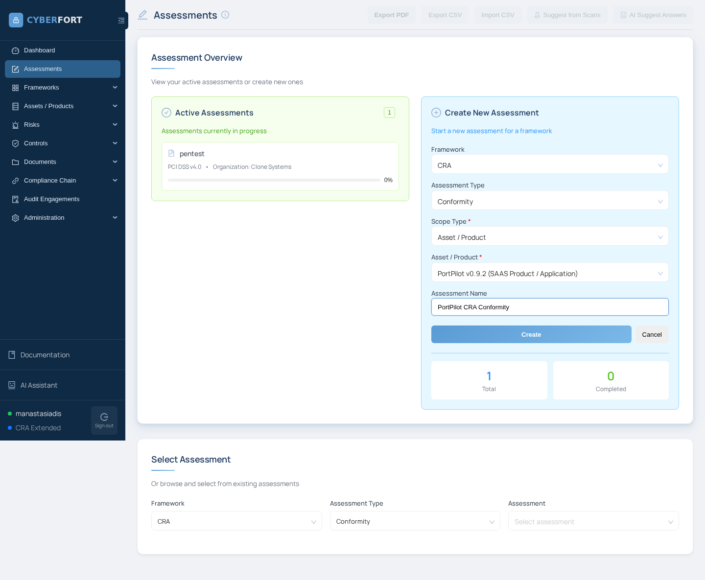

3. Click **Create**. CyberFort confirms with an *Assessment Creation Success* toast and the new assessment appears under *Active Assessments*.

   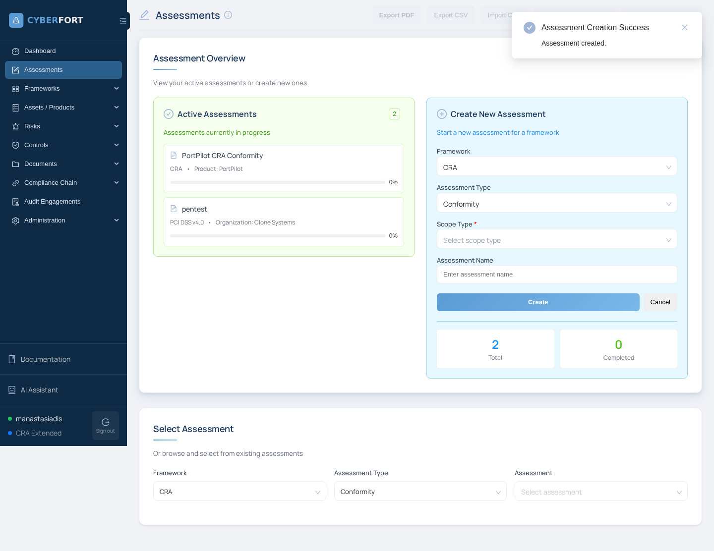

4. Click the **PortPilot CRA Conformity** card (under *Active Assessments*) — or pick it from the *Select Assessment* dropdown at the bottom. The questionnaire opens with 52 conformity questions, paginated 10 per page.

   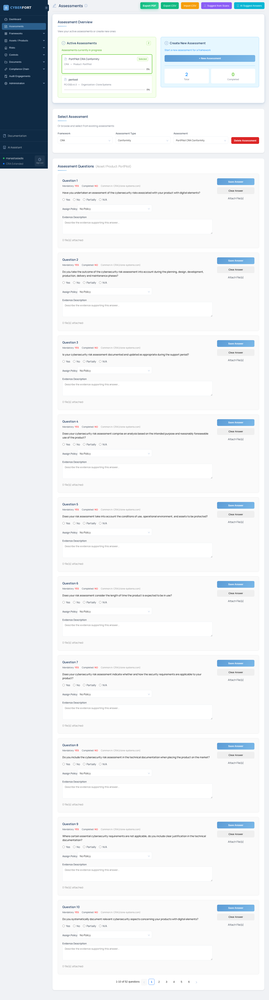

5. For each question, choose **Yes** / **No** / **Partially** / **N/A**, add an *Evidence Description*, optionally attach files, then click **Save Answer**. Focus on the eleven below — they are the ones your scan results directly answer. (The number column matches the position you will see in the UI.)

| # | Question (read it as it appears in CyberFort) | Your answer | Evidence to attach |
|---|------------------------------------------------|-------------|---------------------|
| 13 | *"Are your products with digital elements delivered without any known exploitable vulnerabilities?"* | Not compliant | OSV scan result; ZAP SQLi report |
| 14 | *"Are your products made available on the market with a secure by default configuration?"* | Not compliant | Nmap scan result (port 5432 open); Semgrep `flask-debug-true` |
| 16 | *"Do you ensure that vulnerabilities can be addressed through security updates?"* | Not compliant | Note that no update channel exists for the container image |
| 20 | *"Do you ensure protection from unauthorized access by appropriate control mechanisms?"* | Not compliant | ZAP SQL-injection report; ZAP broken-access report on `/admin/manifests` |
| 21 | *"Do you implement authentication, identity or access management systems?"* | Partially compliant | The product has a login form, but SQL injection bypasses it |
| 22 | *"Do you report on possible unauthorized access?"* | Not compliant | App produces no auth-failure logs |
| 23 | *"Do you protect the confidentiality of stored, transmitted or otherwise processed data through encryption?"* | Not compliant | Passwords stored in plaintext (see Postgres `users` table); `/admin/manifests` leaks confidential cargo notes |
| 25 | *"Do you protect the integrity of stored, transmitted or otherwise processed data, commands, programs and configuration?"* | Not compliant | Semgrep hardcoded-secret finding; reflected XSS allows DOM tampering |
| 32 | *"Are your products designed, developed and produced to limit attack surfaces, including external interfaces?"* | Not compliant | Nmap finding — PostgreSQL exposed on `0.0.0.0:5432` |
| 38 | *"Do you identify and document vulnerabilities and components contained in your products with digital elements?"* | Not compliant | No SBOM exists; OSV reveals 4+ unknown advisories |
| 39 | *"Do you draw up a software bill of materials in a commonly used and machine-readable format?"* | Not compliant | No SBOM file ships with the product |

6. For every **No** or **Partially** answer, attach the scan output as evidence: click **Attach File(s)** under the question and select the PDF/JSON for that finding. The Evidence Description textarea lets you add a one-line summary that the auditor reads first.

   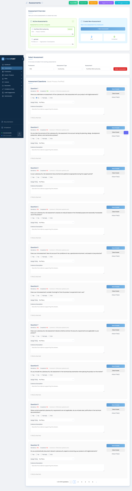

7. Click **Save Answer** on every question. The header for each question flips *Completed* from `NO` to `YES` once a valid answer is saved.

> 💡 The toolbar at the top of the Assessments page has a **Suggest from Scans** button and an **AI Suggest Answers** button — both pre-populate likely answers based on the scan findings you filed in steps 2-5. Use them on at least two questions: it is one of the platform features you are demonstrating.

> 📚 If you also want to fill in the **organisational audit questions** (the 95-question audit set on the same CRA framework), you can — but it is not required for this scenario. The conformity assessment is the product-level one CRA Article 32 requires before placing the product on the market.

---

## Step 7 — Generate the CRA readiness report

1. Stay on the **Assessments** page with `PortPilot CRA Conformity` selected.
2. Use the top-right toolbar:
   * **Export PDF** — produces a PDF of the answered conformity questionnaire with evidence references.
   * **Export CSV** — exports the answers as CSV (handy for the auditor's working spreadsheet).
3. From the **Risks** sidebar, you can also click **Export PDF** on the Risk Register dashboard to attach the full risk export to the readiness pack.

The combined PDFs (Conformity + Risk Register) form the **CRA readiness deliverable** you hand to your instructor — and the same documents an SME would attach to its Article 28 *EU Declaration of Conformity* technical documentation.

---

## Step 8 — Stretch goals (optional)

If you finish early, try the following:

* Patch one of the vulnerabilities (your instructor has the patch set) and rerun the relevant scan to verify it is now clean.
* Use the **Policy** module to draft a *Secure Development Lifecycle* policy and link it to CRA → Vulnerability Handling → objective **3** *(effective and regular security tests)*.
* Use Nmap's `-sV` profile to identify the exact Postgres and Python versions running.

---

## Checklist

Tick these off before declaring the scenario complete.

* [ ] PortPilot registered as a product
* [ ] Nmap scan completed; 5432 risk filed
* [ ] ZAP scan completed; SQLi, XSS, broken-access risks filed
* [ ] Semgrep scan completed; hardcoded-secret risk filed
* [ ] OSV scan completed; at least one transitive-dep risk filed
* [ ] CRA assessment answered against Annex I
* [ ] PDF readiness report generated and exported
