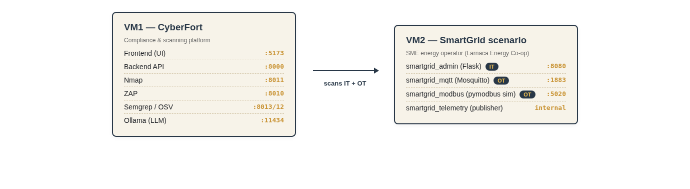
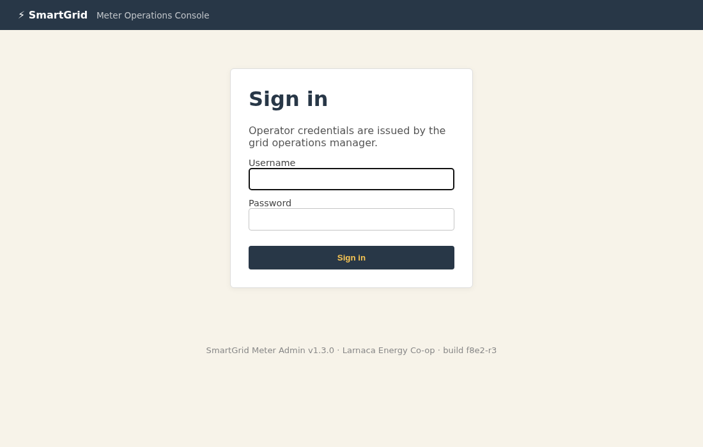
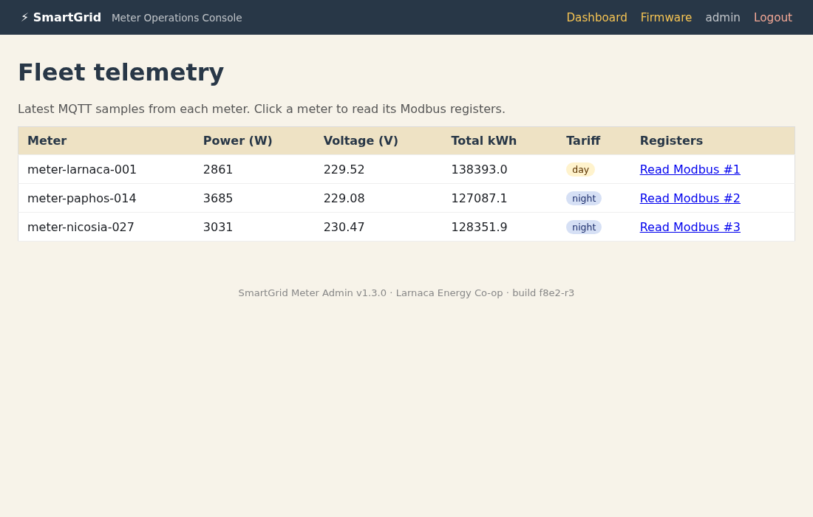
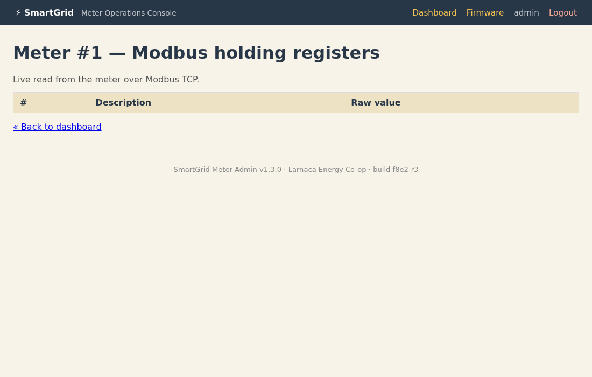
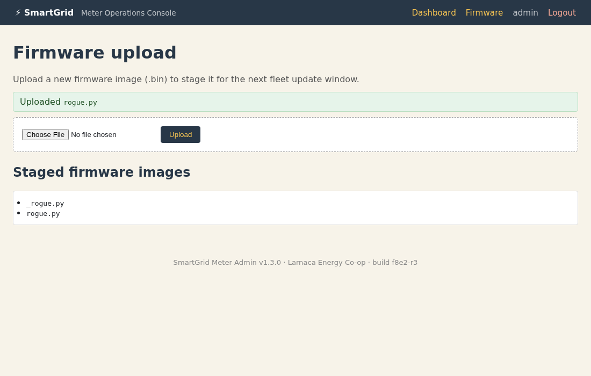
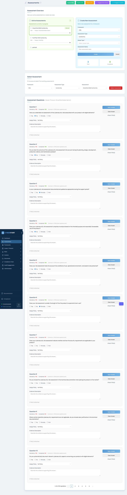

# Scenario 02 — SmartGrid Meter (Energy)

## Instructor guide & answer key

This document is **not** for trainees. It contains the seeded vulnerabilities, expected CyberFort findings, **what a successful deliverable looks like**, scoring rubric, and remediation patches.

---

## 1. Scenario topology



All three exposed ports are reachable from any host on the cyber-range subnet. Internal-only is `smartgrid_telemetry` (the publisher).

---

## 2. Seeded vulnerabilities (the answer key)

| # | Vulnerability                                                            | Where                                              | Detected by              | NIS2 Article 21(2) measure |
|---|--------------------------------------------------------------------------|----------------------------------------------------|--------------------------|----------------------------|
| 1 | MQTT broker accepts anonymous subscribers + publishers                   | `mosquitto/mosquitto.conf` (`allow_anonymous true`) | **Nmap** + manual `mosquitto_sub` | (d), (e), (h) |
| 2 | Modbus TCP simulator reachable with no segmentation                       | `modbus/simulator.py` + `docker-compose.yml`        | **Nmap** + pymodbus client | (b), (e) |
| 3 | Default operator credentials `admin/admin`                                | `admin/meter_admin/app.py` `USERS` dict             | **ZAP** auth-attack rule  | (i) |
| 4 | Firmware upload accepts arbitrary file types                              | `admin/meter_admin/app.py` `firmware()` route       | **ZAP** + **Semgrep** `arbitrary-file-write` | (d), (e) |
| 5 | Hardcoded MQTT credentials in publisher source                            | `telemetry/publisher.py` line 22                    | **Semgrep** `hardcoded-password` | (j) |
| 6 | Hardcoded billing-API key in admin config                                 | `admin/meter_admin/config.py`                       | **Semgrep**              | (j) |
| 7 | Flask `debug=True` shipped to production                                  | `admin/meter_admin/app.py` bottom + `run.py`        | **Semgrep** `flask-debug-true` | (e) |
| 8 | Outdated dependencies — Flask 2.0.1, Werkzeug 2.0.1, pymodbus 2.5.3, paho-mqtt 1.5.1, requests 2.25.0 | `admin/requirements.txt` | **OSV** | (d) |

---

## 3. Demonstration credentials

| System                   | Username        | Password               |
|--------------------------|-----------------|------------------------|
| SmartGrid web UI         | `admin`         | `admin`                |
| SmartGrid web UI (alt)   | `field_eng`     | `fieldeng`             |
| MQTT broker (hardcoded)  | `ops`           | `OpsTopSecret#2024`    |
| MQTT broker (effective)  | _(anonymous)_   | _(any password works)_ |

---

## 4. Verification commands &mdash; with expected output

Run these against a live SmartGrid stack to confirm each finding before grading the trainee.

### 4.1 Anonymous MQTT subscribe

```bash
mosquitto_sub -h <VM2> -p 1883 -t 'smartgrid/#' -v -W 8
```

**Expected output (key lines):**

```text
smartgrid/meter-larnaca-001/telemetry {"meter_id": "meter-larnaca-001", "power_w": 5299, "voltage_v": 230.11, ...}
smartgrid/meter-paphos-014/telemetry  {"meter_id": "meter-paphos-014", ...}
smartgrid/meter-nicosia-027/telemetry {"meter_id": "meter-nicosia-027", ...}
-- total messages in 8s: 6 --
```

### 4.2 Modbus TCP — unauthenticated read

```bash
docker exec smartgrid_admin python -c "
from pymodbus.client.sync import ModbusTcpClient
c = ModbusTcpClient('modbus', port=5020); c.connect()
print(c.read_holding_registers(0, 9, unit=1).registers)
"
```

**Expected output:**

```text
[4121, 2282, 2301, 1116, 1048, 1350, 2, 6346, 324]
```

### 4.3 Default web credentials

```bash
curl -i -X POST http://<VM2>:8080/login -d "username=admin" -d "password=admin" | head -8
```

**Expected output:**

```text
HTTP/1.0 302 FOUND
Location: http://<VM2>:8080/dashboard
Set-Cookie: session=...; HttpOnly; Path=/
Server: Werkzeug/2.0.1 Python/3.9.x
```

### 4.4 Firmware upload accepts an arbitrary file

```bash
echo 'print("rce")' > /tmp/rogue.py
curl -s -b cookies.txt -F file=@/tmp/rogue.py http://<VM2>:8080/firmware | grep -oE 'Uploaded [^<]+'
```

**Expected output:**

```text
Uploaded <code>rogue.py
```

---

## 5. What each exploit looks like

### 5.1 SmartGrid sign-in page (clean baseline)



### 5.2 Default credentials in the login form


### 5.3 Fleet telemetry dashboard (signed in)



### 5.4 Modbus holding registers, live-read over the management UI



### 5.5 Firmware upload accepting an arbitrary `.py` file



---

## 6. What a successful deliverable looks like in CyberFort

### 6.1 The risk register populated with SmartGrid findings

The Risk Registry tab should contain at least eight new risks scoped to `SmartGrid Meter Admin 1.3.0`.


### 6.2 The NIS2 conformity assessment, answered

The `SmartGrid NIS2 Conformity` assessment should show progress on the ten target questions in Step 7 of the handbook.



---

## 7. Risk-register expected entries (detailed)

After the trainee finishes the scenario the register should contain **at least 7 risks** linked to `SmartGrid Meter Admin 1.3.0`:

1. MQTT anonymous access — H/H
2. MQTT clear-text telemetry — H/M
3. Modbus TCP exposed without segmentation — H/VH
4. Default operator credentials — H/H
5. Arbitrary firmware upload — M/H
6. Hardcoded credentials in source — M/H
7. Outdated dependencies (OSV) — H/M

---

## 8. Scoring rubric (100 pts)

| Activity | Points |
|----------|--------|
| Product registered | 5 |
| Nmap scan and conversion of three port findings (MQTT, Modbus, HTTP) | 15 |
| MQTT anonymous-subscribe verification | 10 |
| Modbus unauth-read verification | 10 |
| ZAP scan + default-creds + file-upload findings | 15 |
| Semgrep + hardcoded-secret finding | 10 |
| OSV + at least one dep advisory filed | 10 |
| NIS2 assessment with all 10 Step-7 questions answered | 20 |
| Report PDF generated | 5 |

Pass threshold: 70.

---

## 9. Remediation patches

* **MQTT:** in `mosquitto/mosquitto.conf` set `allow_anonymous false`, add a TLS `listener 8883 0.0.0.0` block, configure `password_file`.
* **Modbus:** remove the `ports: 5020:5020` mapping in `docker-compose.yml` so the protocol stays on the internal docker network. Long-term: use a Modbus-aware gateway with allow-listing.
* **Default creds:** delete the seeded `admin/admin` from the in-memory `USERS` dict; force a password change on first login.
* **Firmware upload:** allow-list `.bin` only, verify a vendor signature before staging, write the file outside the web root.
* **Hardcoded secrets:** move `BILLING_API_KEY`, `MQTT_PASSWORD`, `SECRET_KEY` into env vars.
* **Debug mode:** set `debug=False`; use `gunicorn` for production.
* **Dependencies:** bump Flask to 3.0.3, Werkzeug to 3.0.3, paho-mqtt to 1.6.1, pymodbus to 3.6.6, requests to 2.32.3.

---

## 10. Reset between sessions

```bash
cd /srv/smartgrid-scenario
docker compose down
docker compose up -d --build
```

(No persistent volumes — every restart is factory fresh.)
