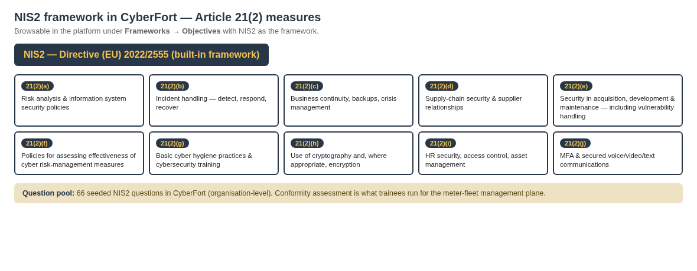

# Scenario 02 — NIS2 control mapping

The bridge between the **eight seeded vulnerabilities in the SmartGrid Meter stack** and the **NIS2 framework as it is represented in CyberFort**.

---

## How the NIS2 framework is structured in CyberFort

CyberFort ships NIS2 (Directive (EU) 2022/2555) as a built-in framework with **66 seeded questions** covering the ten essential cybersecurity risk-management measures of **Article 21(2) (a)–(j)**.

NIS2 has no "Annex I" like CRA — its essential cybersecurity requirements live in Article 21(2)(a)–(j). The seeded questions in CyberFort sit under a flat questionnaire that the trainee paginates through. **The question texts quoted below are verbatim from the platform's NIS2 seed.**

---

## Findings, one card per finding

### Finding 1 — MQTT broker accepts anonymous subscribers

**Where:** `mosquitto/mosquitto.conf` (`allow_anonymous true` and `listener 1883 0.0.0.0`).

**Detected by:** Nmap (port 1883 discovery) + manual `mosquitto_sub -h <VM2> -p 1883 -t '#'`.

| NIS2 Art. 21(2) | Verbatim seeded question |
|------------------|---------------------------|
| **(h)** *(cryptography & encryption)* | Q15 — "Are policies and procedures for cryptography and encryption use documented and implemented based on risk assessment?" |
| **(e)** *(security in network systems)* | Q53 — "Do cybersecurity measures address the critical infrastructure nature and dependencies of essential entity operations?" |
| **(d)** *(supply-chain security)* | Q7  — "Are supply chain cybersecurity risks assessed and managed through formal procedures and contractual requirements?" |

---

### Finding 2 — Modbus TCP exposed, no segmentation

**Where:** `modbus/simulator.py` (binds `0.0.0.0`) + `docker-compose.yml` (port mapping `5020:5020`).

**Detected by:** Nmap (port 5020 discovery) + pymodbus unauthenticated register read.

| NIS2 Art. 21(2) | Verbatim seeded question |
|------------------|---------------------------|
| **(e)** *(network systems)*   | Q53 — "Do cybersecurity measures address the critical infrastructure nature and dependencies of essential entity operations?" |
| **(b)** *(incident handling)* | Q3  — "Are incident handling procedures documented covering detection, response, and recovery phases of cybersecurity incidents?" |

---

### Finding 3 — Default operator credentials `admin/admin`

**Where:** `admin/meter_admin/app.py` — `USERS` dict + `config.py` `DEFAULT_OPERATOR_*`.

**Detected by:** ZAP authentication-attack rule + manual login.

| NIS2 Art. 21(2) | Verbatim seeded question |
|------------------|---------------------------|
| **(i)** *(HR security, access control)* | Q17 — "Are human resources security measures, access control policies, and asset management procedures documented and implemented?" |
| **(j)** *(MFA & secured communications)* | Q19 — "Are multi-factor authentication and secure communication systems implemented where appropriate, particularly for cybersecurity incident management personnel?" |

---

### Finding 4 — Arbitrary firmware upload

**Where:** `admin/meter_admin/app.py` `firmware()` route — accepts any file extension.

**Detected by:** ZAP file-upload rule + Semgrep `arbitrary-file-write`.

| NIS2 Art. 21(2) | Verbatim seeded question |
|------------------|---------------------------|
| **(d)** *(supply-chain security)*  | Q7 — "Are supply chain cybersecurity risks assessed and managed through formal procedures and contractual requirements?" |
| **(e)** *(network systems / vulnerability handling)* | Q9 — "Are security requirements integrated into system acquisition, development, and maintenance processes, including vulnerability management?" |

---

### Finding 5 — Hardcoded MQTT credentials in source

**Where:** `telemetry/publisher.py` — `MQTT_PASSWORD = "OpsTopSecret#2024"` literal.

**Detected by:** Semgrep `hardcoded-password` rule.

| NIS2 Art. 21(2) | Verbatim seeded question |
|------------------|---------------------------|
| **(h)** *(cryptography)* | Q15 — "Are policies and procedures for cryptography and encryption use documented and implemented based on risk assessment?" (operational secrets must not live in source) |

---

### Finding 6 — Hardcoded billing API key

**Where:** `admin/meter_admin/config.py` — `BILLING_API_KEY` is a plaintext literal.

**Detected by:** Semgrep.

| NIS2 Art. 21(2) | Verbatim seeded question |
|------------------|---------------------------|
| **(h)** *(cryptography)* | Q15 — "Are policies and procedures for cryptography and encryption use documented and implemented based on risk assessment?" |

---

### Finding 7 — Flask `debug=True` in production code

**Where:** `admin/meter_admin/app.py` last block + `run.py`.

**Detected by:** Semgrep `flask-debug-true`.

| NIS2 Art. 21(2) | Verbatim seeded question |
|------------------|---------------------------|
| **(e)** *(network systems)*    | Q9  — "Are security requirements integrated into system acquisition, development, and maintenance processes, including vulnerability management?" |
| **(g)** *(basic cyber hygiene)* | Q13 — "Are basic cyber hygiene practices implemented and is cybersecurity training provided to relevant personnel?" |

---

### Finding 8 — Outdated dependencies

**Where:** `admin/requirements.txt` — Flask 2.0.1, Werkzeug 2.0.1, pymodbus 2.5.3, paho-mqtt 1.5.1, requests 2.25.0.

**Detected by:** OSV scan.

| NIS2 Art. 21(2) | Verbatim seeded question |
|------------------|---------------------------|
| **(d)** *(supply-chain security)* | Q7 — "Are supply chain cybersecurity risks assessed and managed through formal procedures and contractual requirements?" |
| **(e)** *(network systems / vulnerability handling)* | Q9 — "Are security requirements integrated into system acquisition, development, and maintenance processes, including vulnerability management?" |

---

## Article 21(2) coverage matrix

<table class="cov">
<thead><tr><th>Art. 21(2)</th><th>Measure (paraphrased)</th><th>Covered?</th><th>Trainee evidence</th></tr></thead>
<tbody>
<tr><td>(a)</td><td>Risk analysis &amp; ISMS policies</td><td class="partial">implicit</td><td>Trainee notes no documented OT risk policy</td></tr>
<tr><td>(b)</td><td>Incident handling</td><td class="yes">✓</td><td>Modbus + MQTT exposure show OT-IR gaps</td></tr>
<tr><td>(c)</td><td>Business continuity / DR / backups</td><td class="no">—</td><td>Not exercised in this scenario</td></tr>
<tr><td>(d)</td><td>Supply-chain security</td><td class="yes">✓</td><td>OSV scan + firmware-upload finding</td></tr>
<tr><td>(e)</td><td>Security in dev &amp; maintenance / vulnerability handling</td><td class="yes">✓</td><td>Semgrep + OSV + segmentation gaps</td></tr>
<tr><td>(f)</td><td>Effectiveness assessment of measures</td><td class="partial">implicit</td><td>This exercise itself is the first effectiveness assessment</td></tr>
<tr><td>(g)</td><td>Basic cyber hygiene &amp; training</td><td class="partial">implicit</td><td>Flask debug + default creds expose missing training</td></tr>
<tr><td>(h)</td><td>Cryptography / encryption</td><td class="yes">✓</td><td>MQTT clear-text + hardcoded MQTT secret</td></tr>
<tr><td>(i)</td><td>HR security, access control, asset management</td><td class="yes">✓</td><td>Default `admin/admin`, single role</td></tr>
<tr><td>(j)</td><td>MFA / secured communications</td><td class="yes">✓</td><td>No MFA, hardcoded secrets</td></tr>
</tbody>
</table>

**Coverage summary:** **6 of 10** Article 21(2) measures are directly exercised. Three more — (a), (f), (g) — are implicit (the gaps surface organisationally rather than in the scan output). Only (c) Business continuity is fully out of scope.

---

## What the trainee actually clicks (assessment flow)

1. **Assessments → + New Assessment** — Framework: `NIS2`, Assessment Type: `Conformity`, Scope: `Asset / Product → SmartGrid Meter Admin`.
2. **Click the new card** — the 241-question questionnaire opens, paginated 10-per-page.
3. **For each of the ten target questions** in Step 7 of the handbook: pick `Yes` / `No` / `Partially` / `N/A`, write an Evidence Description, attach scan output, click **Save Answer**.
4. **Export PDF** from the toolbar — that PDF, plus the Risk Register PDF, is the readiness pack the SME hands to its NIS2 supervisory authority.

---

## Why this matters in the proposal context

Larnaca Energy Co-op is the SME profile the CYBERFORT proposal explicitly targets: a small **essential entity** under NIS2 operating critical infrastructure without the staffing of a tier-1 utility. The trainee learns how that operator can produce a credible NIS2 readiness report end-to-end on a one-day budget using CyberFort — the same artefact that would otherwise take a consulting engagement of several weeks.
