# Scenario 02 — SmartGrid Meter (Energy)

## Trainee handbook

> ⏱ Estimated time: **2 hours** &middot; 🎯 Level: **Intermediate** &middot; 🔌 Sector: **Energy (essential entity under NIS2)**

---

## Scenario brief

You are the new cybersecurity lead at **Larnaca Energy Co-op**, an SME distribution-system operator. The co-op runs a small fleet of smart meters across Larnaca, Paphos and Nicosia. The meters publish telemetry to an in-house **MQTT** broker every few seconds and the operations team reads register values directly from each meter over **Modbus TCP** through a small web console called **SmartGrid Meter Admin v1.3.0**.

Because the Co-op qualifies as an **essential entity** under Directive (EU) 2022/2555 (NIS2), the board wants a full security review of the meter fleet's management plane before the next supervisory inspection. You will use **CyberFort** to scan, score, and produce a NIS2 readiness report.

You have:

* A virtual machine running CyberFort (`https://<VM1-IP>:5173`), or access to the hosted reference instance at `https://access.cyber-fort.eu/login`.
* A virtual machine hosting this scenario in Docker (`<VM2-IP>`). Shell access to VM2.
* CyberFort credentials issued by your instructor.


> ℹ️ The hosted reference instance cannot reach a private cyber-range subnet, so the scanner integrations cannot actively scan VM2 from there. The walkthrough below shows the **exact UI steps** for each scan — and where the scanner cannot reach your target, you **replicate** the finding by adding it manually to the Risk Register.

---

## Learning outcomes

By the end of this scenario you will be able to:

1. Register a multi-component product (IT + OT) in CyberFort.
2. Run an **Nmap** scan covering both IT and **OT** ports (8080, 1883, 5020).
3. Verify anonymous **MQTT** subscription and unauthenticated **Modbus** register reads.
4. Run an **OWASP ZAP** scan against the management web UI and uncover default credentials + a firmware-upload RCE.
5. Run a **Semgrep** SAST scan and find hardcoded credentials in source code.
6. Run an **OSV** dependency scan against `requirements.txt`.
7. Complete a **NIS2 Article 21(2)** assessment in CyberFort.
8. Export a NIS2 readiness PDF report.

---

## Step 0 — Verify the lab is up

On VM2:

```bash
cd /srv/smartgrid-scenario
docker compose ps
```

You should see four running containers: `smartgrid_admin`, `smartgrid_mqtt`, `smartgrid_modbus`, `smartgrid_telemetry`. Open `http://<VM2-IP>:8080/login` in a browser. You should land on the SmartGrid Meter Admin sign-in page:


> 💡 Do **not** try to sign in yet. We will let CyberFort do the discovery for us.

---

## Step 1 — Register the meter management system as a product in CyberFort

1. From the left sidebar, expand **Assets / Products** and click **Manage Assets**. You see the existing asset list.

   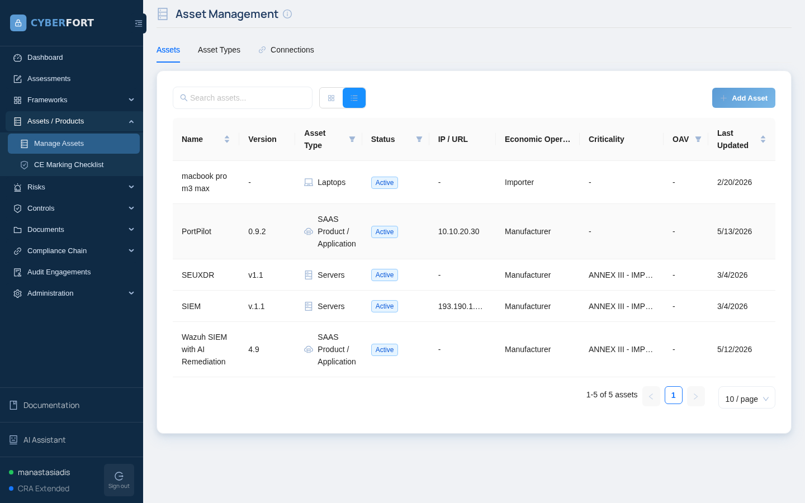

2. Click **+ Add Asset** (top right). The *Details* tab of the modal opens.

   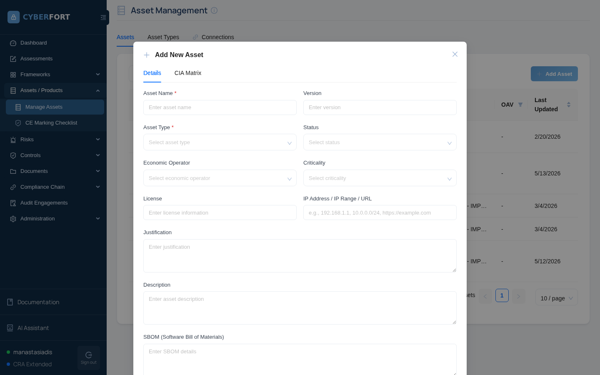

3. Fill in:
   * **Asset Name:** `SmartGrid Meter Admin`
   * **Version:** `1.3.0`
   * **Asset Type:** `SAAS Product / Application`
   * **Status:** `Active`
   * **Economic Operator:** `Manufacturer`
   * **Criticality:** `ANNEX III` (the meter fleet supports an essential service)
   * **IP Address / URL:** `<VM2-IP>` (e.g. `10.10.20.31`)
   * **Description:** "SmartGrid Meter Admin — Flask portal for an SME energy operator. Manages a fleet of 3 smart meters via Modbus TCP and MQTT."

   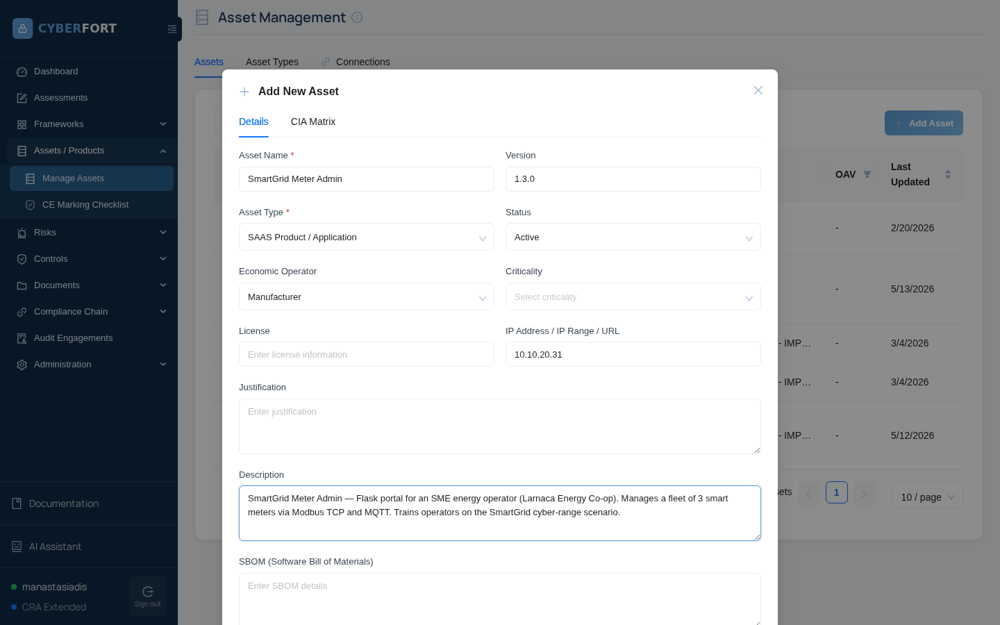

4. Click **Save**. SmartGrid Meter Admin now appears in the asset list.

   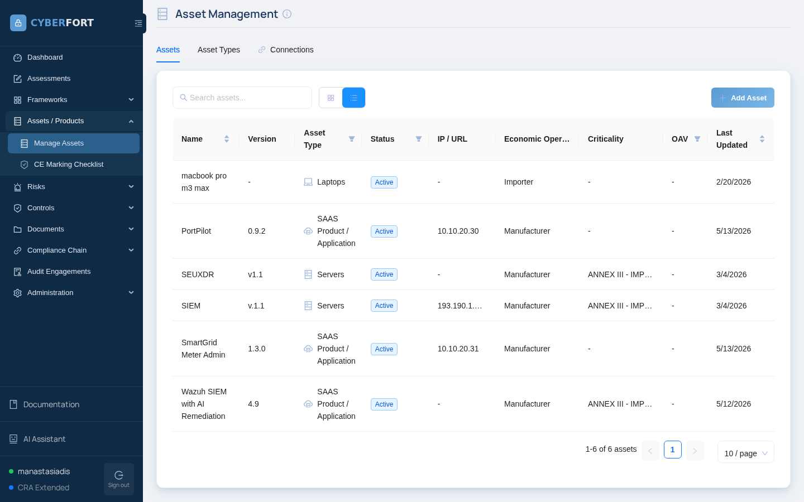

---

## Step 2 — Run an Nmap scan against the OT/IT stack

The critical step. Energy operators must know **every exposed port** on the management plane.

1. Expand **Security Tools** in the sidebar and click **Security Scanners**.
2. Scan Type: `Basic Scan - Top 1000 ports`. Target: `<VM2-IP>`.
3. Click **Run Scan**.

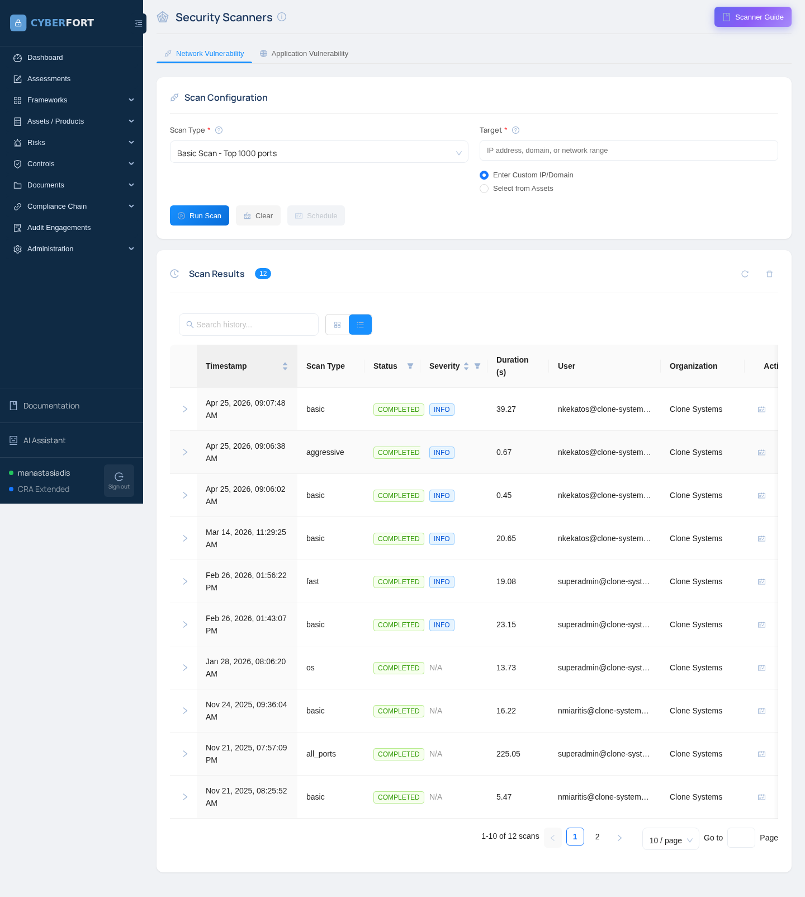

After ~1 minute you should see:

| Port | Service     | Notes                                                              |
|------|-------------|--------------------------------------------------------------------|
| 8080 | http        | SmartGrid Meter Admin web UI                                       |
| 1883 | mqtt        | MQTT broker — **should never be exposed outside the OT subnet**    |
| 5020 | modbus-tcp  | Modbus TCP — protocol has **no authentication by design**          |

> 🛑 **Finding #1 — MQTT broker exposed.** MQTT on 1883 is in clear text and (as we are about to discover) accepts anonymous clients. NIS2 Article 21(2)(d), (e), (h).

> 🛑 **Finding #2 — Modbus TCP exposed.** Modbus has no built-in authentication; anyone who reaches port 5020 can read or write meter registers. NIS2 Article 21(2)(b), (e).

---

## Step 3 — Confirm the exposures manually

CyberFort's scanners flag the ports, but you need concrete evidence to file in the Risk Register.

### 3a. MQTT — anonymous subscribe

```bash
mosquitto_sub -h <VM2-IP> -p 1883 -t 'smartgrid/#' -v -W 8
```

**Expected output:**

```text
smartgrid/meter-larnaca-001/telemetry {"meter_id": "meter-larnaca-001", "ts": ..., "power_w": 5299, "voltage_v": 230.11, ...}
smartgrid/meter-paphos-014/telemetry  {"meter_id": "meter-paphos-014", ...}
smartgrid/meter-nicosia-027/telemetry {"meter_id": "meter-nicosia-027", ...}
```

Three meters' real-time kWh and tariff data, in clear text, with no authentication.

> 🛑 **Finding #3 — Anonymous MQTT subscription leaks consumption data.** NIS2 Article 21(2)(h) — *use of cryptography*. Customer kWh is personal data with a GDPR dimension.

### 3b. Modbus — unauthenticated register read

```bash
python -c "
from pymodbus.client.sync import ModbusTcpClient
c = ModbusTcpClient('<VM2-IP>', port=5020); c.connect()
print(c.read_holding_registers(0, 9, unit=1).registers)
"
```

**Expected output:**

```text
[4121, 2282, 2301, 1116, 1048, 1350, 2, 6346, 324]
# power_w · voltage L1×10 · voltage L2×10 · voltage L3×10 · current L1×100 · current L2×100 · current L3×100 · total_kWh_high · total_kWh_low
```

A meter could be written to in the same way (function code 6 — write single register).

> 🛑 **Finding #4 — Modbus registers readable and writable by anyone on the network.** NIS2 Article 21(2)(b), (e), (i).

The same data is visible through the management UI (which uses the same protocol internally):


---

## Step 4 — Run an OWASP ZAP scan against the management web UI

1. **Security Tools → Security Scanners → Application Vulnerability** tab.
2. Target: `http://<VM2-IP>:8080`. Active scan.
3. While ZAP runs, try the default credentials yourself: `admin` / `admin`. They work.


After signing in you land on the fleet dashboard:


Expected ZAP findings:

* **Default Credentials** — `admin/admin` on `/login`. Severity High.
* **File Upload — No Type Restriction** on `/firmware`. Severity High.
* **CSRF on `/firmware`** (no token).
* **Cookie flags missing** — session cookie without `Secure` or `HttpOnly`.

### 4a. Firmware upload accepts arbitrary file types

The `/firmware` endpoint stages any file under the meter-admin uploads directory — try uploading a `.py` file:


> 🛑 **Finding #5 — Default operator credentials shipped with the product.** NIS2 Article 21(2)(i).

> 🛑 **Finding #6 — Arbitrary file upload on the firmware endpoint.** NIS2 Article 21(2)(d), (e) — supply-chain & firmware integrity.

---

## Step 5 — Run a Semgrep SAST scan

```bash
cd /srv/smartgrid-scenario
zip -r /tmp/smartgrid-src.zip admin/ modbus/ telemetry/
```

In CyberFort: **Security Tools → Code Analysis**. Upload the ZIP and **Run Scan**.

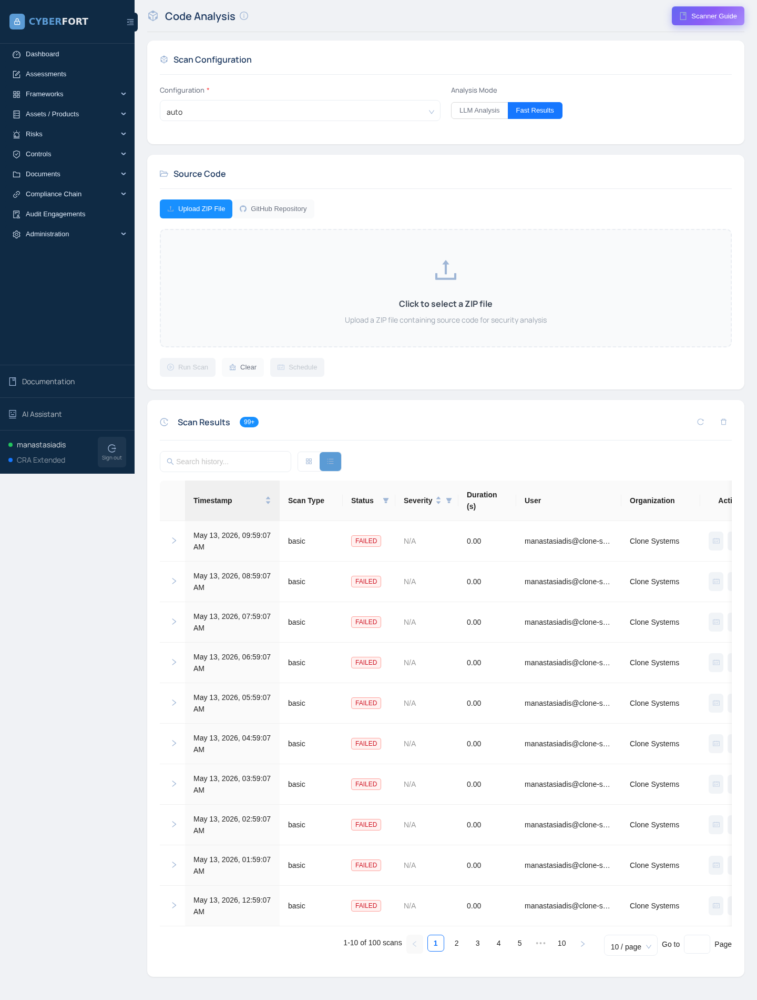

Expected findings:

| Severity | Rule                         | File                                                          |
|----------|------------------------------|---------------------------------------------------------------|
| High     | `hardcoded-password`         | `telemetry/publisher.py` (`MQTT_PASSWORD = "OpsTopSecret#2024"`) |
| High     | `hardcoded-password`         | `admin/meter_admin/config.py` (`BILLING_API_KEY`)             |
| Medium   | `flask-debug-true`           | `admin/meter_admin/app.py`                                    |
| Medium   | `arbitrary-file-write`       | `admin/meter_admin/app.py` (firmware upload)                  |

> 🛑 **Finding #7 — Hardcoded credentials in source.** NIS2 Article 21(2)(j) — no operational secret should live in source.

---

## Step 6 — Run an OSV dependency scan

**Security Tools → Dependency Check**. Upload the same ZIP or just `admin/requirements.txt`.


Expected advisories:

| Package    | Version | Notable advisory |
|------------|---------|------------------|
| Flask      | 2.0.1   | GHSA-m2qf-hxjv-5gpq |
| Werkzeug   | 2.0.1   | GHSA-px8h-6qxv-m22q, GHSA-2g68-c3qc-8985 |
| Jinja2     | 3.0.0   | GHSA-h5c8-rqwp-cp95 |
| requests   | 2.25.0  | GHSA-j8r2-6x86-q33q |
| pymodbus   | 2.5.3   | GHSA-7796-x727-6w2v |

> 🛑 **Finding #8 — Multiple high-severity advisories on third-party components.** NIS2 Article 21(2)(d).

### Cross-check with Scan Findings

**Security Tools → Scan Findings** aggregates everything into one filterable table:


After filing the eight risks for SmartGrid Meter Admin, your **Risk Register** should look similar to this:

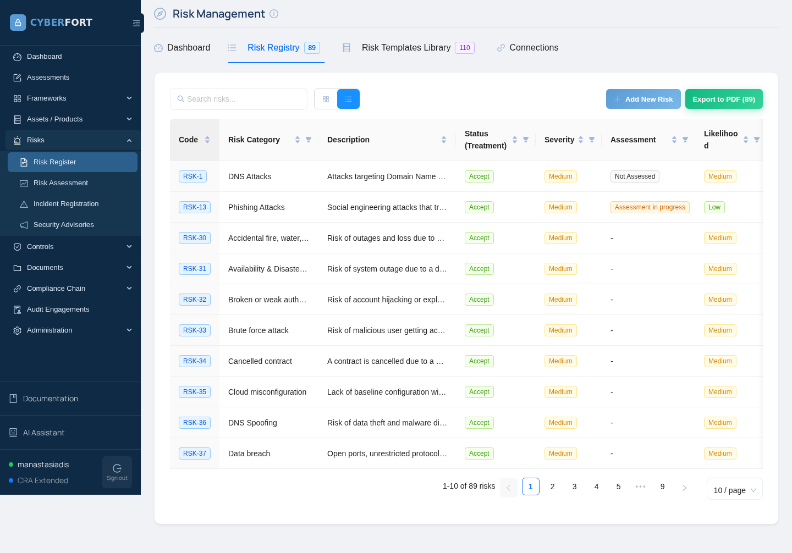

---

## Step 7 — Complete the NIS2 assessment

1. **Assessments → + New Assessment**.

   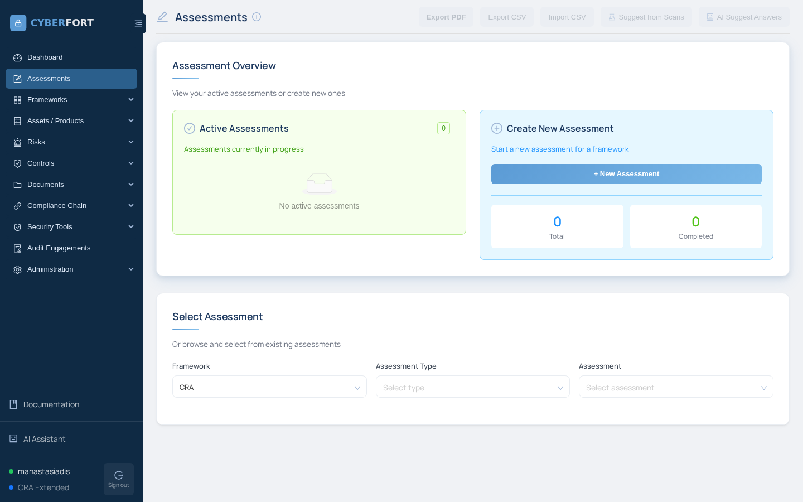

2. Fill the form:
   * **Framework:** `NIS2`
   * **Assessment Type:** `Conformity`
   * **Scope Type:** `Asset / Product`
   * **Asset / Product:** `SmartGrid Meter Admin`
   * **Assessment Name:** `SmartGrid NIS2 Conformity`

   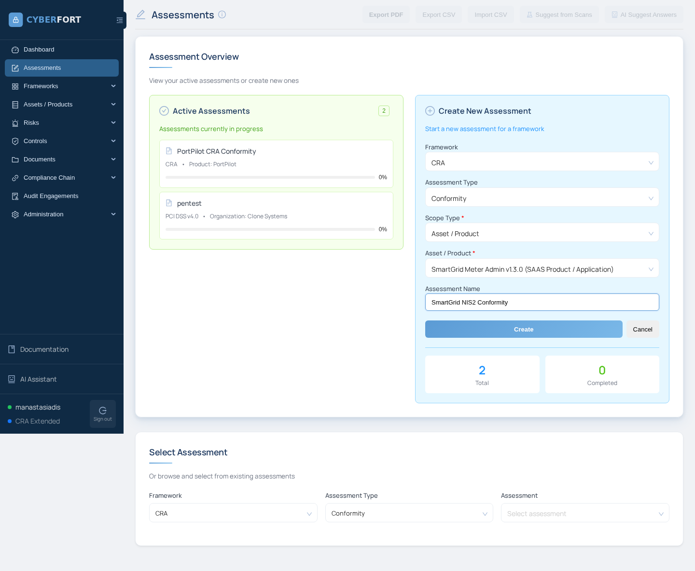

3. Click **Create**.

   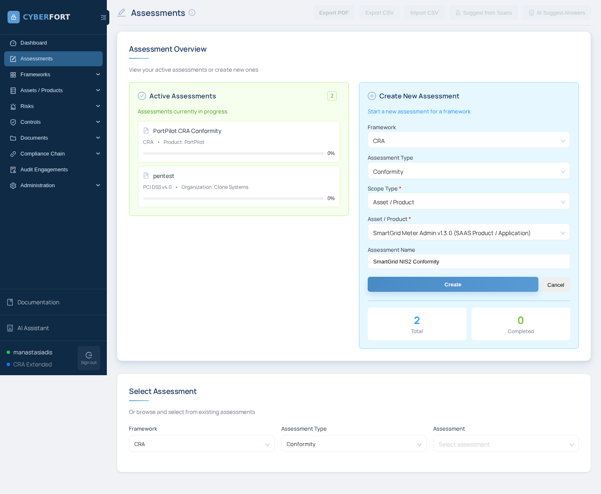

4. Click the new `SmartGrid NIS2 Conformity` card to open the 66-question questionnaire.

   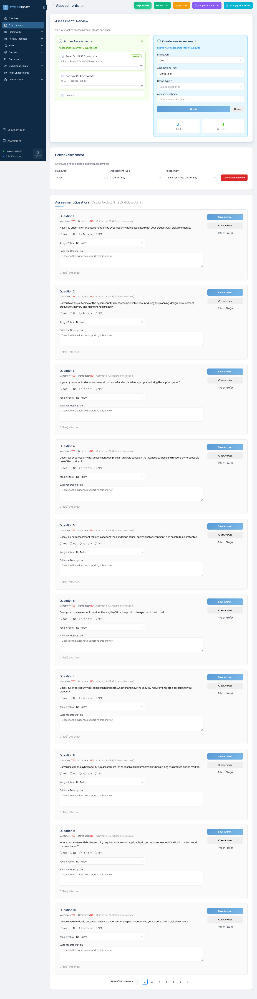

5. Focus on the questions below — they line up directly with your findings. **The text is exactly as you will see it in the CyberFort UI** (taken from the platform's NIS2 question pool).

| # | Question (verbatim from the CyberFort NIS2 questionnaire) | Your answer | Evidence |
|---|------------------------------------------------------------|-------------|----------|
| 1  | *"Are cybersecurity risk analysis policies documented and do they address sector-specific cybersecurity risks?"* | Not compliant | No documented OT risk policy. |
| 3  | *"Are incident handling procedures documented covering detection, response, and recovery phases of cybersecurity incidents?"* | Not compliant | No SIEM, no auth-failure logs, no playbook for an MQTT compromise. |
| 7  | *"Are supply chain cybersecurity risks assessed and managed through formal procedures and contractual requirements?"* | Not compliant | OSV finding — five outstanding advisories on shipped libraries. |
| 9  | *"Are security requirements integrated into system acquisition, development, and maintenance processes, including vulnerability management?"* | Not compliant | Hardcoded secrets + debug mode + default credentials. |
| 11 | *"Are policies and procedures established to regularly assess and measure cybersecurity risk management measure effectiveness?"* | Not compliant | First effectiveness review is this exercise. |
| 13 | *"Are basic cyber hygiene practices implemented and is cybersecurity training provided to relevant personnel?"* | Partially | Operators received generic IT training but no OT-specific module. |
| 15 | *"Are policies and procedures for cryptography and encryption use documented and implemented based on risk assessment?"* | Not compliant | MQTT in clear text; no TLS on the broker. |
| 17 | *"Are human resources security measures, access control policies, and asset management procedures documented and implemented?"* | Not compliant | Default `admin/admin`; one role for every operator; no asset-management of meter inventory. |
| 19 | *"Are multi-factor authentication and secure communication systems implemented where appropriate, particularly for cybersecurity incident management personnel?"* | Not compliant | No MFA on the management portal. |
| 53 | *"Do cybersecurity measures address the critical infrastructure nature and dependencies of essential entity operations?"* | Not compliant | Modbus + MQTT exposed; no segmentation between management plane and customer-data telemetry. |

6. Attach the relevant scan output as evidence on each "Not compliant" answer.
7. Save as **Draft**.

> 💡 Use the **AI assistant** on at least two questions — for example, ask it to draft a remediation paragraph for the MQTT clear-text finding.

---

## Step 8 — Generate the NIS2 readiness PDF

Use the **Export PDF** button on the Assessments page. Combine it with the **Export to PDF** on the Risk Register dashboard for a complete readiness pack — the document an SME would hand to its NIS2 supervisory authority.

---

## Step 9 — Stretch goals

* Patch one vulnerability (`mosquitto.conf` → `allow_anonymous false` + TLS) and rerun the MQTT verification.
* Use the **Policy** module to draft an "OT segmentation and zoning policy" and link it to NIS2 Art. 21(2)(b) and (e).
* Run `nmap --script modbus-discover -p 5020 <VM2-IP>` to enumerate the slave IDs (1, 2, 3) with zero prior knowledge.

---

## Checklist

* [ ] Meter admin registered as a product
* [ ] Nmap scan run; MQTT + Modbus + HTTP findings filed
* [ ] Anonymous MQTT subscribe verified
* [ ] Modbus unauth register read verified
* [ ] ZAP scan run; default creds + file-upload findings filed
* [ ] Semgrep scan run; hardcoded-secret finding filed
* [ ] OSV scan run; at least one dep advisory filed
* [ ] NIS2 assessment answered against the 10 questions in Step 7
* [ ] NIS2 readiness PDF generated
