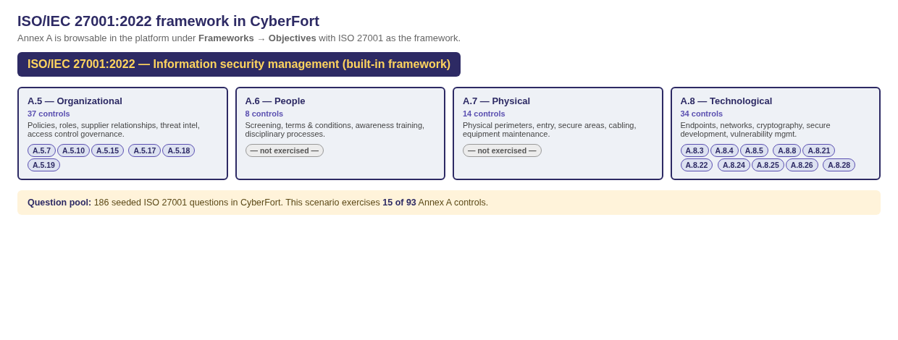

# Scenario 03 — ISO/IEC 27001:2022 control mapping

The bridge between the **nine seeded vulnerabilities in the NetLink Customer Portal** and the **ISO 27001 framework as represented in CyberFort**.

---

## How the ISO 27001 framework is structured in CyberFort

CyberFort ships ISO/IEC 27001:2022 as a built-in framework with **186 seeded questions** spanning Clauses 4–10 and all four Annex A themes.

This scenario exercises Annex A only; Clauses 4–10 (ISMS context, leadership, planning, support, operation, performance evaluation, improvement) are out of scope for a two-hour technical session. **The question texts quoted below are verbatim from the platform's ISO 27001 seed.**

---

## Findings, one card per finding

### Finding 1 — PostgreSQL exposed on customer subnet

**Where:** `docker-compose.yml` — `ports: ["5432:5432"]` binds the database to all interfaces.

**Detected by:** Nmap.

| Annex A control | Verbatim seeded question |
|------------------|---------------------------|
| **A.8.21** *(security of network services)* | Q149 — "Are networks, systems, and applications monitored for security threats and anomalous behavior?" |
| **A.8.22** *(segregation of networks)*       | Q149 — (same question; the seed treats network monitoring + segregation as one) |

---

### Finding 2 — SQL injection in customer search

**Where:** `api/src/routes/customers.js` — string concatenation into the SQL.

**Detected by:** ZAP + Semgrep.

| Annex A control | Verbatim seeded question |
|------------------|---------------------------|
| **A.8.28** *(secure coding)*                  | Q173 — "Are secure coding principles systematically applied in software development processes?" |
| **A.8.26** *(application security requirements)* | Q169 — "Are information security requirements systematically identified and approved for application development and acquisition?" |
| **A.8.25** *(secure development life cycle)*  | Q167 — "Are secure development rules established and systematically applied throughout the system development lifecycle?" |

---

### Finding 3 — IDOR on invoice download

**Where:** `api/src/routes/invoices.js` — fetches an invoice by id without verifying ownership.

**Detected by:** ZAP active scan + manual `curl`.

| Annex A control | Verbatim seeded question |
|------------------|---------------------------|
| **A.5.15** *(access control)*           | Q29 — "Are access control rules established based on business requirements and information security risk assessments?" |
| **A.8.3**  *(information access restriction)* | Q124 — "Do access restrictions align with user roles, business requirements, and information classification levels?" |

---

### Finding 4 — Session cookie without HttpOnly / Secure

**Where:** `api/src/routes/auth.js` — `res.cookie("token", token, { httpOnly: false })`.

**Detected by:** ZAP passive scan.

| Annex A control | Verbatim seeded question |
|------------------|---------------------------|
| **A.8.5** *(secure authentication)* | Q127 — "Are authentication technologies implemented based on risk assessment and access control requirements?" |

---

### Finding 5 — Hardcoded JWT signing secret in source

**Where:** `api/src/config.js` — `JWT_SECRET: "netlink-jwt-2024"`.

**Detected by:** Semgrep `hardcoded-jwt-secret`.

| Annex A control | Verbatim seeded question |
|------------------|---------------------------|
| **A.5.17** *(authentication information)* | Q33  — "Is authentication information managed through controlled processes with clear guidance provided to users?" |
| **A.8.4**  *(access to source code)*      | Q125 — "Is access to source code and development tools appropriately controlled and monitored?" |
| **A.8.24** *(use of cryptography)*        | Q165 — "Are cryptographic controls implemented with appropriate key management based on information protection requirements?" |

---

### Finding 6 — Hardcoded DB password and provisioning API key

**Where:** `api/src/config.js` — `DB_PASSWORD` and `PROVISIONING_API_KEY` as plain literals.

**Detected by:** Semgrep `hardcoded-password`.

| Annex A control | Verbatim seeded question |
|------------------|---------------------------|
| **A.5.17** *(authentication information)* | Q33  — "Is authentication information managed through controlled processes with clear guidance provided to users?" |
| **A.8.4**  *(access to source code)*      | Q125 — "Is access to source code and development tools appropriately controlled and monitored?" |

---

### Finding 7 — `/api/admin/diagnostics` echoes secrets

**Where:** `api/src/routes/admin.js` — diagnostics response body includes `db.password` and `provisioning_api_key`.

**Detected by:** Manual (after JWT forgery from Finding 5).

| Annex A control | Verbatim seeded question |
|------------------|---------------------------|
| **A.5.10** *(acceptable use of information)* | Q19  — "Are acceptable use policies documented, communicated, and consistently enforced across the organization?" |
| **A.8.3**  *(information access restriction)* | Q124 — "Do access restrictions align with user roles, business requirements, and information classification levels?" |

---

### Finding 8 — Outdated npm dependencies

**Where:** `api/package.json` — express 4.16.0, jsonwebtoken 8.5.0, lodash 4.17.20, ejs 3.1.5, body-parser 1.18.0, cookie-parser 1.4.5, pg 8.7.1.

**Detected by:** OSV.

| Annex A control | Verbatim seeded question |
|------------------|---------------------------|
| **A.5.7**  *(threat intelligence)*                          | Q12  — "Is threat intelligence and security guidance from special interest groups regularly reviewed and incorporated into security measures?" |
| **A.5.19** *(information security in supplier relationships)* | Q37  — "Are information security requirements systematically defined and implemented for supplier relationships?" |
| **A.8.8**  *(management of technical vulnerabilities)*       | Q133 — "Are technical vulnerabilities systematically identified, assessed, and remediated within appropriate timeframes?" |

---

### Finding 9 — Plaintext passwords in DB

**Where:** `db/init.sql` — `password` column is `VARCHAR(128)` and seeded with literal strings.

**Detected by:** Manual / SQLi data dump.

| Annex A control | Verbatim seeded question |
|------------------|---------------------------|
| **A.5.17** *(authentication information)* | Q34  — "Do users follow established procedures for protecting and managing their authentication information?" |
| **A.8.24** *(use of cryptography)*        | Q165 — "Are cryptographic controls implemented with appropriate key management based on information protection requirements?" |

---

## Annex A coverage matrix

<table class="cov">
<thead><tr><th>Annex A control</th><th>Title</th><th>Covered?</th><th>Trainee evidence</th></tr></thead>
<tbody>
<tr><td>A.5.7</td><td>Threat intelligence</td><td class="yes">✓</td><td>OSV scan</td></tr>
<tr><td>A.5.10</td><td>Acceptable use of information</td><td class="yes">✓</td><td>Diagnostics endpoint echoes secrets</td></tr>
<tr><td>A.5.15</td><td>Access control</td><td class="yes">✓</td><td>IDOR finding</td></tr>
<tr><td>A.5.17</td><td>Authentication information</td><td class="yes">✓</td><td>Hardcoded JWT secret + plaintext passwords</td></tr>
<tr><td>A.5.18</td><td>Access rights</td><td class="yes">✓</td><td>IDOR finding</td></tr>
<tr><td>A.5.19</td><td>Supplier relationships</td><td class="yes">✓</td><td>OSV finding</td></tr>
<tr><td>A.8.3</td><td>Information access restriction</td><td class="yes">✓</td><td>IDOR + diagnostics endpoint</td></tr>
<tr><td>A.8.4</td><td>Access to source code</td><td class="yes">✓</td><td>Hardcoded secrets readable from source</td></tr>
<tr><td>A.8.5</td><td>Secure authentication</td><td class="yes">✓</td><td>Cookie flags + plaintext passwords</td></tr>
<tr><td>A.8.8</td><td>Management of technical vulnerabilities</td><td class="yes">✓</td><td>OSV finding</td></tr>
<tr><td>A.8.21</td><td>Security of network services</td><td class="yes">✓</td><td>PostgreSQL exposed</td></tr>
<tr><td>A.8.22</td><td>Segregation of networks</td><td class="yes">✓</td><td>PostgreSQL exposed</td></tr>
<tr><td>A.8.24</td><td>Use of cryptography</td><td class="yes">✓</td><td>Weak JWT secret + plaintext passwords</td></tr>
<tr><td>A.8.25</td><td>Secure development life cycle</td><td class="yes">✓</td><td>Whole scenario answers "do you have one?"</td></tr>
<tr><td>A.8.26</td><td>Application security requirements</td><td class="yes">✓</td><td>SQL injection + IDOR</td></tr>
<tr><td>A.8.28</td><td>Secure coding</td><td class="yes">✓</td><td>SQL injection</td></tr>
<tr><td>A.6.*</td><td>People controls (8 controls)</td><td class="no">—</td><td>Out of scope — organisational</td></tr>
<tr><td>A.7.*</td><td>Physical controls (14 controls)</td><td class="no">—</td><td>Out of scope — physical site visits</td></tr>
</tbody>
</table>

**Coverage summary:** **16 of 93** Annex A controls exercised end-to-end through one product. This is intentionally broad so the trainee experiences how a single application audit drives the gap analysis for a non-trivial slice of the ISMS.

---

## What the trainee actually clicks (assessment flow)

1. **Assessments → + New Assessment** — Framework: `ISO 27001`, Assessment Type: `Conformity`, Scope: `Asset / Product → NetLink Customer Portal`.
2. **Click the new card** — the ~600-question questionnaire opens, paginated.
3. **For each of the ten target questions** in Step 7 of the handbook: pick `Yes` / `No` / `Partially` / `N/A`, write an Evidence Description, attach scan output, click **Save Answer**.
4. **Export PDF** from the toolbar — that PDF, combined with the Risk Register PDF, is the **gap report** an SME would attach to their Stage 1 audit pre-assessment file.

---

## Why this matters in the proposal context

NetLink is fictional but exactly the kind of SME the CYBERFORT proposal targets: a small ISP that has to demonstrate a credible ISMS to win enterprise customers (and increasingly to meet NIS2 essential-entity obligations for digital infrastructure providers). The scenario shows that a one-day CyberFort review can produce the gap report, the risk register, and the policy stubs that would otherwise take a consulting engagement of several weeks for an SME without an in-house security team.
