# Scenario 03 — NetLink ISP Customer Portal (Digital infrastructure)

## Trainee handbook

> ⏱ Estimated time: **2 hours** &middot; 🎯 Level: **Intermediate** &middot; 🌐 Sector: **Digital infrastructure (ISP / managed-service provider)**

---

## Scenario brief

You are a cybersecurity consultant engaged by **NetLink Telco**, a small Cypriot ISP serving SMEs across Limassol, Larnaca and Nicosia. The board wants to win larger enterprise contracts and has decided to pursue **ISO/IEC 27001:2022 certification** within twelve months.

Before booking the Stage 1 audit, NetLink's CTO has asked you to use **CyberFort** to perform a gap assessment of the customer self-service portal (the one customers use to log in, view bills, and manage their service). The portal — **NetLink Customer Portal v2.4.1** — is a Node.js + PostgreSQL application.

You have:

* A virtual machine running CyberFort (`https://<VM1-IP>:5173`), or access to the hosted reference instance at `https://access.cyber-fort.eu/login`.
* A virtual machine running the NetLink portal in Docker (`http://<VM2-IP>:3000`).
* Shell access to VM2; source under `/srv/netlink-scenario/.../api/`.

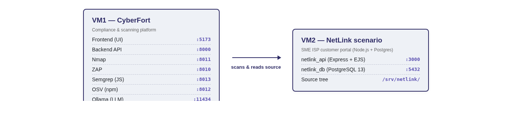

> ℹ️ The hosted reference instance cannot reach a private cyber-range subnet, so the scanner integrations cannot actively scan VM2. The walkthrough shows the **exact UI steps** for each scan — and where the scanner cannot reach your target, you **replicate** the finding by adding it manually to the Risk Register.

---

## Learning outcomes

1. Register the portal as a product in CyberFort.
2. Run an **Nmap** scan against the IT-shaped attack surface.
3. Run an **OWASP ZAP** scan against the web application.
4. Run a **Semgrep** SAST scan against the **Node.js** source and identify hardcoded secrets.
5. Run an **OSV** scan against `package.json` and identify advisories on popular npm packages.
6. Forge a JWT using a leaked signing secret — the showpiece of the scenario.
7. Map findings to **ISO/IEC 27001:2022 Annex A** controls.
8. Complete a **CyberFort ISO 27001 assessment** and export the gap report PDF.

---

## Step 0 — Verify the lab is up

```bash
cd /srv/netlink-scenario/03-netlink-isp-digital-infra
docker compose ps
curl -s http://localhost:3000/healthz
```

Two containers running (`netlink_api`, `netlink_db`) and `/healthz` returns `{"status":"ok"}`. Open `http://<VM2-IP>:3000/login`:

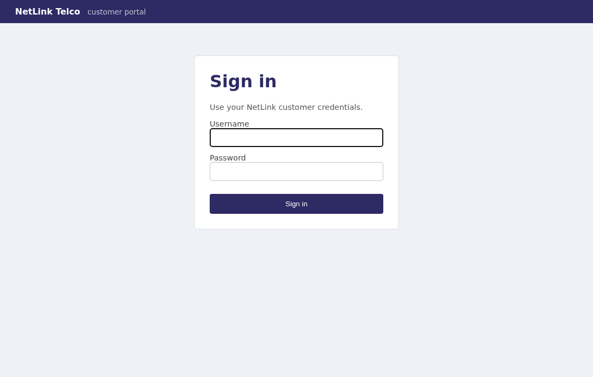

Log in as a regular customer with `bob` / `bobcustomer`:

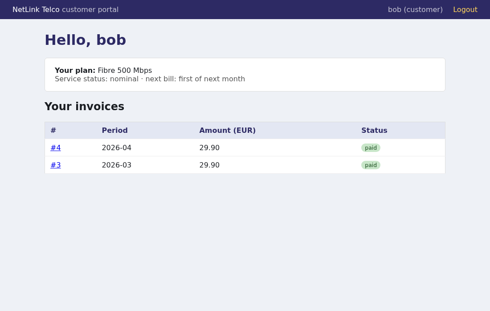

---

## Step 1 — Register the portal as a product

1. **Assets / Products → Manage Assets**.

   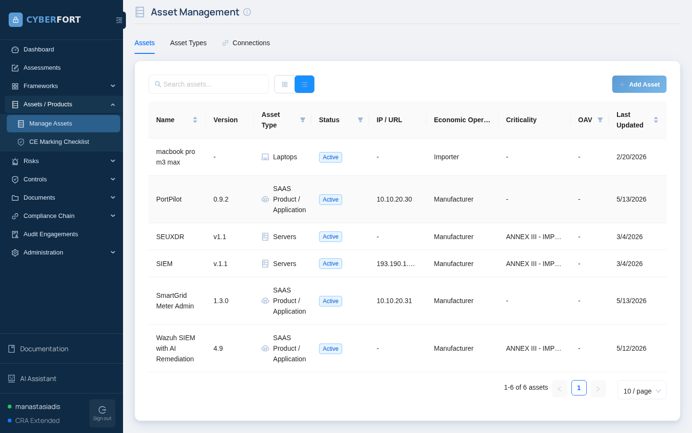

2. Click **+ Add Asset**.

   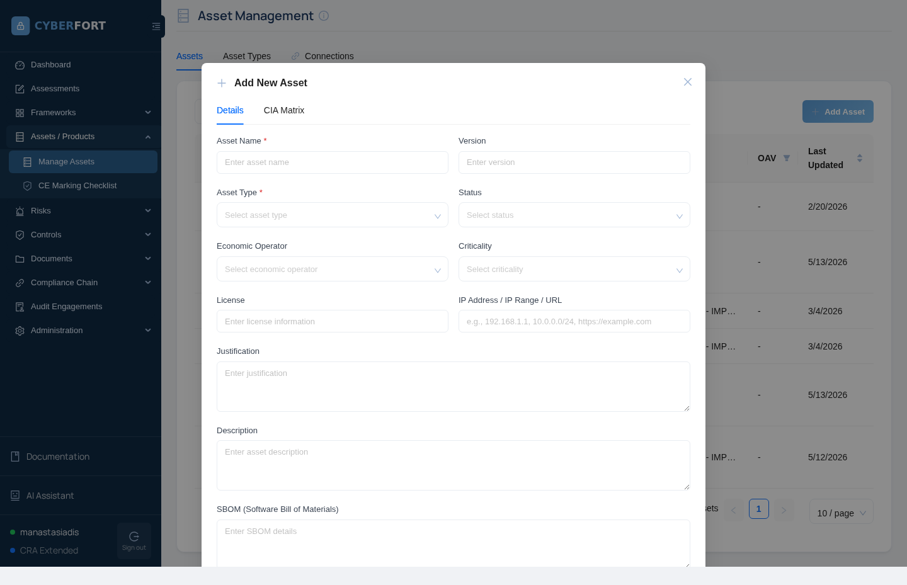

3. Fill in:
   * **Asset Name:** `NetLink Customer Portal`
   * **Version:** `2.4.1`
   * **Asset Type:** `SAAS Product / Application`
   * **Status:** `Active`
   * **Economic Operator:** `Manufacturer`
   * **Criticality:** High (the portal processes personal data + billing)
   * **IP Address / URL:** `<VM2-IP>` (e.g. `10.10.20.32`)
   * **Description:** "NetLink Customer Portal — Node.js Express + EJS + PostgreSQL portal for an SME ISP."

   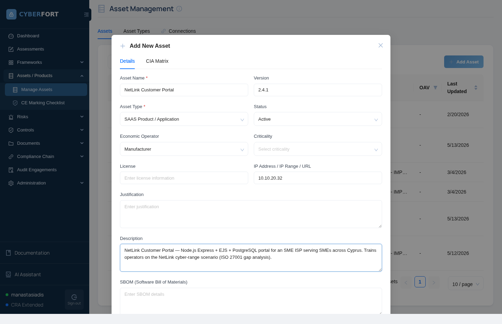

4. Click **Save**.

   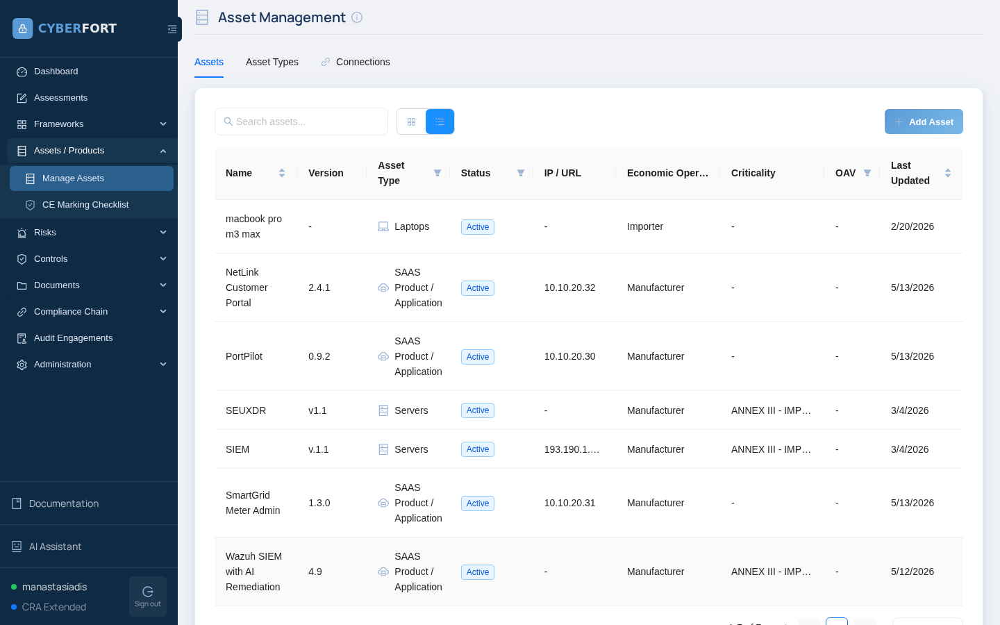

---

## Step 2 — Run an Nmap scan

1. **Security Tools → Security Scanners**, *Network Vulnerability* tab.
2. Target: `<VM2-IP>`. Scan Type: `Basic Scan - Top 1000 ports`.
3. **Run Scan**.


You should see:

| Port | Service     | Notes |
|------|-------------|-------|
| 3000 | http        | NetLink Customer Portal |
| 5432 | postgresql  | PostgreSQL 13 — **should not be reachable from the customer network** |

> 🛑 **Finding #1 — Database reachable from the customer-facing network.** Maps to ISO 27001:2022 **A.8.22 — Segregation of networks** and **A.8.21 — Security of network services**.

### Replicate the finding in the Risk Register

If the scanner couldn't reach your private target, open **Risks → Risk Register → Add New Risk**.


Fill it in with the JWT-forgery showpiece risk you will demonstrate in Step 5:

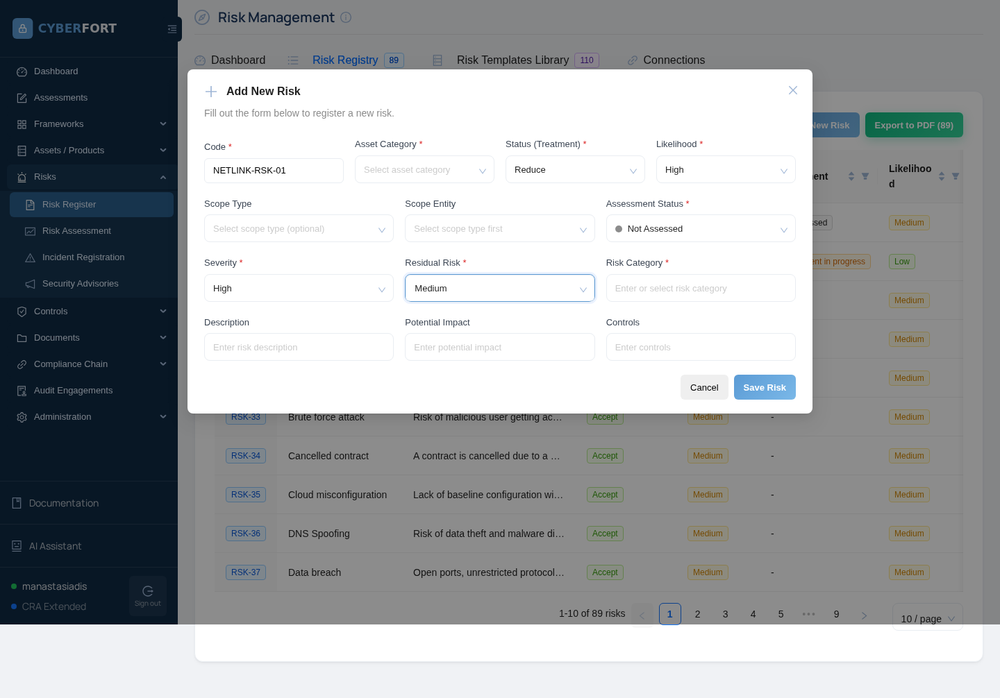

Click **Save Risk**.

---

## Step 3 — Run an OWASP ZAP active scan

1. **Security Tools → Security Scanners → Application Vulnerability** tab.
2. Target URL: `http://<VM2-IP>:3000`. Authenticated active scan; seed with `bob` / `bobcustomer`.

While ZAP runs, work through the three manual checks below — ZAP cannot easily find them on its own.

### 3a. SQL injection on `/api/customers/search`

Signed in as `bob`, open:

```
http://<VM2-IP>:3000/api/customers/search?q=%25%27%20UNION%20SELECT%20id%2C%20username%2C%20password%2C%20role%20FROM%20users%20--%20
```

The JSON response contains rows from the `customers` table **and** rows from the `users` table — usernames + plaintext passwords + roles:

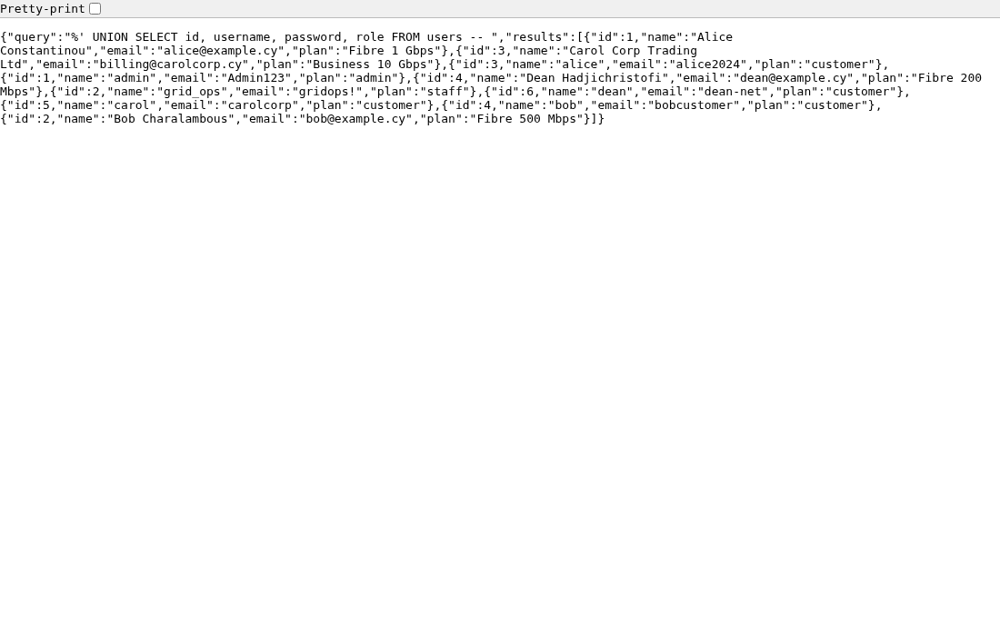

> 🛑 **Finding #2 — SQL injection in customer search.** Maps to ISO 27001:2022 **A.8.28 — Secure coding** and **A.8.26 — Application security requirements**.

### 3b. IDOR on `/api/invoices/:id`

Still signed in as `bob` (his own invoices are #3 and #4):

```bash
curl -b cookies.txt http://<VM2-IP>:3000/api/invoices/5
```

The response is invoice #5 — which belongs to **Carol Corp Trading Ltd**, a B2B customer with a 1,290 EUR monthly bill and a `CONFIDENTIAL: linked to fibre lease...` note:

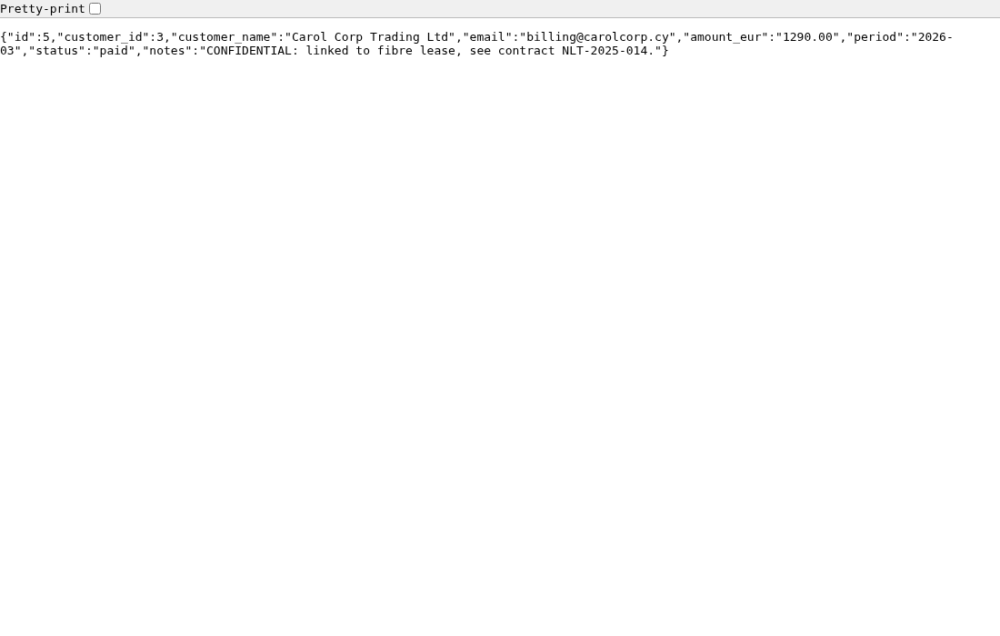

> 🛑 **Finding #3 — Insecure Direct Object Reference on invoice download.** Maps to ISO 27001:2022 **A.5.15** access control, **A.5.18** access rights, **A.8.3** information access restriction.

### 3c. Cookie hardening

Inspect the `token` cookie in DevTools after logging in. It is **not** marked `HttpOnly` and not `Secure`. Any XSS would steal it.

> 🛑 **Finding #4 — Session cookie missing `HttpOnly`/`Secure` flags.** ISO 27001 **A.8.5** secure authentication.

---

## Step 4 — Run a Semgrep SAST scan

```bash
cd /srv/netlink-scenario/03-netlink-isp-digital-infra
zip -r /tmp/netlink-src.zip api/
```

**Security Tools → Code Analysis**. Upload the ZIP.

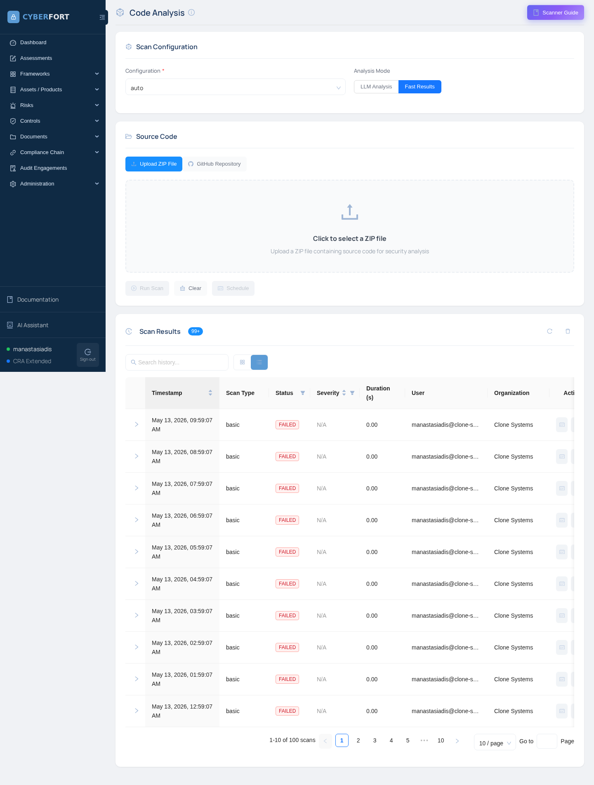

Expected findings:

| Severity | Rule                              | File                       |
|----------|-----------------------------------|----------------------------|
| **Critical** | `hardcoded-jwt-secret`        | `api/src/config.js`        |
| High     | `hardcoded-password`              | `api/src/config.js` (DB_PASSWORD, PROVISIONING_API_KEY) |
| High     | `sql-injection`                   | `api/src/routes/customers.js` |
| Medium   | `missing-jwt-options`             | `api/src/auth.js`           |

> 🛑 **Finding #5 — Hardcoded JWT signing secret in source.** Maps to **A.5.17**, **A.8.4**, **A.8.24**. Step 5 shows why this single finding is worse than it looks.

---

## Step 5 — Demonstrate the JWT forgery (the showpiece)

You read `src/config.js` and saw:

```js
JWT_SECRET: "netlink-jwt-2024",
```

That single string lets any reader of the source forge an admin JWT. From any machine, mint a token and hit `/api/admin/diagnostics`:

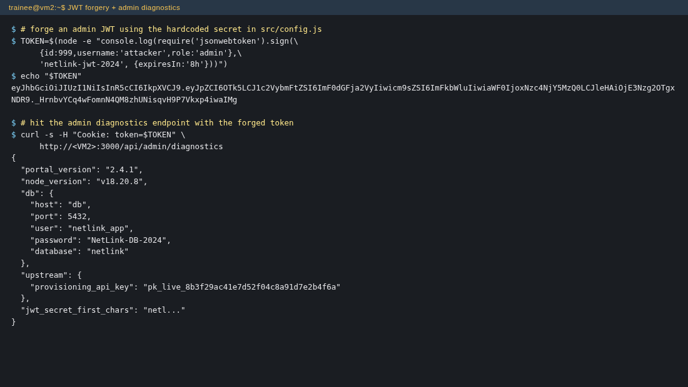

The diagnostics endpoint blesses any caller who can present an admin-role JWT — and the JWT secret is in the repo, so the chain is **leaked-source → forged-admin-token → plaintext DB password + provisioning API key**.

> 🛑 **Finding #6 — Privilege escalation chain via leaked JWT secret.** Maps to **A.5.17**, **A.8.5**, **A.5.10**. Add this to the risk register with Likelihood `High` / Impact `Critical`.

---

## Step 6 — Run an OSV dependency scan

**Security Tools → Dependency Check**. Upload `api/package.json` (or the same ZIP).

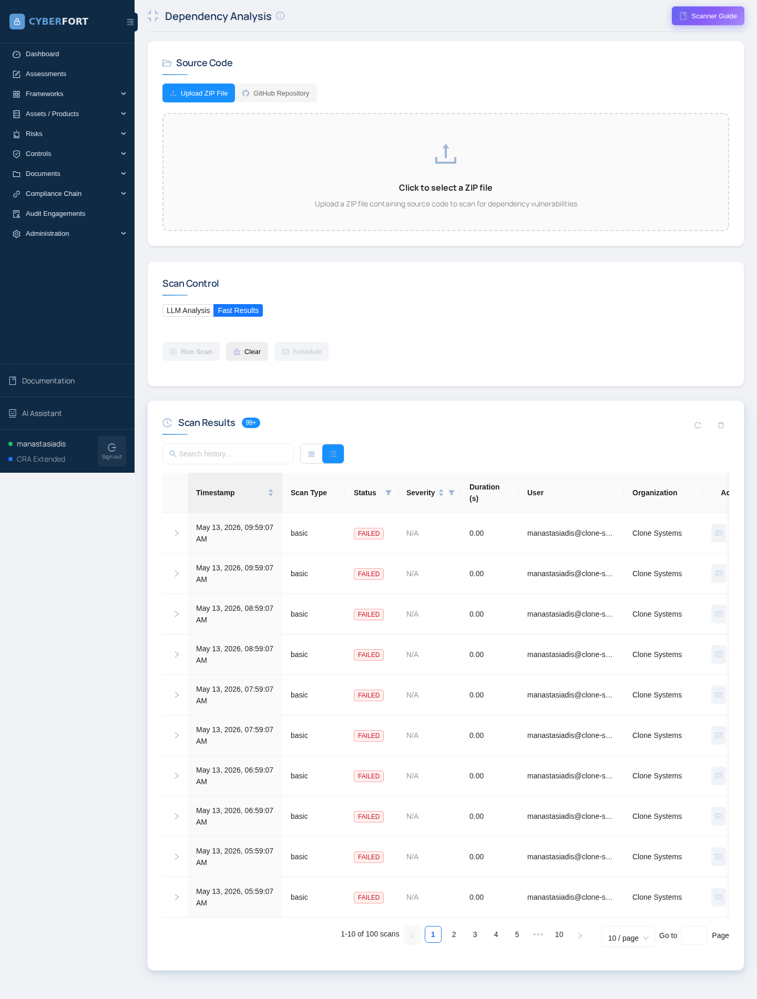

Expected advisories:

| Package         | Version  | Notable advisory |
|-----------------|----------|------------------|
| express         | 4.16.0   | GHSA-rv95-896h-c2vc (open redirect) |
| jsonwebtoken    | 8.5.0    | GHSA-qwph-4952-7xr6 (algorithm confusion) |
| lodash          | 4.17.20  | GHSA-35jh-r3h4-6jhm (prototype pollution) |
| ejs             | 3.1.5    | GHSA-phwq-j96m-2c2q (SSTI) |
| body-parser     | 1.18.0   | GHSA-qwcr-r2fm-qrc7 (DoS) |
| pg              | 8.7.1    | GHSA-x5ww-5r43-rmrf (pg-native RCE) |

> 🛑 **Finding #7 — Six dependencies with high-severity advisories.** Maps to **A.5.7**, **A.5.19**, **A.8.8**.

### Cross-check with Scan Findings

**Security Tools → Scan Findings** aggregates everything into one filterable table:

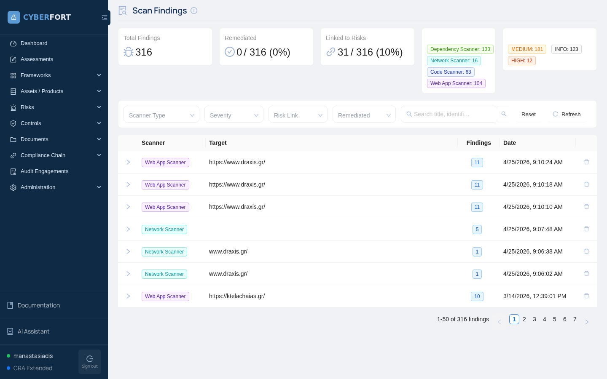

After filing the seven risks for NetLink, the **Risk Register** should look similar to this:


---

## Step 7 — Complete the ISO 27001 gap assessment

1. **Assessments → + New Assessment**.

   

2. Form fields:
   * **Framework:** `ISO 27001`
   * **Assessment Type:** `Conformity`
   * **Scope Type:** `Asset / Product`
   * **Asset / Product:** `NetLink Customer Portal`
   * **Assessment Name:** `NetLink ISO 27001 Gap`

   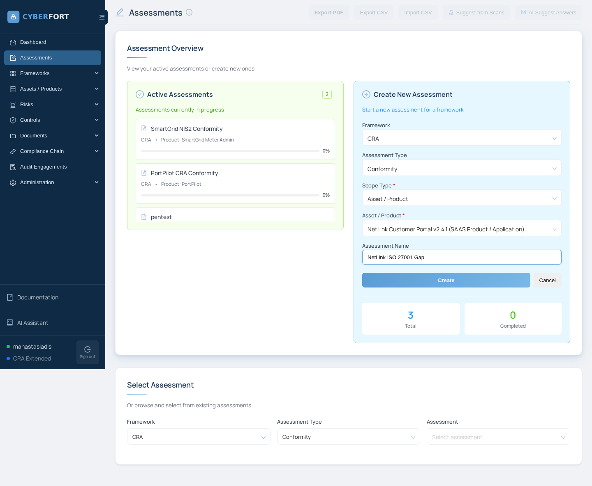

3. **Create**.

   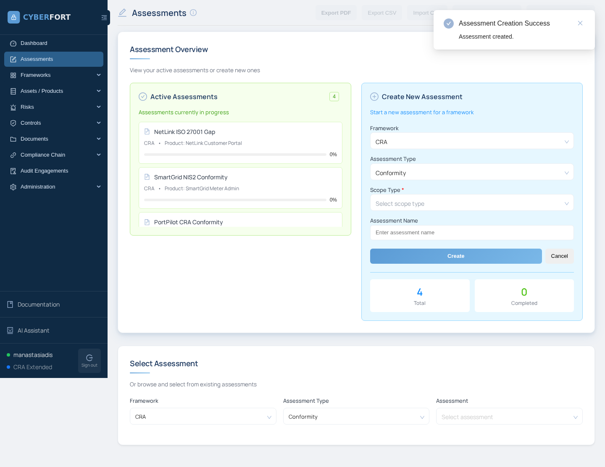

4. Click the new card. The ISO 27001 questionnaire opens — **186 questions paginated**. Focus on the ten below. **The text is exactly as you will see it in the CyberFort UI** (verbatim from the platform's ISO 27001 seeded question pool).

   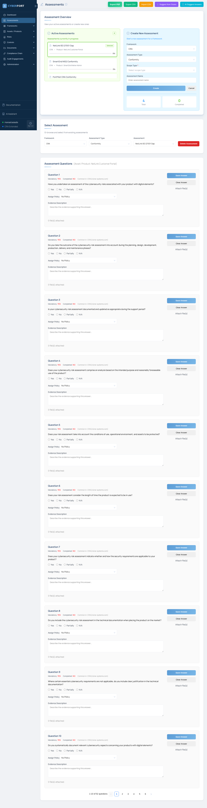

| # | Question (verbatim from the CyberFort ISO 27001 questionnaire) | Answer | Evidence |
|---|----------------------------------------------------------------|--------|----------|
| 1   | *"Are information security policies documented, approved by management, communicated to relevant personnel, and reviewed at planned intervals?"* | Not compliant | No portal-specific ISMS policy. |
| 19  | *"Are acceptable use policies documented, communicated, and consistently enforced across the organization?"* | Not compliant | `/api/admin/diagnostics` returning secrets in clear is an acceptable-use violation. |
| 29  | *"Are access control rules established based on business requirements and information security risk assessments?"* | Not compliant | IDOR finding shows no documented access-control model. |
| 33  | *"Is authentication information managed through controlled processes with clear guidance provided to users?"* | Not compliant | Plaintext passwords in DB; hardcoded JWT secret in source. |
| 125 | *"Is access to source code and development tools appropriately controlled and monitored?"* | Not compliant | JWT signing secret lives in the application repo, readable by every developer. |
| 127 | *"Are authentication technologies implemented based on risk assessment and access control requirements?"* | Not compliant | No MFA; cookie missing `HttpOnly`/`Secure`. |
| 133 | *"Are technical vulnerabilities systematically identified, assessed, and remediated within appropriate timeframes?"* | Not compliant | OSV finds six advisories; no SBOM; no remediation timeline. |
| 149 | *"Are networks, systems, and applications monitored for security threats and anomalous behavior?"* | Not compliant | PostgreSQL exposed on the customer-facing subnet; no monitoring. |
| 165 | *"Are cryptographic controls implemented with appropriate key management based on information protection requirements?"* | Not compliant | JWT signing secret hardcoded in source; DB password in source; no rotation. |
| 173 | *"Are secure coding principles systematically applied in software development processes?"* | Not compliant | SQL injection on `/api/customers/search` and string-concatenated SQL throughout. |

5. Attach the relevant scan output as evidence to each answer.
6. Save as **Draft**.

> 💡 Use the **AI assistant** at least twice — e.g. ask it to draft a remediation paragraph for the JWT secret finding, and a one-page management summary for the SQLi finding.

---

## Step 8 — Generate the ISO 27001 gap report

Click **Export PDF** in the Assessments toolbar. Combine with the Risk Register PDF (also `Export to PDF`) — this is the gap report you would hand NetLink's CTO and the Stage 1 auditor's pre-assessment file.

---

## Step 9 — Stretch goals

* Patch the SQL injection (parameterised queries) and rerun the ZAP active scan to confirm the alert clears.
* Use the **Policy** module to draft a *Secure Development Policy* and link it to ISO 27001 control **A.8.25**.
* Reset the JWT secret to a strong randomly-generated value loaded from an env var. Verify all forged tokens are rejected after restart.

---

## Checklist

* [ ] Portal registered as a product
* [ ] Nmap scan with PostgreSQL finding filed
* [ ] ZAP scan launched
* [ ] SQL injection verified manually
* [ ] IDOR verified — Bob read Carol Corp's invoice
* [ ] Semgrep finding for hardcoded JWT secret filed
* [ ] JWT forgery executed successfully against `/api/admin/diagnostics`
* [ ] OSV scan with at least three advisories filed
* [ ] ISO 27001 assessment answered against ten Step-7 questions
* [ ] Gap report PDF generated
