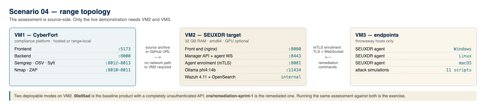

# Scenario 04 — Clone Systems SEUXDR (SIEM with AI remediation)

The **CYBERFORT pilot scenario**. Unlike scenarios 01–03, the target is not a deliberately vulnerable teaching app — it is **Clone Systems' own commercial product**, a self-hosted SIEM/XDR with LLM-driven automated remediation. A manufacturer's engineer uses CyberFort end-to-end to establish a **CRA baseline conformity position**, remediate against the backlog it produces, and re-assess.

The pilot ran as a **six-month engagement, February to July 2026**, and closed the loop:

| Phase | When | Position |
|-------|------|----------|
| Onboard — tenant, framework, first scans | February – June 2026 | framework in place |
| Baseline — 30 objectives graded against code | 22 – 29 July 2026 | **2 of 30 — 6.7%** |
| Remediate — sprint 1, 60 files, 8,261 lines | 30 July 2026 | Tier 0 closed |
| Re-assess — same objectives, new evidence | 30 July 2026 | **21 of 30 — 70.0%** |

Both figures were read from the live platform. The full record, including the nine objectives that did not reach compliant and why, is in [`docs/PILOT_TIMELINE.md`](docs/PILOT_TIMELINE.md). The deliverable is a real regulatory artefact, not a training exercise.

## What's in the box

```
04-clonesystems-seuxdr-siem/
├── README.md                            ← this file (deployment + pilot setup)
├── docs/
│   ├── TRAINEE_HANDBOOK.md              ← 2-hour trainee exercise, remediated product only
│   ├── PILOT_RUNBOOK.md                 ← the operator walkthrough, Steps 0–12
│   ├── CRA_CONFORMITY_MAPPING.md         ← product evidence → CRA objectives → the 52 conformity questions
│   ├── ASSESSOR_GUIDE.md                ← answer key, verification commands, review rubric
│   ├── REMEDIATION_BACKLOG.md           ← ranked gap → fix plan, with sprint 1 marked closed
│   ├── PILOT_TIMELINE.md                ← the 7% → 70% record: what changed and what moved
│   └── screenshots/                     ← platform captures + topology and CRA-hierarchy diagrams
├── presentation/
│   ├── 31072026_clone_systems_pilot.pptx ← the pilot review deck, on the CYBERFORT template
│   ├── 31072026_clone_systems_pilot.pdf
│   └── assets/                          ← retina screenshots used by the deck
└── range/                               ← cyber-range deployment kit
    ├── README.md                        ← modes, resource costs, the GPU problem
    ├── .env.example                     ← host IP, ports, which product ref to deploy
    ├── deploy.sh · verify.sh · reset.sh
    ├── fetch-source.sh                  ← builds the trainee's source archive at a ref
    └── docker-compose.range.yml
```

**Two audiences, two documents.** [`docs/PILOT_RUNBOOK.md`](docs/PILOT_RUNBOOK.md) is the manufacturer's own end-to-end pass — it establishes the baseline, remediates and re-assesses, and it produced the 7% → 70% record. [`docs/TRAINEE_HANDBOOK.md`](docs/TRAINEE_HANDBOOK.md) is a two-hour cyber-range exercise for a trainee acting as an **independent conformity assessor** against the **remediated product only**: they are told the manufacturer claims 70%, and asked to verify it and find the residual gaps. Assessing a product that mostly passes is the harder and more realistic skill, and it is the one a notified body actually performs.

The trainee needs the source, not the running stack — `range/fetch-source.sh` produces `seuxdr-3.4.0-<sha>-src.zip` at the remediated ref for upload to the three source-side scanners. Only Step 5 of the handbook, which tests the access-control claim with `curl`, needs a deployed target.



**Why there is no `docker-compose.yml` here.** Scenarios 01–03 ship one because the target *is* the scenario — a purpose-built vulnerable app that exists only for the exercise. Scenario 04's target is a shipping commercial product with its own repository, compose file and build. Vendoring a copy would fork the product and go stale on its first release, so `range/` fetches it at a pinned reference instead and adapts it for a range VM. See [`range/README.md`](range/README.md).

The kit deploys the target in either of **two modes**, which is what makes this scenario worth range time: `00a95ad` gives the baseline product with a completely unauthenticated API, and `cra/remediation-sprint-1` gives the remediated one. Trainees run the same CyberFort assessment against both and watch the objective statuses move, rather than taking the instructor's word for it.

The deck is reproducible. Screenshots are regenerated with `CF_USER=… CF_PASS=… python3 scripts/capture_s4_platform.py`, and the deck itself with `python3 scripts/build_pilot_deck.py [template.pptx]` — it rebuilds on the supplied CYBERFORT template so the branding, funding footer and layouts stay authoritative.

The product under assessment lives in its own repository and is **not vendored here**:

```
git@github.com:CyberGuardEU/t4.4_siem_ai_remediation.git
```

## Product under assessment

| Field | Value |
|-------|-------|
| Product | **SEUXDR** — also branded *CyberGuard* and *SECUR-EU SIEM* in the shipped UI |
| Manufacturer | Clone Systems, Inc. (Larnaka, CY) — **economic operator: manufacturer** |
| Release assessed | `main` @ `00a95ad`, agent `1.0.1`; registered in CyberFort as asset `SEUXDR` v3.4 |
| CRA classification | **Annex III — important products with digital elements, Class I → "Security information and event management (SIEM) systems"** |
| Stack | Go 1.23 (Gin, GORM, SQLite) manager + agent · React 19 / TypeScript 5.7 / Vite 6 / Ant Design 5 front end · Wazuh 4.11 + OpenSearch detection engine · Ollama `phi4:14b` for AI analysis |
| Agent platforms | Linux (journald + syslog), Windows (Event Log), macOS (Unified Logging) |
| Remediation actions | `BLOCK_IP` (iptables / netsh / pfctl) · `KILL_PROCESS` · `DELETE_FILE` |

> **Important — which build is assessed.** The repository ships the *authentication-stripped* variant. `CyberGuard_Stripped_Documentation.md` records "Stripped login and user authentication, stripped RBAC" on 2025-10-29, and the code confirms it: no auth middleware, no login route, no `users`/`roles`/`sessions` tables. The pilot assesses **what is in the repository**, which is why the baseline readiness score is low. The CRA-conformant target is the full SEUXDR build with JWT + RBAC restored. Do not read this scenario's findings as a statement about a hardened production deployment.

## Topology

* **VM1** — CyberFort. Hosted reference instance at `https://access.cyber-fort.eu` (`CRA Extended` tenant), or a range-local deployment on `:5173` / `:8000` with scanners on `:8010`–`:8013`.
* **VM2** — SEUXDR manager stack (`docker compose`): front end `:8080` (HTTPS), manager API + agent WebSocket `:8443` (TLS), agent enrolment `:8081` (mTLS), Ollama `:11434`. Requires **32 GB RAM**; a GPU is strongly recommended.
* **VM3** — one or more endpoint hosts running the SEUXDR agent, used to demonstrate detection and AI remediation with the bundled attack-simulation scripts.

CyberFort scans the product's **source archive** (Code Analysis, Dependency Check, SBOM Generator) rather than its running instance, so VM2 does not need to be reachable from VM1 for the core pilot. Network scanning of VM2 is optional and only possible on a range-local CyberFort.

## Deploy the product on VM2

```bash
cd 04-clonesystems-seuxdr-siem/range
cp .env.example .env && $EDITOR .env    # set RANGE_HOST_IP and RANGE_PRODUCT_REF
./deploy.sh                             # clone at the ref, certs, build, Wazuh install
./verify.sh                             # ports, containers, model, and which mode is live
```

`deploy.sh` handles the three things that otherwise break a range deployment: the product's compose hard-codes a developer's motherboard model as the container hostname, hard-codes `192.168.0.154` in `localhost.ext` and `manager/manager.yaml`, and declares a **mandatory NVIDIA device reservation** that makes `docker compose up` fail outright on a host without a GPU rather than falling back to CPU.

Budget **32 GB RAM, amd64, ~25 GB disk and 25–40 minutes** for a first bring-up. This is a far heavier target than scenarios 01–03. Or interactively, using the product's own installer:

```bash
cd /srv/seuxdr && ./setup-docker.sh      # interactive: host IP, ports, LLM mode, GPU
```

Manual path, if you prefer explicit control:

```bash
# edit IP.1 in localhost.ext and domain / IP_ADDRESSES in manager/manager.yaml first
sh gen-certs.sh
docker compose up --build -d
docker exec -it seuxdr-manager /usr/local/bin/startup.sh TEST
```

> **The web UI is unreachable as shipped.** The SPA gates every page behind a login that posts to `/api/login`, and that route does not exist in the stripped build. For the pilot, drive the manager through `SEUXDR_Manager_API.postman_collection.json` — every endpoint is unauthenticated, so the collection works as-is. That is also the cleanest way to *demonstrate* the access-control finding rather than merely assert it.

## Package the source for CyberFort

The three source-side scanners take a ZIP or a GitHub URL. Produce a clean archive:

```bash
cd /srv/seuxdr
zip -r /tmp/seuxdr-src.zip . \
  -x '*.git*' -x 'manager/manager' -x '*/node_modules/*' -x 'assets/*'
ls -lh /tmp/seuxdr-src.zip
```

Excluding `manager/manager` matters: a 35 MB unsigned prebuilt macOS binary is committed to the repository, and it is itself one of the pilot's findings (see `docs/REMEDIATION_BACKLOG.md`, GAP-19).

## Generate detection evidence on VM3

The product repository ships eleven attack-simulation scripts. They inject synthetic log entries into the host's native logging system — no packets leave the host and no real malware is created. Best single demonstration:

```bash
sudo ./test_quick_attacks.sh          # 18 events, 4 vectors, one source IP
sudo ./test_macos_process_threats.sh  # exercises KILL_PROCESS
sudo ./test_macos_malware_detection.sh # exercises DELETE_FILE
```

Windows equivalents are `test_rdp_enhanced.ps1`, `test_windows_malware.ps1` and `test_windows_network_intrusion.ps1` (run as Administrator).

Expect a **~60 second floor** before anything happens: alert polling is 30 s and the poller deliberately reads 30 s into the past to let Wazuh catch up. Nothing will execute automatically — `action_mode: "manual_only"` is the shipped default, and analyses land as `manual_action_required`. That default is a genuine strength and should be presented as one.

## What the pilot should surface

* **SBOM Generator (Syft)** — the product ships no SBOM. Generating one is the first Annex I Part II artefact the pilot creates.
* **Dependency Check (OSV)** — `go.mod` carries direct dependencies pinned to unreleased pseudo-versions and pre-module `+incompatible` releases from 2018–2021, including `gorilla/websocket v1.4.2`, which carries the remediation command channel. `manager_front/package.json` ships three faker libraries in production dependencies.
* **Code Analysis (Semgrep)** — a live Wazuh/OpenSearch admin credential committed in three tracked files; private keys written `0644`; storage and certificate directories created `0777`; enrolment secrets logged in cleartext.
* **Risk Register** — the four blocking findings: absent authentication, unauthenticated remote destructive actions, unvalidated LLM output reaching root-privileged commands, and the missing Annex I Part II apparatus.
* **CRA Technical File** — six guidance pages (SBOM, secure SDLC, security design, patch & support, vulnerability disclosure, dependency policy) that map one-to-one onto the documentation the product does not yet have.
* **EU Declaration of Conformity** — a live readiness score. The pilot's honest baseline is **7% — Not Yet Ready**, and that number is the point. (The score is tenant-aggregated across nine products; scoped to SEUXDR alone the baseline is 2 of 30 objectives compliant. After sprint 1 the widget reads 11% and SEUXDR's own objective compliance reads 70%.)

Full walkthrough in [`docs/PILOT_RUNBOOK.md`](docs/PILOT_RUNBOOK.md); mapping and answer key in [`docs/CRA_CONFORMITY_MAPPING.md`](docs/CRA_CONFORMITY_MAPPING.md) and [`docs/ASSESSOR_GUIDE.md`](docs/ASSESSOR_GUIDE.md).

## Safety

The product's remediation actions delete files, kill processes and rewrite host firewall rules as root. `DELETE_FILE` is an unrecoverable `rm -f` with no target validation, no quarantine and no restore. Run the pilot stack and its agents **only on throwaway hosts on an isolated network**, and leave `action_mode` at `manual_only` unless you are deliberately demonstrating the automatic path on a disposable endpoint.
