# Scenario 04 — Clone Systems SEUXDR

## Pilot runbook

> ⏱ Engagement span: **6 months** &middot; assessment pass: **1 working day** &middot; 🎯 Level: **Advanced** &middot; 🛡 Sector: **ICT security vendor (CRA manufacturer)**

> ℹ️ Steps 0–11 below are the assessment pass — one focused day. In the pilot they sat at the end of a six-month engagement that stood up the tenant, seeded the framework and built the control and policy library first. The dated record is in [`PILOT_TIMELINE.md`](PILOT_TIMELINE.md).

---

## Pilot brief

You are an engineer at **Clone Systems, Inc.** Your company builds **SEUXDR**, a self-hosted SIEM/XDR platform that collects security telemetry from Windows, Linux and macOS endpoint agents and uses a locally hosted LLM to generate and execute automated remediation actions — IP blocking, process termination and malicious-file quarantine.

SEUXDR is a **product with digital elements** placed on the EU market, and it is listed in **CRA Annex III as an important product, Class I**. Before the next release ships, the board needs to know one thing: *where do we actually stand against the Cyber Resilience Act, and what has to change before we can CE-mark this?*

Your job is to answer that using CyberFort, and to produce the evidence pack that backs the answer.

You have:

* A CyberFort tenant with **CRA mode enabled** (`https://access.cyber-fort.eu`, tenant `CRA Extended`).
* The SEUXDR source repository (`git@github.com:CyberGuardEU/t4.4_siem_ai_remediation.git`).
* A running SEUXDR stack on a throwaway host, plus one or more endpoint agents.
* The product's own attack-simulation scripts, to generate detection evidence.

This is **not** a training exercise against a seeded target. Every finding you file is real, and the readiness score you produce is the number Clone Systems will act on.

---

## Outcomes

By the end of the pilot you will have:

1. Determined and **justified** SEUXDR's CRA scope and product classification.
2. Registered the product with its full CRA metadata and seeded the CRA compliance chain.
3. Generated the product's **first SBOM** in a machine-readable format.
4. Run source-side dependency, SAST and (optionally) network scans against the real codebase.
5. Converted scanner output and manual findings into a **risk register** and published **VEX statements**.
6. Populated the **CRA Technical File** structure across all six required areas.
7. Completed the **52-question CRA conformity assessment** with evidence on every answer.
8. Set the **compliance status of all 30 CRA objectives** for the product scope.
9. Produced a **gap analysis** and read the compliance chain end to end.
10. Read a live **EU Declaration of Conformity readiness score** and worked the CE marking checklist.
11. Exported the complete readiness pack and a ranked remediation backlog.

---

## Step 0 — Access the platform and stand up the product

Sign in at `https://access.cyber-fort.eu/login`.

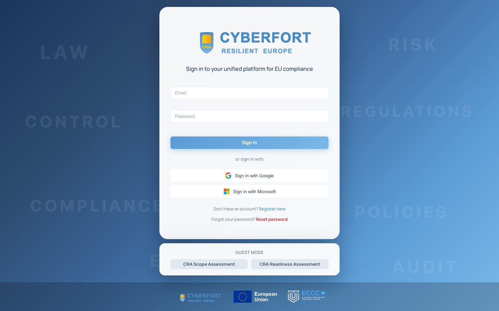

Note the two buttons below the sign-in form — **CRA Scope Assessment** and **CRA Readiness Assessment**. These are public, no-login tools; you will use the first one in Step 1.

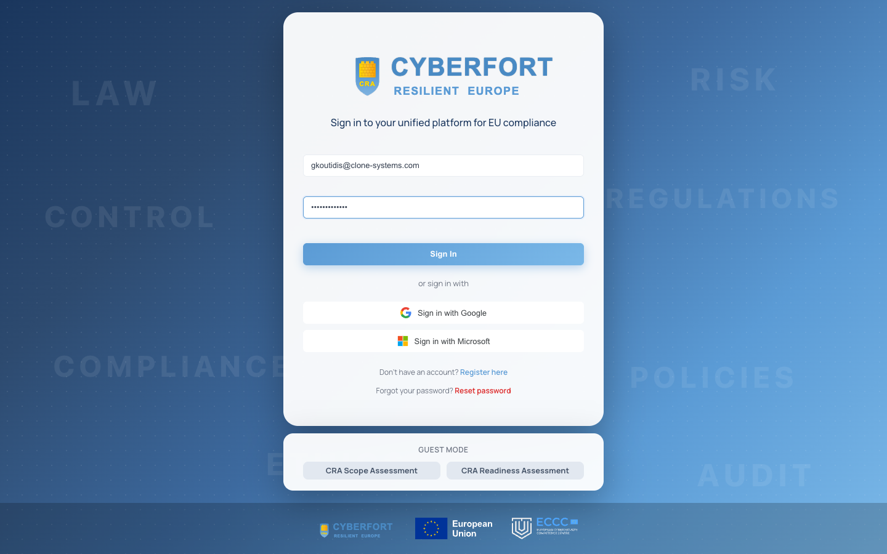

After signing in you land on the dashboard. The sidebar holds every module the pilot uses: **Assessments**, **Frameworks**, **Assets / Products**, **Risks**, **Controls**, **Documents**, **Compliance Chain** and **Security Tools**.


> 💡 The **CRA Start Example** tour card is a 15-minute condensed walkthrough for exactly this product class — *"CRA compliance for a SIEM with AI"*. Run it once before the pilot if you have never used the platform; this runbook is the full-depth version of the same journey.

Bring the product up on the target host, then package the source for the scanners:

```bash
cd /srv/seuxdr
docker compose ps                       # expect seuxdr-manager, frontend, ollama
zip -r /tmp/seuxdr-src.zip . -x '*.git*' -x 'manager/manager' -x '*/node_modules/*'
```

> ℹ️ The hosted reference instance cannot reach a private lab subnet, so **Security Scanners** (Nmap / ZAP) cannot actively scan your manager host from there. The three source-side tools — Code Analysis, Dependency Check and SBOM Generator — take a ZIP upload or a GitHub URL and work from anywhere, and they carry the bulk of this pilot. Where a network finding matters, you record it in the Risk Register manually; the platform treats both origins identically once a finding exists.

---

## Step 1 — Determine CRA scope and classify the product

### 1a. Run the public CRA Scope Assessment

From the login page, open **CRA Scope Assessment** and complete the three-step wizard: *Company Details* (Clone Systems, micro/small, CY, ICT security), *Product Details* (CRA category, product type `Software Only`, imports third-party components `yes`, expected lifecycle, contains open-source `yes`), and *Market Information* (EU member states, documentation languages, harmonised standards already applied).

The scope report tells you whether the product is in scope, its classification, and which conformity assessment procedures apply. For SEUXDR the answer is unambiguous and it is the most consequential output of the whole day:

> 🛑 **Finding #1 — Annex III Class I means self-assessment is not available.** SEUXDR is an important product with digital elements on three independent Annex III limbs: it *is* a SIEM system, it *is* an intrusion detection and prevention system, and it removes/quarantines malicious software. Article 32(2) therefore requires a notified-body route or the full application of harmonised standards. A Module A internal-control self-declaration is **not** a legal option. Every downstream plan has to be built around that.

### 1b. Register the product

Go to **Assets / Products → Manage Assets**.

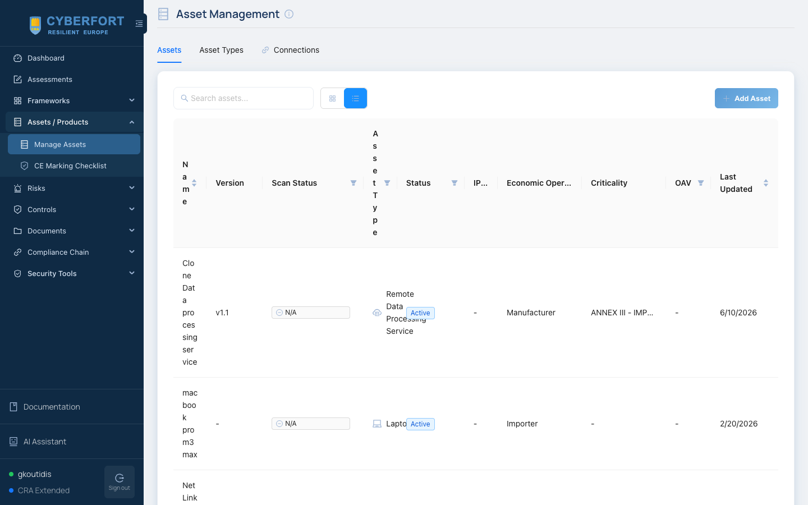

Click **+ Add Asset**. The modal opens on the *Details* tab, with a *CIA Matrix* tab alongside.

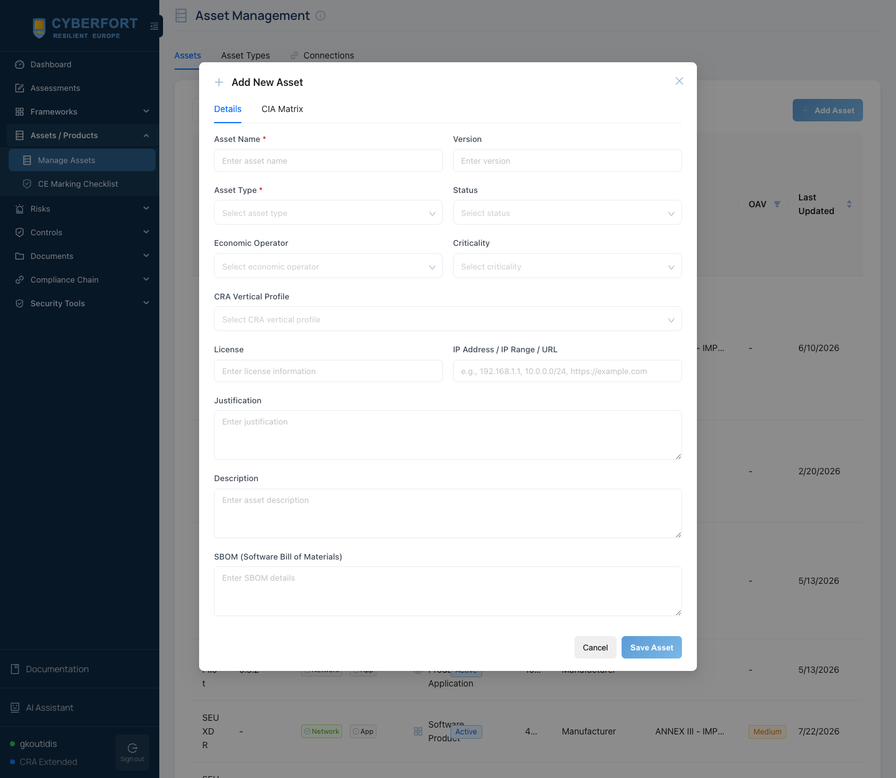

Fill it in with the product's real metadata:

* **Asset Name:** `SEUXDR`
* **Version:** `3.4`
* **Asset Type:** `Software Product`
* **Status:** `Active`
* **Economic Operator:** `Manufacturer`
* **Criticality:** `Security information and event management (SIEM) systems` — the option sits under the group header *ANNEX III – IMPORTANT PRODUCTS WITH DIGITAL ELEMENTS – Class I*
* **CRA Vertical Profile:** `Anti-Malware / Malware Detection Product` — the second Annex III limb, recorded so the classification argument is visible in the record
* **License:** `Proprietary — Clone Systems commercial licence, 5-year support term`
* **IP Address / URL:** the manager host
* **Justification:** *"Security information and event management (SIEM) system with automated AI-driven remediation. Listed in CRA Annex III as an important product with digital elements, Class I, therefore subject to Article 32(2) conformity assessment obligations."*
* **Description:** the product summary — collection over mTLS, local LLM, the three remediation actions, no third-party cloud
* **SBOM:** leave blank for now. You will come back after Step 3, and the fact that it starts blank is itself Finding #4.


Click **Save Asset**.

> 💡 The *Criticality* and *CRA Vertical Profile* fields only appear when CRA mode is enabled on the tenant. Setting them is what makes the CRA Technical File pages, the CE Marking Checklist and the DoC readiness score meaningful for this asset.

---

## Step 2 — Seed the CRA framework and its compliance chain

Go to **Frameworks → Configuration → Manage Frameworks** (this needs an organisation-admin role; ask your tenant admin if the menu is not visible).

Select `CRA` from the template dropdown, leave **Include pre-built chain links** enabled, and click **Add Selected Framework**.

Seeding does the heavy lifting that would otherwise be weeks of documentation work: it creates the CRA objective tree **and** auto-creates the connected library entities, fully wired together — risk templates, the *Baseline Controls* and *CRA Horizontal Controls* sets (codes like `CRA-SD-1`, `CRA-VH-1`), and policy documents seeded as `Draft` with body text pre-filled. You should see the confirmation *"Chain links (risks, controls, policies) were included."*

For the SEUXDR asset scope this produces **30 objectives across 6 chapters**: Chapter I (2), Chapter II (4), Chapter III (1), Chapter V (2), **ANNEX I (13)** and **Vulnerability Handling (8)**.

Verify the seed took by opening **Compliance Chain → All Links** with `CRA` selected. The header counts the entities the framework is wired to — in the pilot tenant that reads **45 risks, 98 controls, 48 policies and 330 objective links across 9 assets**. Those are the entities you spend the rest of the day reviewing rather than writing.

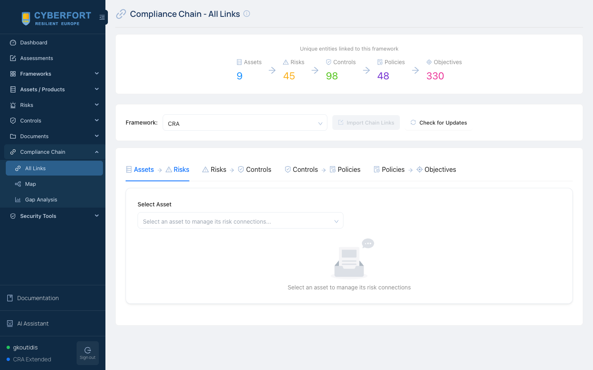

> 💡 Nothing below needs to be typed from scratch. The rest of the pilot is reviewing seeded entities and tuning them to SEUXDR's real exposure — which is the difference between a compliance programme you can start today and one you can start next quarter.

---

## Step 3 — Generate the product's first SBOM

Go to **Security Tools → SBOM Generator**. The generator wraps **Syft** and accepts a ZIP upload or a GitHub repository URL.

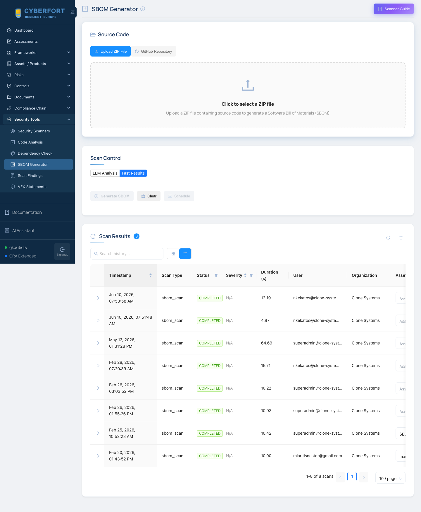

Upload `/tmp/seuxdr-src.zip` (or point it at the repository), then click **Generate SBOM**.

> 🛑 **Finding #2 — the product ships no SBOM.** There is no CycloneDX or SPDX artefact anywhere in the repository. The closest thing is `licenses/credits.txt`, a hand-maintained 26-entry list that still contains the template placeholder `<Include your full license text here>`, declares the product MIT-licensed while `readme.md:390` points at Apache-2.0, and omits nearly all ~100 indirect Go modules and **every** front-end dependency. CRA Annex I Part II(1) requires a component inventory covering at least top-level dependencies, in a commonly used machine-readable format. This is a hard blocker for questions 38, 39 and 40.

When the run finishes, go back to the asset record and paste the top-level component summary into the **SBOM** field. Then read **Documents → Technical File → SBOM Management** and note the six requirements the platform lists — format, top-level dependency listing, generation frequency, version tracking, machine-readable delivery, and an update policy. Generating the artefact satisfies the first two; the other four are process commitments you still owe.

---

## Step 4 — Scan the real codebase

### 4a. Dependency Check (OSV)

**Security Tools → Dependency Check**. Upload the ZIP or supply the GitHub URL; the tool reads `go.mod`, `package-lock.json` and equivalents. Choose `LLM Analysis` for richer remediation text.

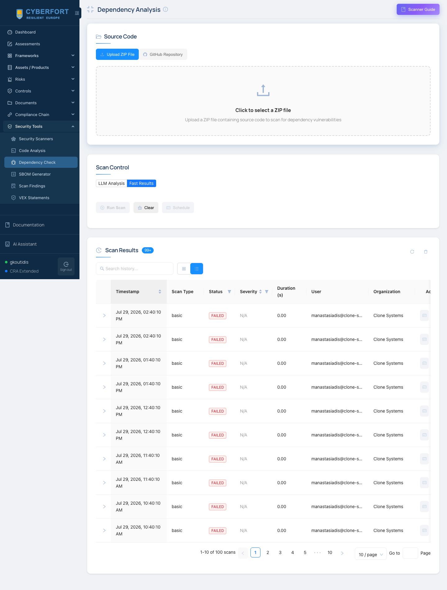

> 🛑 **Finding #3 — direct dependencies pinned to unreleased and pre-module versions, with no scanning to catch them.** `golang-migrate v3.5.4+incompatible` is a 2018 pre-modules release when upstream is v4.x. **`gorilla/websocket v1.4.2` is from 2020 — and it carries the remediation command channel.** `patrickmn/go-cache v2.1.0+incompatible` is 2019. `kardianos/service` and `tkanos/gonfig` are pinned to 2021 commits with no tagged release at all. `golang/mock` and `pkg/errors` are archived upstream. The front end ships **three faker libraries in production `dependencies`**, including the sabotaged `faker@6.6.6` and the name-squat `faker-js@1.0.0`. No base container image is digest-pinned, and two float on `latest`.

### 4b. Code Analysis (Semgrep)

**Security Tools → Code Analysis**. Same input options; pick `Use Default` or `Fast Results`.

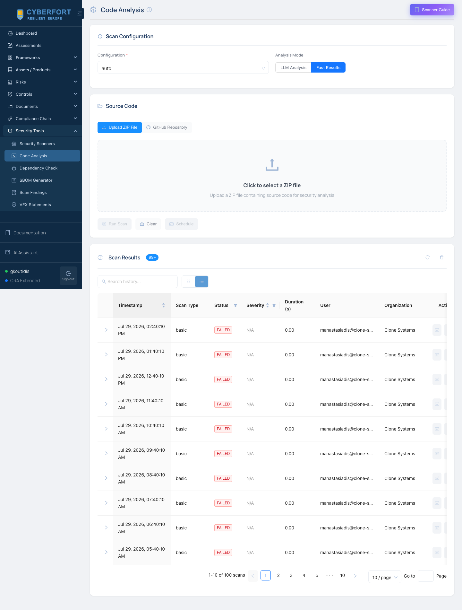

Expect these, and verify each by opening the file:

| Severity | Finding | Where |
|----------|---------|-------|
| Critical | Live Wazuh/OpenSearch admin credential committed | `main.go:176-177` + two integration tests |
| High | Missing authentication on all API routes | `manager/routes/routes.go:64-103` |
| High | Private keys written world-readable (`os.Create` → `0644`) | `manager/helpers/helpers.go:314-337,137-152` |
| High | Storage and certificate directories created `0777` (`os.ModePerm`) | `manager/main.go:36,53` |
| High | Enrolment API key and licence key logged in cleartext | `manager/handlers/agent_actions.go:62` |
| Medium | Endpoint log content written `0644` | `manager/api/websocketservice/logstore.go:36,72` |

> 🛑 **Finding #4 — a live credential is committed to the repository in three tracked files.** `admin` / `S1lMfWxh1HB6SbKg.9fmkoq.P5W+07M5`. Rotate it, then purge it from git history — a rotation without a history rewrite leaves the secret recoverable by anyone who has ever cloned.

> 🛑 **Finding #5 — the key that protects every agent key is stored unwrapped beside the keys it protects.** The group KEK RSA private key is generated at `manager/api/configurationservice/configuration_service.go:130`, serialised PKCS#8 at `:134` and saved to `groups.key_encryption_key` at `:142` — in an **unencrypted SQLite database**, in a `0777` directory. The per-agent AES keys in `agents.encryption_key` *are* RSA-OAEP wrapped, but with the KEK sitting next to them the wrapping provides no protection against file-level database theft.

### 4c. Security Scanners (Nmap / ZAP) — optional

**Security Tools → Security Scanners** has *Network Vulnerability* and *Application Vulnerability* tabs.

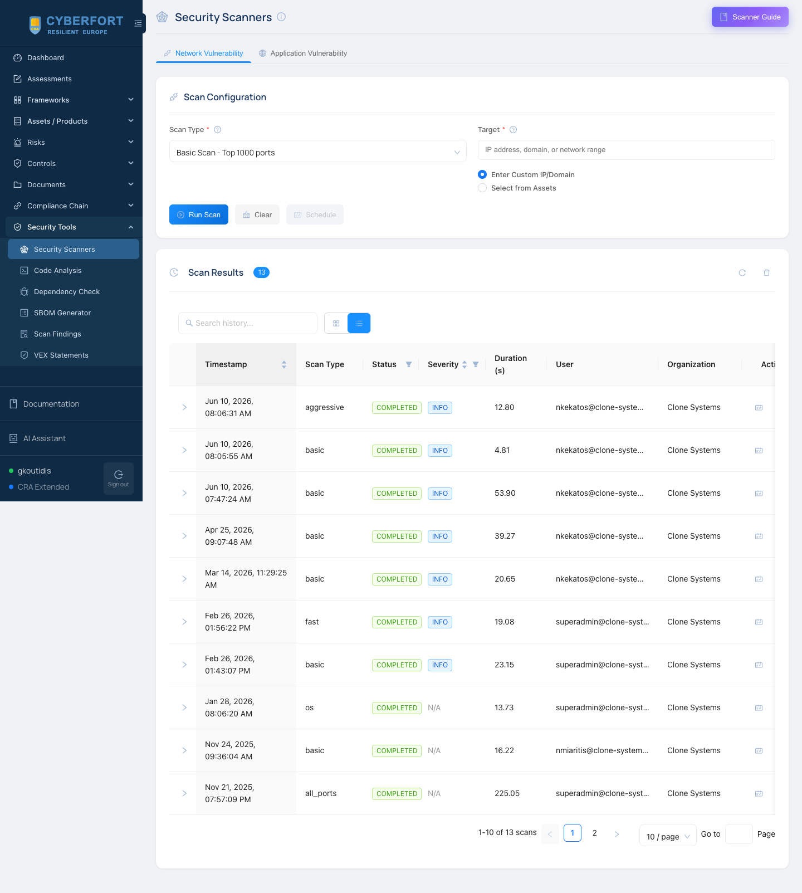

On a range-local CyberFort, scan the manager host. What matters is the exposure surface:

| Port | Service | Note |
|------|---------|------|
| 8080 | https | front end (unreachable as shipped — no login route exists) |
| 8443 | https | manager REST API + agent WebSocket — **entirely unauthenticated** |
| 8081 | mTLS | agent enrolment — properly protected |
| 11434 | http | **Ollama, unauthenticated, published to the host** despite an internal Docker network being defined |

> 🛑 **Finding #6 — unauthenticated remote file deletion, process termination and network blocking across the whole agent fleet.** `POST /api/agent/:agentId/execute-action` is registered with no authentication middleware (`manager/routes/routes.go:86`). The handler validates the action verb and nothing else (`manager/handlers/agent_actions.go:385-388`), then dispatches to the endpoint at `:454`, where the agent runs `rm -f "${FILEPATH}"` as root. Any party with TCP reach to port 8443 can delete any file, kill any process or firewall-block any IP on any connected agent — unrate-limited, and unattributed because no operator identity is recorded. It also bypasses the `manual_only` safety mode entirely, because the handler never reads `ACTION_MODE`. Demonstrate it with the product's own Postman collection, which declares `auth: None` on all 31 requests.

> 🛑 **Finding #7 — unvalidated LLM output becomes a root-privileged destructive command argument.** Model output flows unbroken from `manager/api/socanalystservice/react_service.go:318-320` to `rm -f` / `pkill -x` / `pfctl` on the endpoint. The **only** validation of the target is that it is non-empty (`:99-101` and `agent/monitoring/monitoring.go:463-467`). There is no IP validation, no path canonicalisation, no protected-path or protected-process denylist anywhere in the repository. Worse, attacker-controlled log text is interpolated raw into the prompt (`prompt_service.go:206`), so anyone who can write a log line — a crafted User-Agent, filename or SSH username — can influence which host action runs. The documented agent-side whitelist and timeout protect a **different, dead code path**.

---

## Step 5 — Triage findings into risks and VEX statements

### 5a. Review the aggregated findings

**Security Tools → Scan Findings** aggregates every scanner into one filterable table, with severity counts, remediation toggles and a **Link to Risk** action per finding.

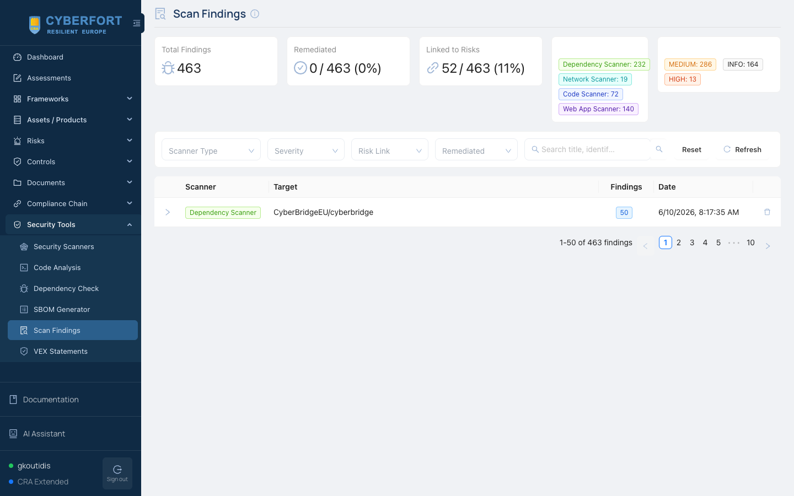

Work the table top-down. For each finding you intend to act on, expand it and click **Link to Risk** so the finding, the risk and the objective stay connected in the compliance chain.

### 5b. File the blocking risks

**Risks → Risk Register → Add New Risk**.

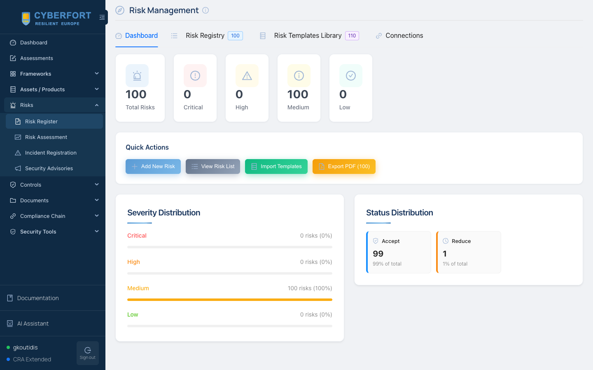

File at minimum these five, which are the ones that block market placement:

| Code | Risk | Likelihood | Severity | Residual | Objective |
|------|------|-----------|----------|----------|-----------|
| `SEUXDR-RSK-01` | Unauthenticated remote destructive action across the agent fleet | High | Critical | High | Annex I 3b, 2 |
| `SEUXDR-RSK-02` | No user authentication, authorisation or operator accountability | High | Critical | High | Annex I 3b |
| `SEUXDR-RSK-03` | Unvalidated LLM output executed as root; prompt injection unmitigated | Medium | Critical | High | Annex I 1, 3i |
| `SEUXDR-RSK-04` | No SBOM, no vulnerability disclosure policy, no CI or dependency scanning | High | High | High | VH-1 … VH-8 |
| `SEUXDR-RSK-05` | Committed live credential; plaintext KEK; world-readable keys and logs | Medium | High | Medium | Annex I 3a, 3c |

Also worth filing, because they will bite in the field: `BLOCK_IP` has no expiry and **no reachable `UNBLOCK_IP` path** (it is implemented agent-side but no manager code can emit it), `DELETE_FILE` has no quarantine or restore, and on macOS each new block **erases the previous one** because `seuxdr-firewall-macos.sh:44` replaces the whole pf anchor while the UI reports every block as completed.

### 5c. Publish VEX statements

**Security Tools → VEX Statements → New Statement**, then **Export CycloneDX VEX**.

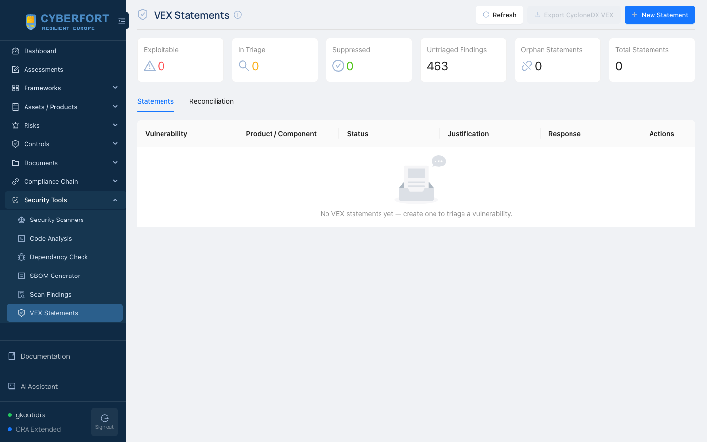

VEX is how you tell downstream users and market-surveillance authorities that a CVE in your SBOM is *not exploitable in your product* — the difference between an honest SBOM and an alarming one. For each significant advisory OSV raised against a transitive dependency, publish a statement with a status and a justification. This is one of the few Annex I Part II obligations you can discharge the same day.

---

## Step 6 — Populate the CRA Technical File

**Documents → Technical File** holds six guidance pages, each listing the numbered requirements the CRA expects you to document, with the governing Article or Recital cited alongside. Work them in order; each one maps directly onto documentation SEUXDR does not yet have.

| Page | What it requires | SEUXDR baseline |
|------|------------------|-----------------|
| **SBOM Management** | format, top-level dependencies, generation frequency, version tracking, machine-readable delivery, update policy | artefact created in Step 3; four process commitments still owed |
| **Secure SDLC Evidence** | code review, SAST/DAST integration, CI/CD security gates, pre-release checklist, dependency scanning SLAs, pen-test records | **nothing exists** — no CI configuration of any kind |
| **Security Design** | threat modelling (STRIDE/PASTA), attack-surface analysis, crypto and authentication decisions, data-flow diagrams, trust boundaries, security assumptions | **nothing exists** — no threat model in the repository |
| **Patch & Support Policy** | support-period declaration (**≥ 5 years** under the CRA), patch timelines by severity, SLAs, end-of-support policy, customer notification, emergency procedures | **no support period is declared anywhere** |
| **Vulnerability Disclosure** | security contact point, disclosure timeline, CVD process, triage workflow, **ENISA 24 h / 72 h reporting (Article 14)**, public advisory process | `readme.md:394` contains the literal empty placeholder `contact []` |
| **Dependency Policy** | acceptable licences, vulnerability thresholds, update cadence, approved/blocked components, transitive dependency management, supply-chain risk assessment | no policy; licence declaration is self-contradictory |

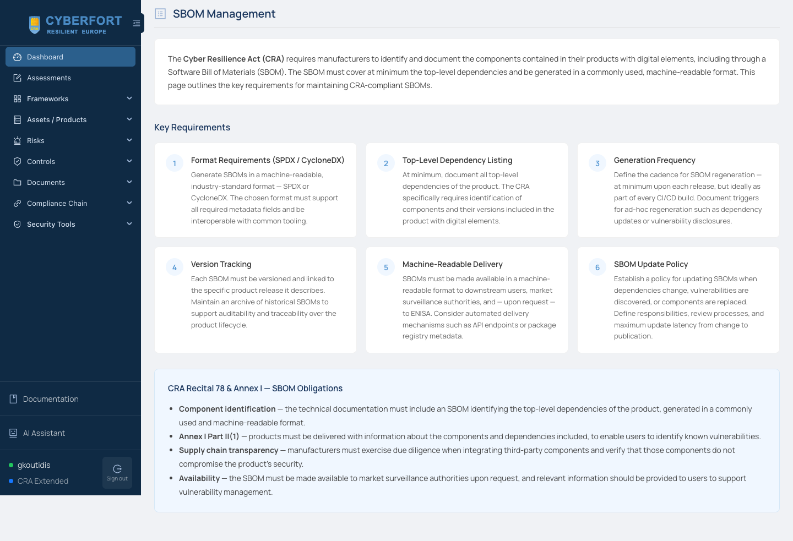

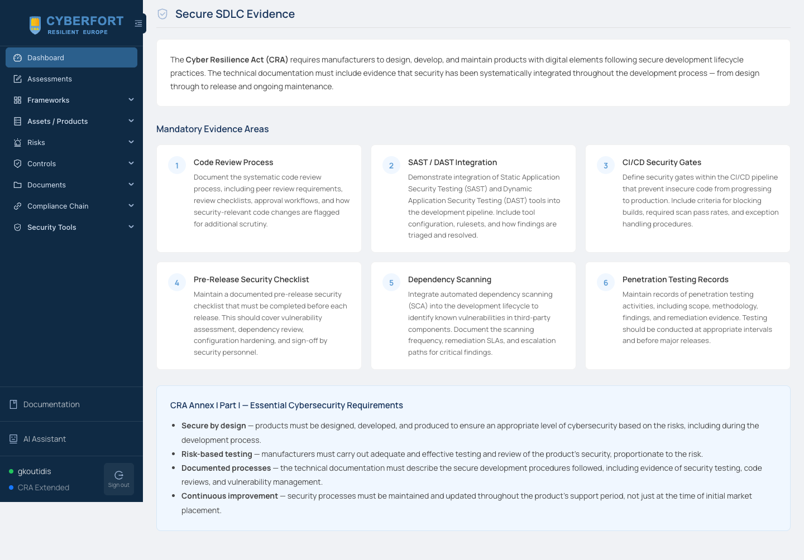

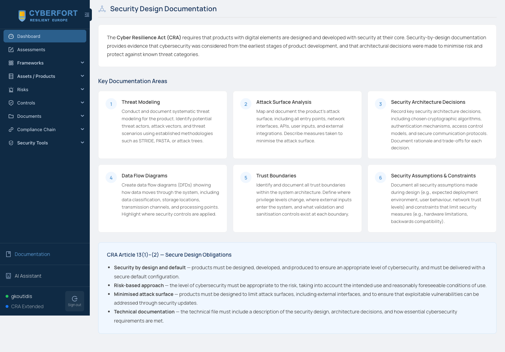

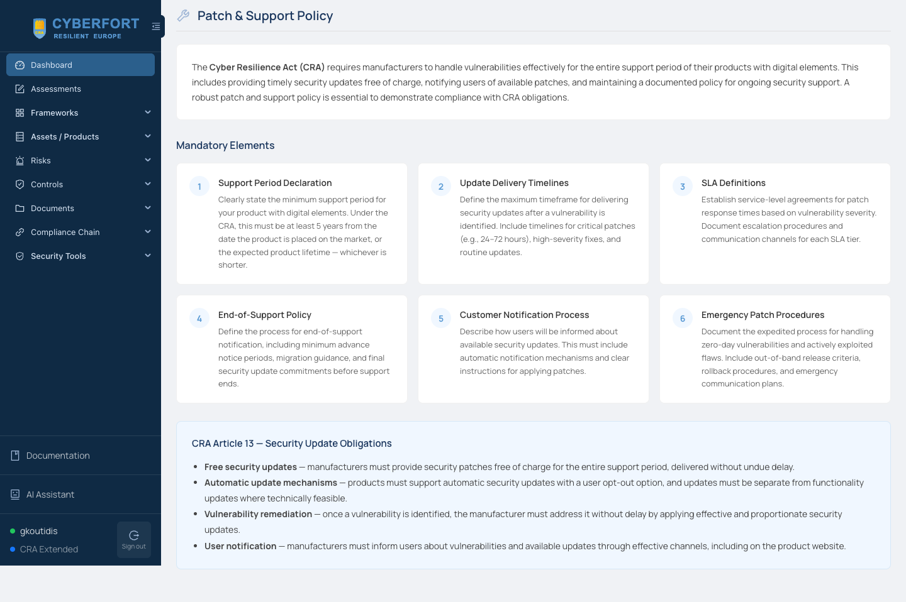


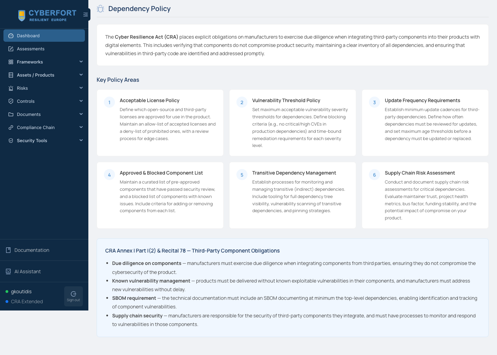

> 🛑 **Finding #8 — the entire Annex I Part II apparatus is absent.** No `SECURITY.md`, no security contact, no CVD policy, no advisory channel, no SBOM, no CI, no dependency scanning, no code signing, no changelog, and **no git tags at all** — eight unstructured commits on `main`. Six of the eight Vulnerability Handling objectives have no supporting artefact whatsoever. Note too that `CyberGuard_Stripped_Documentation.md:893` directs vulnerability reports to `github.com/SecureEU/seuxdr/issues`, which is **not the product's repository**.

Then upload the artefacts. **Documents → Evidence** is the library; it verifies document integrity so you can prove later that what an assessor reads is what you uploaded. There is also a **Generate via AI** action for drafting the policy documents you are missing.

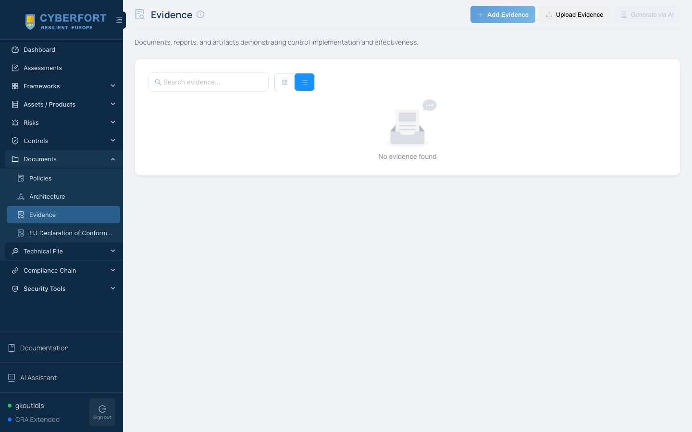

> 💡 Draft the six missing policies here rather than in a word processor. Seeded policy templates already exist from Step 2 — *Vulnerability Management Policy*, *Patch Management Policy*, *Software Development Lifecycle Policy* — several already `Approved`. Reviewing and adopting a seeded policy takes minutes; writing one from a blank page takes a week.

---

## Step 7 — Complete the CRA conformity assessment

**Assessments → + New Assessment**: Framework `CRA`, Assessment Type `Conformity`, Scope Type `Asset / Product`, Asset `SEUXDR`, Name `SEUXDR CRA Conformity Assessment`. Click **Create**.

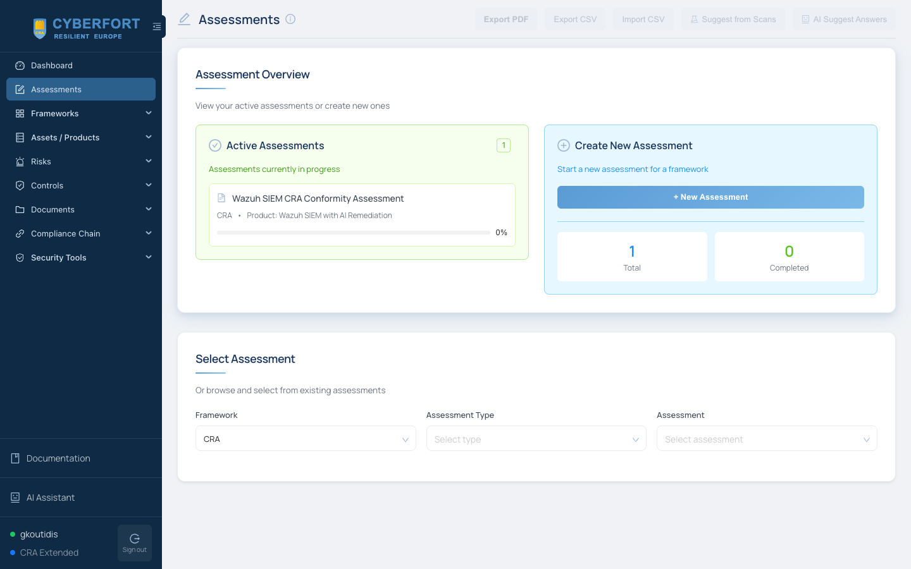

Click the new card under *Active Assessments*. The questionnaire opens with **52 conformity questions**, paginated 10 per page. Each shows `Mandatory: YES`, a `Completed` flag, the four answer radios, an **Assign Policy** selector, an **Evidence Description** box and **Attach File(s)**.

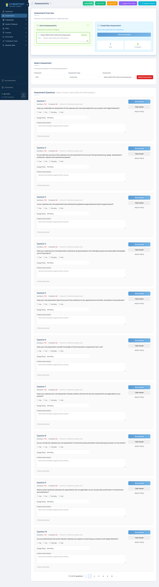

Answer all 52. The recommended baseline answer, governing objective and evidence for every question is tabulated in [`CRA_CONFORMITY_MAPPING.md`](CRA_CONFORMITY_MAPPING.md) — work straight down that table. The honest baseline is **2 Yes, 19 Partially, 31 No**.

Two answers deserve particular care, because they are the ones a notified body will read first:

* **Q29** *"Do you protect the availability of essential and basic functions, also after an incident?"* → **Yes**. The failed-alert queue with exponential backoff, the dead-letter queue and resume-after-restart state tracking are genuinely well built. Attach the migration and the state-resume code.
* **Q34** *"Do you provide security-related information by recording and monitoring relevant internal activity?"* → **Yes**. Structured JSON logging with request correlation IDs, and a full persisted AI reasoning trail including `react_history`. For an AI-driven product this explainability record is better than typical for the class.

> 💡 Use **Suggest from Scans** and **AI Suggest Answers** in the toolbar on Q13, Q38 and Q39 — the OSV and SBOM Generator output feeds them directly. Demonstrating that scanner results pre-populate conformity answers is one of the platform capabilities the pilot exists to show.

> ⚠️ Resist the temptation to answer *Partially* where the honest answer is *No*. The readiness score is not a grade; it is the input to a remediation plan and, eventually, a document a market-surveillance authority can request for ten years after placement. An inflated baseline produces a plan that does not fix the right things.

---

## Step 8 — Set the compliance status of all 30 objectives

**Frameworks → Objectives**. Select Framework `CRA`, Scope Type `Asset / Product`, and `SEUXDR (Software Product)`.


Each objective row carries its **Requirement Description**, the seeded **Objective Utilities** (the documents that would satisfy it), the **Policies** actually linked with their approval state, an **Upload** action for evidence, and a **Compliance Status** selector.

Set all 30 per the coverage matrix in the mapping document. The summary position:

| Status | Count | Objectives |
|--------|-------|-----------|
| **Compliant** | 2 | Annex I `3f` (availability/resilience), `3j` (security logging) |
| **Partially compliant** | 10 | Annex I `3a`, `3c`, `3d`, `3g`, `3h`, `3i`, `3k` &middot; VH-7 &middot; Chapter I (2 objectives) |
| **Not compliant** | 18 | Annex I `1`, `2`, `3b`, `3e` &middot; VH-1 … VH-6, VH-8 &middot; Chapters II, III, V |

Upload evidence against every objective as you go — the gap analysis in the next step reports *objectives without evidence* as a distinct gap category, and at baseline that number is the entire tree.

> 💡 **AI Auto-select** proposes statuses for objectives you have left unassessed, based on the linked policies and answered questions. Use it, then check each proposal against the code before accepting it. It is a drafting aid, not an assessor.

---

## Step 9 — Gap analysis and the compliance chain

**Compliance Chain → Gap Analysis**, framework `CRA`.


The dashboard gives you the overall compliance score, an objective status breakdown, evidence coverage, policy coverage (count by status, approved percentage, objective-policy linkage), assessment progress with the unanswered-question count, a chapter-by-chapter breakdown table, and three explicit gap lists: **objectives without evidence**, **objectives marked not compliant**, and **objectives without linked policies**. Click **Export PDF**.

Then read the chain itself. **Compliance Chain → Map** renders every relationship between assets, risks, controls, policies, objectives and incidents as an interactive graph; **All Links** is the same data as a searchable table.

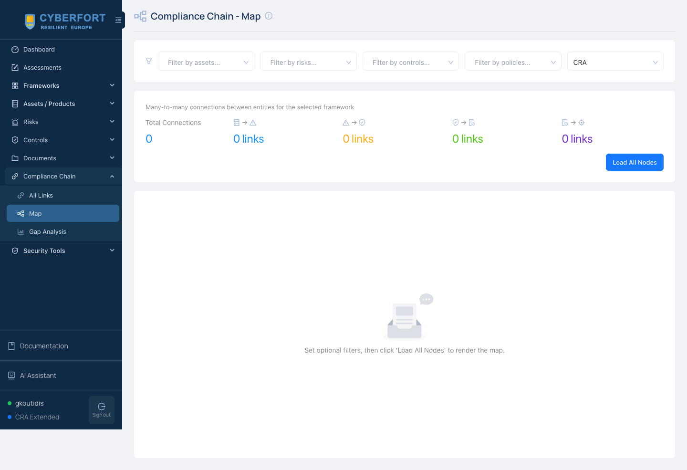


Trace `SEUXDR-RSK-01` from the risk, through the controls that mitigate it, to the policies that govern it, to the CRA objectives it maps to. That traceability is what turns a pile of scan output into a technical file — and the places where the graph has no edges are exactly what the gap analysis is reporting.

---

## Step 10 — DoC readiness and the CE marking checklist

**Documents → EU Declaration of Conformity**.

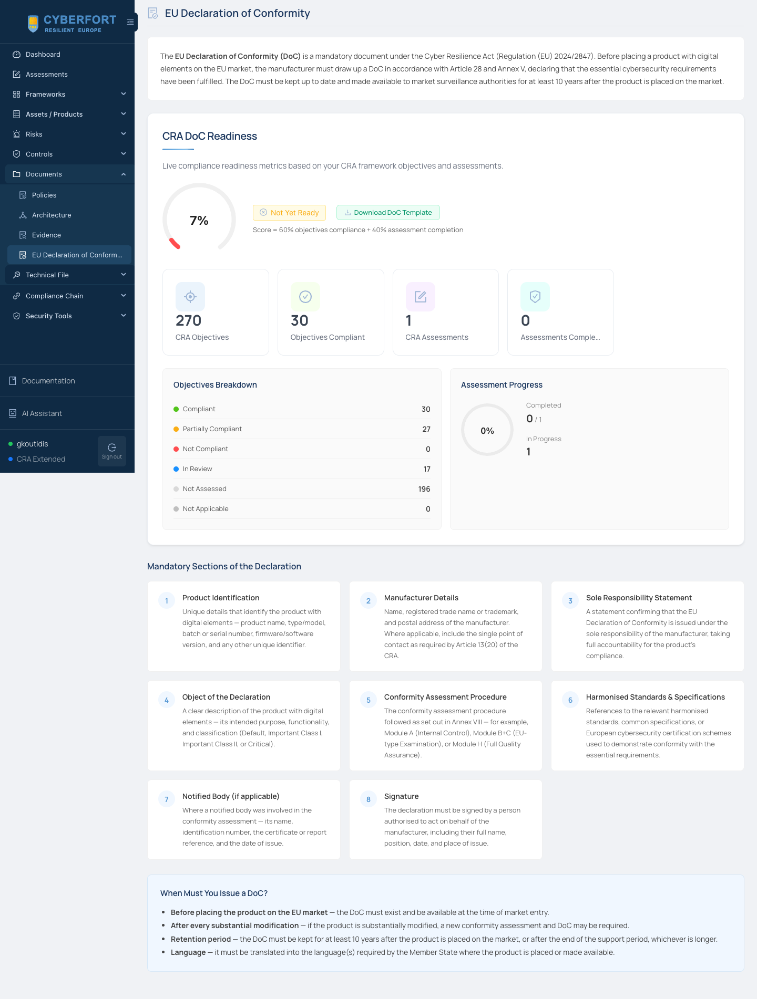

The page states the obligation plainly: under Article 28 and Annex V the manufacturer must draw up a DoC before placing the product on the market, keep it current, and make it available to market-surveillance authorities for **at least 10 years**. It then scores your live readiness — **60% objective compliance plus 40% assessment completion** — and tracks all eight mandatory declaration sections: product identification, manufacturer details, sole-responsibility statement, object of the declaration, conformity assessment procedure, harmonised standards, notified body, and signature.

> 🛑 **Finding #9 — the honest baseline is 7%, "Not Yet Ready".** That number is the pilot's headline result, and it is the right one to report. It is not a failure of the assessment; it is the assessment working. Be precise about what it measures: the score aggregates across every product in the tenant (270 CRA objectives, 30 compliant, 1 assessment, 0 completed). Scoped to SEUXDR alone the position is 2 of 30 objectives compliant with the assessment unstarted. Two further gaps show up here specifically: the *Conformity Assessment Procedure* section cannot be completed because no notified body has been engaged (Finding #1), and *Product Identification* is weaker than it looks — the agent declares `1.0.1`, the front end declares `0.0.0`, and **the manager has no version identifier anywhere**, so there is no single product version to declare.

Finish at **Assets / Products → CE Marking Checklist**. Create a checklist for SEUXDR and work the Items tab; the Documentation Status tab tracks each supporting document CE marking requires.

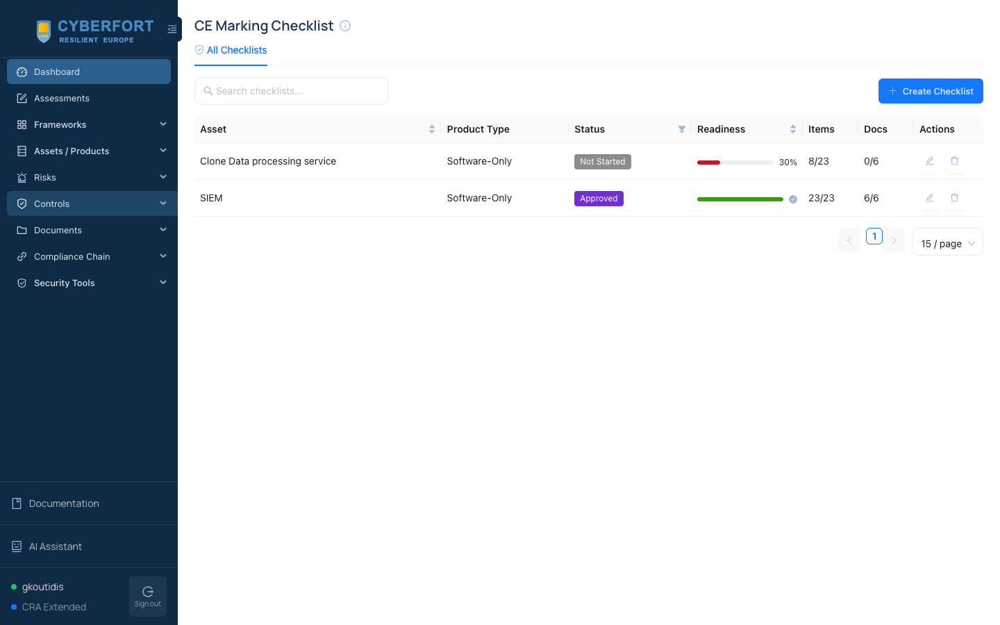

---

## Step 11 — Export the readiness pack

Export each of these and keep them together — this set is the pilot deliverable:

1. **Conformity assessment PDF** — Assessments toolbar → *Export PDF* (also *Export CSV* for the working spreadsheet).
2. **Objectives checklist PDF** — Frameworks → Objectives → *Export PDF*.
3. **Gap analysis PDF** — Compliance Chain → Gap Analysis → *Export PDF*.
4. **Risk register PDF** — Risks → Risk Register → *Export PDF*.
5. **SBOM** — Security Tools → SBOM Generator, machine-readable.
6. **CycloneDX VEX** — Security Tools → VEX Statements → *Export CycloneDX VEX*.
7. **Policy pack PDF** — Documents → Policies → *Export to PDF*.

Together these are the **Annex V technical documentation skeleton** and the input to the Article 28 Declaration of Conformity. Hand them to the board with the ranked backlog in [`REMEDIATION_BACKLOG.md`](REMEDIATION_BACKLOG.md).

---

## Step 12 — Demonstrate the product's own capability (optional but recommended)

The pilot has been assessing SEUXDR against the CRA. It is worth also showing what the product *does*, because several Annex I claims rest on it. On a throwaway endpoint:

```bash
sudo ./test_quick_attacks.sh     # 18 events, 4 vectors, one source IP
```

Watch the alert reach the manager, the LLM produce an analysis with its full reasoning chain, and the recommended action land as `manual_action_required`. That single screen is the evidence for Q34 (security-relevant information recording), Q29 (availability after an incident) and Claim 7 (secure-by-default AI safety posture) all at once.

Expect a **~60 second floor** — alert polling is 30 s and the poller reads 30 s into the past to let Wazuh catch up. On CPU-only hardware the analysis will likely time out: the configured 360 s budget is overridden by a hard-coded 60 s context at `manager/api/messageprocessor/message_processor.go:1065`. **Use a GPU host for the demonstration.**

> ⚠️ Leave `action_mode` at `manual_only`. Switching to `automatic` to show end-to-end auto-remediation is only safe on a disposable endpoint, given Finding #7 — and remember that `manager/config/config.go:384-386` **defaults to `automatic` when the key is unset**, which the shipped `manager/test.yaml` profile does.

---

## Checklist

Tick these off before declaring the pilot complete.

* [ ] CRA Scope Assessment run; Annex III Class I classification justified and recorded
* [ ] SEUXDR registered with Criticality, CRA Vertical Profile, Economic Operator and justification
* [ ] CRA framework seeded with chain links; 30 objectives visible in the asset scope
* [ ] SBOM generated and attached to the asset record
* [ ] Dependency Check, Code Analysis run against the real source
* [ ] Findings triaged in Scan Findings and linked to risks
* [ ] Five blocking risks filed in the Risk Register
* [ ] VEX statements published and exported as CycloneDX
* [ ] All six CRA Technical File areas reviewed; evidence uploaded to the Evidence Library
* [ ] All 52 conformity questions answered with evidence descriptions and attachments
* [ ] All 30 objectives given a compliance status with evidence
* [ ] Gap analysis exported; compliance chain traced for at least one risk end to end
* [ ] DoC readiness score recorded; CE Marking Checklist created
* [ ] Seven-document readiness pack exported
* [ ] Remediation backlog ranked and presented to the board
