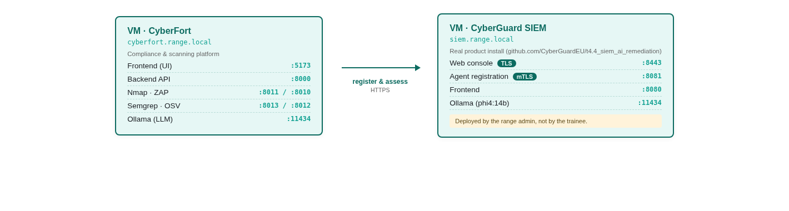
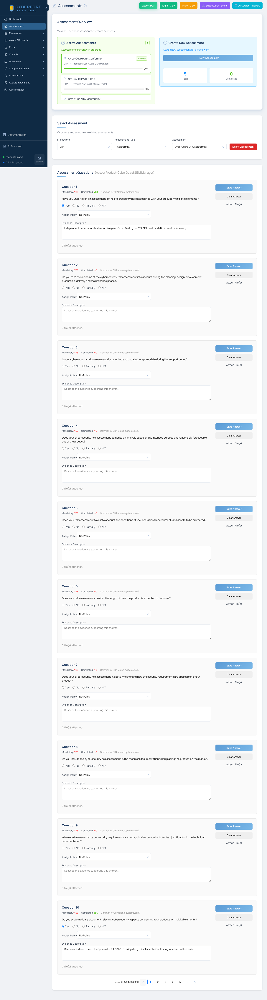

# Scenario 04 — CyberGuard SIEM Manager (Cybersecurity product)

## Instructor guide & answer key

This document is **not** for trainees. It contains the intended answers to the CRA questionnaire, evidence-to-question mapping, scoring rubric, and what a successful deliverable looks like.

> **Scenario shape:** unlike scenarios 1–3, this is **not** a vulnerable-target audit — the SIEM product is assumed to have passed engineering. The trainee's job is to run the **CRA conformity assessment** and produce the readiness pack. Most answers are **Compliant**, one is **Partially compliant** by design.

---

## 1. Scenario topology



Two VMs on the training subnet:

| Host | Role |
|------|------|
| `cyberfort.range.local` | CyberFort platform — the tool the trainee uses. |
| `siem.range.local` | Real CyberGuard SIEM installed by the range admin from [`github.com/CyberGuardEU/t4.4_siem_ai_remediation`](https://github.com/CyberGuardEU/t4.4_siem_ai_remediation). |

The SIEM VM must be running before the session — the trainee never touches its install. If the range admin needs to redeploy:

```bash
git clone https://github.com/CyberGuardEU/t4.4_siem_ai_remediation.git
cd t4.4_siem_ai_remediation
./setup-docker.sh              # 10–15 min, interactive
```

Verify reachability from the CyberFort VM:

```bash
curl -k -s -o /dev/null -w "HTTP %{http_code}\n" https://siem.range.local:8080/
curl -k -s https://siem.range.local:8443/api/version
```

---

## 2. Product classification and framework fit

CyberGuard SIEM Manager v1.0 is:

| Attribute | Value |
|-----------|-------|
| Sector | Cybersecurity software |
| Regulator | EU Cyber Resilience Act (Regulation (EU) 2024/2847) |
| CRA classification | **Annex III Class II** — important product with digital elements (network protection / IDS/IPS) |
| Conformity path | Internal audit + notified-body review of technical documentation (Annex VII Module B/C) |
| Support period | 60 months from release (Article 13(8)) |
| Vendor | CyberGuard Labs SME s.à r.l. (Cyprus, 24 employees) |

---

## 3. Evidence bundle — what each file is for

The evidence bundle at `evidence/` maps to specific CRA questions:

| Evidence file | Purpose | CRA questions it satisfies |
|---------------|---------|-----------------------------|
| `cyberguard-sbom.spdx.json` | SBOM in SPDX 2.3 | 38, 39 |
| `penetration-test-report.md` | Independent pen-test | 1, 13, 20, 21, 41 |
| `secure-development-lifecycle.md` | SDLC + patch policy | 10, 14, 16, 25 |
| `coordinated-vulnerability-disclosure-policy.md` | CVD / PSIRT policy | 43, 46 |

The four documents are deliberately **credible but fictional**. They are complete enough to defend against a notified-body's initial review; they would not withstand a real audit but serve their teaching purpose.

---

## 4. Answer key — the 16 target CRA questions

Verbatim question texts extracted from `frameworks_seed.py` (CRA conformity pool). Trainees should reach these answers:

| # | Question | Expected answer | Rationale |
|---|----------|-----------------|-----------|
| 1  | Risk assessment done? | Compliant | Pen-test report §Executive summary + threat model |
| 10 | Cybersecurity aspects documented? | Compliant | SDLC + release notes |
| 13 | No known exploitable vulns at ship? | Compliant | Pen-test: 0 critical, retested high/medium |
| 14 | Secure by default configuration? | Compliant | SDLC §2 secure-coding checklist |
| 16 | Vulns addressable via updates? | Compliant | SDLC §5 (7-day patch SLA) |
| 17 | Automatic updates enabled by default? | **Partially compliant** | The manager auto-updates; agents pull on check-in (may be air-gapped). Trainee should write the compensating-control paragraph, ideally invoking the AI assistant. |
| 20 | Unauthorized-access controls? | Compliant | Pen-test: RBAC + MFA, no high findings |
| 21 | Auth / IAM implemented? | Compliant | Same |
| 23 | Encryption in transit / rest? | Compliant | TLS 1.3 + mTLS |
| 25 | Integrity of data / config? | Compliant | Cosign-signed releases |
| 34 | Security-relevant info recording? | Compliant | The product is a SIEM — self-auditing |
| 38 | Vulns + components documented? | Compliant | SBOM + PSIRT tracker |
| 39 | SBOM in machine-readable format? | Compliant | SPDX 2.3 |
| 41 | Regular security tests? | Compliant | Quarterly pen-test + continuous fuzzing |
| 43 | Fixed-vuln descriptions published? | Compliant | CVD policy §Publication |
| 46 | Contact for reporting vulns? | Compliant | CVD policy — `security@cyberguard.example` |

**Only Q17 is `Partially compliant`.** Trainees who mark it Compliant without qualifying should be prompted to consider the air-gapped-agent case.

---

## 5. What a successful deliverable looks like

At the end of the scenario the CyberFort tenant should contain:

* One asset: `CyberGuard SIEM Manager 1.0.0` (Manufacturer, Annex III Class II, IP `siem.range.local`).
* One CRA Conformity assessment: `CyberGuard CRA Conformity` with 16 questions answered and evidence attached.
* A generated **CRA readiness PDF** exported from the Assessments toolbar.



---

## 6. Scoring rubric (100 pts)

| Activity | Points |
|----------|--------|
| SIEM console reachable and product identity confirmed | 5 |
| Asset registered with correct CRA classification (Annex III Class II) | 10 |
| CRA Conformity assessment created and scoped to the asset | 10 |
| All 16 target questions answered | 35 (~2 pts each) |
| Evidence attached to at least 12 of the 16 answers | 15 |
| AI assistant used on at least one question (ideally Q17) | 10 |
| Readiness PDF exported | 10 |
| Combined readiness pack (PDF + SBOM + policies + pen-test) assembled | 5 |

Pass threshold: 70.

---

## 7. Common trainee mistakes

| Mistake | Coach's response |
|---------|------------------|
| Marks Q17 as fully Compliant | Ask about air-gapped agents; steer toward Partially with a compensating-control note. |
| Answers all questions without attaching evidence | Fail — CRA notified-body review requires evidence, not just answers. |
| Registers CyberGuard as `Importer` or `Distributor` instead of `Manufacturer` | CyberGuard Labs is the manufacturer per the scenario brief. Wrong operator role = wrong CRA obligations. |
| Selects Framework `NIS2` instead of `CRA` | NIS2 is operator-side. This product is being placed on the EU market — CRA applies. |
| Tries to install the SIEM themselves | The SIEM VM is already provisioned by the range admin — the trainee only assesses it. |
| Scans the SIEM and files "no findings" as a risk | The scenario is not about exploitation. Scans are optional; a clean(ish) result is fine. |

---

## 8. Range-admin operations

| Task | Command / location |
|------|--------------------|
| Restart the SIEM after a lab session | `cd t4.4_siem_ai_remediation && docker compose restart` on `siem.range.local` |
| Full reset (drop DB, regenerate certs) | `./clear-db.sh && ./delete-certs.sh && ./setup-docker.sh` |
| Reset the CyberFort tenant | Delete the `CyberGuard SIEM Manager` asset and the `CyberGuard CRA Conformity` assessment via the platform UI |

The SIEM VM should stay powered across sessions — reprovisioning is 10–15 min.
