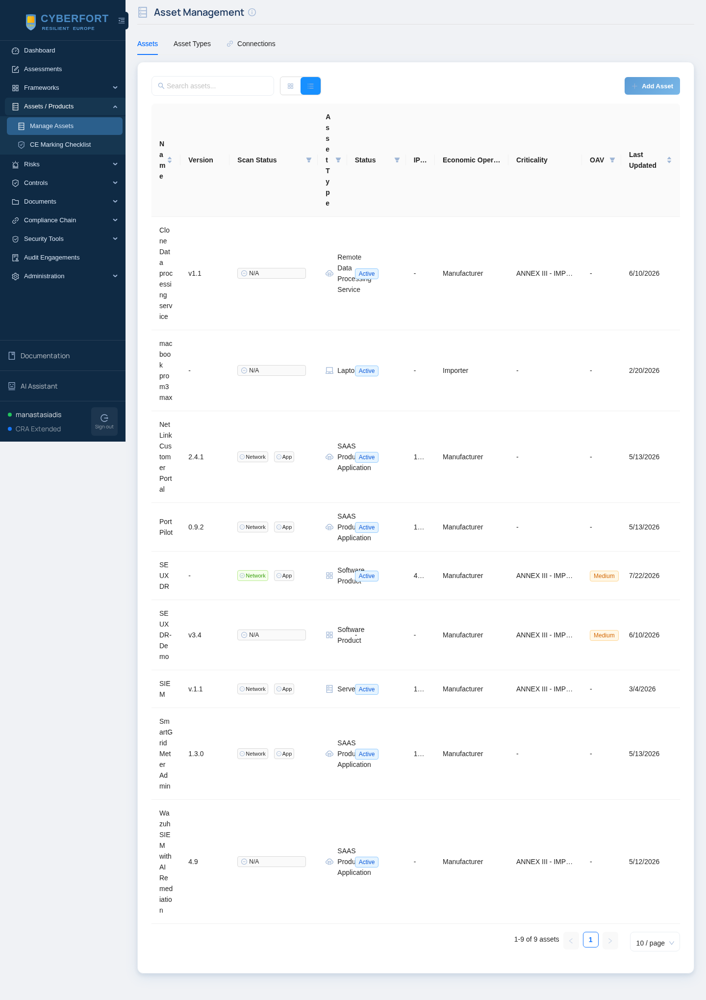
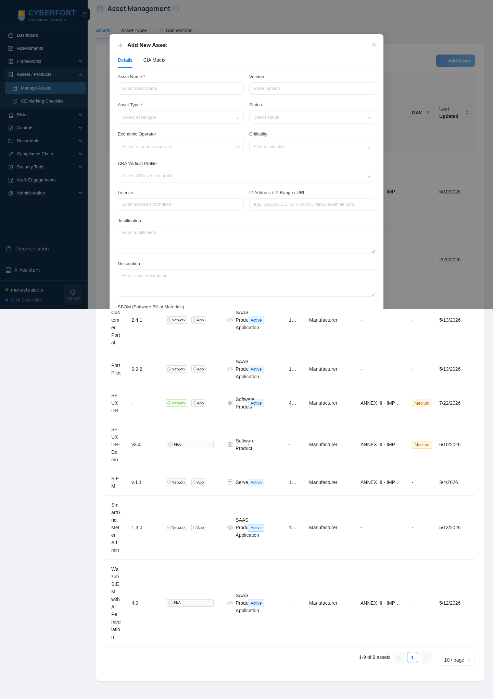
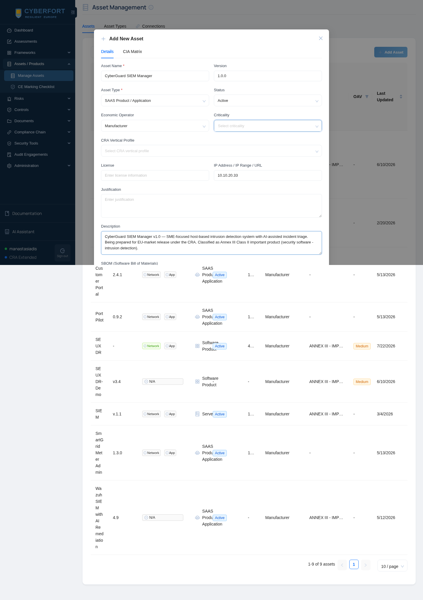
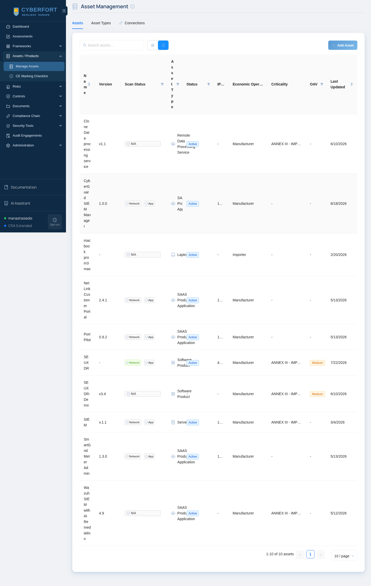
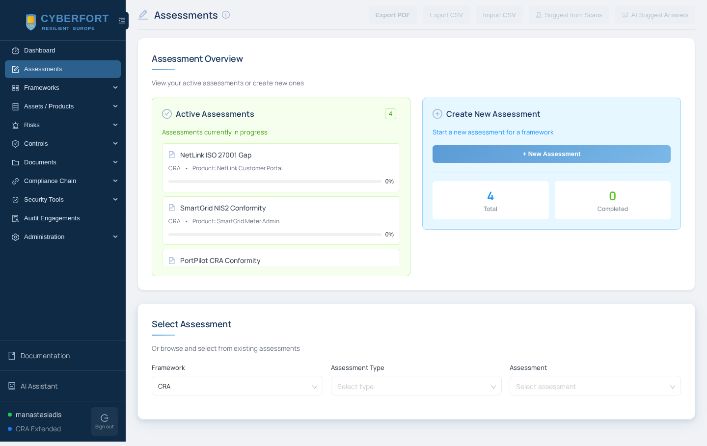
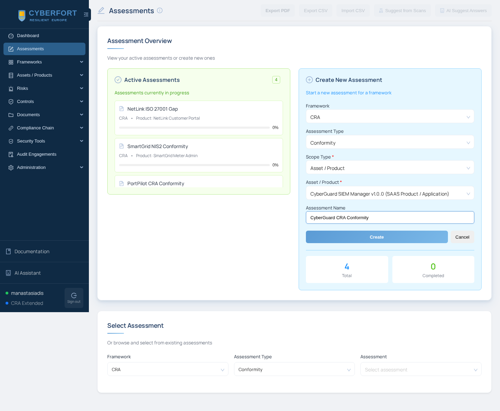
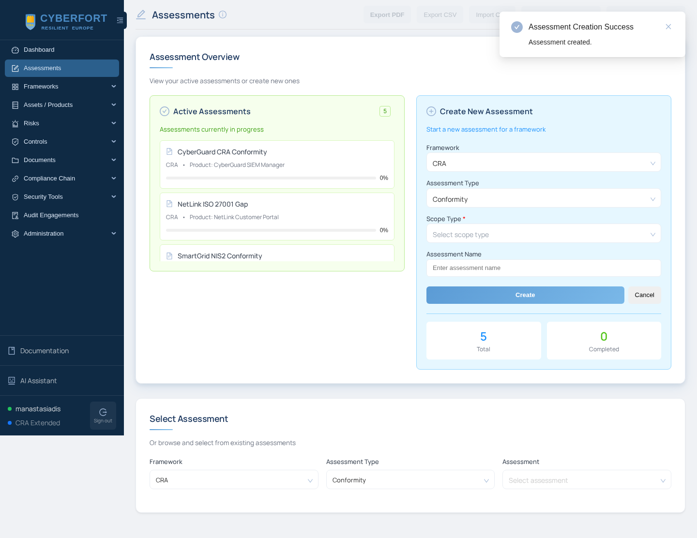
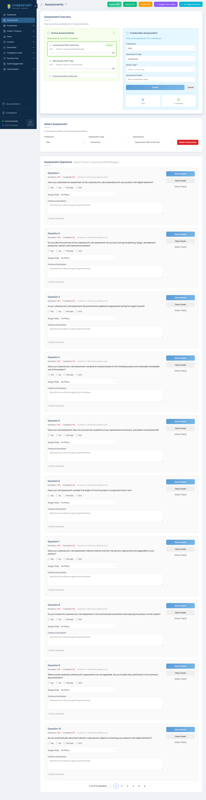
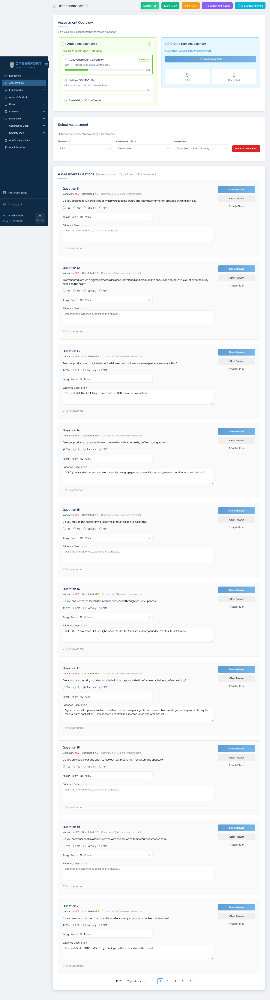

# Scenario 04 — CyberGuard SIEM Manager (Cybersecurity product)

## Trainee handbook

> ⏱ Estimated time: **60 minutes** &middot; 🎯 Level: **Introductory to intermediate** &middot; 🛡 Sector: **Cybersecurity products / SME vendor**

---

## Scenario brief

You are the compliance officer at **CyberGuard Labs SME s.à r.l.**, a small Cypriot cybersecurity vendor (24 employees). The company is finalising **CyberGuard SIEM Manager v1.0** — a host-based intrusion-detection system with AI-assisted incident triage — for release on the EU market in **Q3 2026**.

Because the product is a **security software** solution, it falls under the **Cyber Resilience Act (CRA)** as an **Annex III Class II "important product with digital elements"**. Before you can place it on the market you must:

* Draw up an EU Declaration of Conformity (CRA Article 28).
* Compile the technical documentation (CRA Annex V).
* Demonstrate that the essential cybersecurity requirements (CRA Annex I) are met.
* Have a vulnerability-handling process in place (CRA Annex I §2).

Your engineering team has already produced the required artefacts (SBOM, penetration-test report, secure-development lifecycle policy, coordinated-vulnerability-disclosure policy). Your job is to **use CyberFort to conduct the CRA conformity assessment** and produce the readiness pack.

You have:

* **CyberFort** running at `https://cyberfort.range.local:5173/` (or the hosted reference instance at `https://access.cyber-fort.eu/login`).
* **The real CyberGuard SIEM** — already installed by the range admin — running at `https://siem.range.local:8080/`. This is the product going through CRA conformity.
* An evidence bundle at `/srv/cyberfort-scenarios/04-cyberguard-siem-vendor/evidence/` on the CyberFort VM.


> ℹ️ **This scenario is not about finding vulnerabilities.** It is about learning how to conduct a CRA conformity assessment for a security product using CyberFort. All the engineering work has already been done; you are the auditor / compliance officer.

---

## Learning outcomes

1. Register a security product as an asset in CyberFort with the correct CRA classification.
2. Understand what the CRA requires of a **SIEM manufacturer** (as opposed to an operator).
3. Complete the **CRA conformity questionnaire** in CyberFort question-by-question.
4. Attach evidence (SBOM, test reports, CVD policy) to each answer.
5. Invoke the **AI assistant** to draft remediation for any partial-compliance answers.
6. Export the CRA readiness PDF and combine it with the risk register + policy pack.

---

## Step 0 — Confirm you can reach the product

Open the CyberGuard SIEM web console in a browser:

```
https://siem.range.local:8080/
```

You will be prompted to accept a self-signed certificate (the SIEM is running with a locally-issued cert). Accept it — this is the pre-market reference build.

Confirm the product identity from the CyberFort VM:

```bash
curl -k -s https://siem.range.local:8443/api/version
```

Note:

* **Product name:** `CyberGuard SIEM Manager`
* **Version:** `1.0.0`
* **Vendor:** `CyberGuard Labs SME s.à r.l.`

You will register **exactly these values** as the asset in CyberFort in Step 1.

Take a moment to review the CyberGuard capabilities in the console — endpoint agents, alert stream, active-response scripts, optional AI SOC-analyst triage. This is a **CRA Annex III Class II** product (security software — network protection / intrusion detection).

The evidence bundle lives at `/srv/cyberfort-scenarios/04-cyberguard-siem-vendor/evidence/`:

```text
evidence/
├── cyberguard-sbom.spdx.json                          ← SBOM in SPDX 2.3
├── penetration-test-report.md                         ← independent pen-test
├── coordinated-vulnerability-disclosure-policy.md     ← CVD policy
└── secure-development-lifecycle.md                    ← SDLC policy
```

You will attach these to the assessment answers as you go.

---

## Step 1 — Register CyberGuard as an asset in CyberFort

Sign in to CyberFort at `https://cyberfort.range.local:5173/` (or the hosted reference instance).

1. From the left sidebar, expand **Assets / Products** and click **Manage Assets**.

   

2. Click **+ Add Asset**. The *Details* tab of the modal opens.

   

3. Fill in:
   * **Asset Name:** `CyberGuard SIEM Manager`
   * **Version:** `1.0.0`
   * **Asset Type:** `SAAS Product / Application`
   * **Status:** `Active`
   * **Economic Operator:** `Manufacturer`
   * **Criticality:** `ANNEX III - IMPORTANT PRODUCTS WITH DIGITAL ELEMENTS - Class II` (or the closest available)
   * **IP Address / URL:** `siem.range.local` (the CyberGuard host)
   * **Description:** "CyberGuard SIEM Manager v1.0 — SME-focused host-based intrusion detection system with AI-assisted incident triage. Being prepared for EU-market release under the CRA."

   

4. Click **Save**. CyberGuard now appears in the asset list.

   

---

## Step 2 — Create a CRA Conformity assessment

1. In the sidebar click **Assessments**.

   

2. Click **+ New Assessment** and fill in:
   * **Framework:** `CRA`
   * **Assessment Type:** `Conformity`  *(the product-level assessment, not the org-level Audit)*
   * **Scope Type:** `Asset / Product`
   * **Asset / Product:** `CyberGuard SIEM Manager`
   * **Assessment Name:** `CyberGuard CRA Conformity`

   

3. Click **Create**. CyberFort confirms with an *Assessment Creation Success* toast.

   

---

## Step 3 — Answer the CRA questions with evidence

1. Under **Active Assessments**, click the **CyberGuard CRA Conformity** card. The 52-question conformity questionnaire opens, paginated 10-per-page.

   

2. For each question below, select the answer, write a one-line **Evidence Description**, and attach the file from `evidence/`. The question texts are **verbatim** from the CyberFort CRA seed.

| # | CRA question (verbatim from the CyberFort questionnaire) | Answer | Evidence to attach |
|---|-----------------------------------------------------------|--------|---------------------|
| 1  | *"Have you undertaken an assessment of the cybersecurity risks associated with your product with digital elements?"* | Compliant | `penetration-test-report.md` (executive summary + STRIDE-based threat model) |
| 10 | *"Do you systematically document relevant cybersecurity aspects concerning your products with digital elements?"* | Compliant | `secure-development-lifecycle.md` |
| 13 | *"Are your products with digital elements delivered without any known exploitable vulnerabilities?"* | Compliant | `penetration-test-report.md` (findings summary — 0 critical, retest evidence for high/medium) |
| 14 | *"Are your products made available on the market with a secure by default configuration?"* | Compliant | `secure-development-lifecycle.md` §2 (mandatory secure-coding checklist) |
| 16 | *"Do you ensure that vulnerabilities can be addressed through security updates?"* | Compliant | `secure-development-lifecycle.md` §5 (7-day patch SLA for High/Critical) |
| 17 | *"Are automatic security updates installed within an appropriate timeframe enabled as a default setting?"* | Partially compliant | Signed automatic updates for the manager; agents pull on next check-in. Note in evidence field. |
| 20 | *"Do you ensure protection from unauthorized access by appropriate control mechanisms?"* | Compliant | `penetration-test-report.md` (auth section — RBAC + MFA, no High findings) |
| 21 | *"Do you implement authentication, identity or access management systems?"* | Compliant | Same reference |
| 23 | *"Do you protect the confidentiality of stored, transmitted or otherwise processed data through encryption?"* | Compliant | `secure-development-lifecycle.md` — TLS 1.3 on all channels, mTLS for agent registration |
| 25 | *"Do you protect the integrity of stored, transmitted or otherwise processed data, commands, programs and configuration?"* | Compliant | Signed release artefacts (Sigstore/cosign — see SDLC §4) |
| 34 | *"Do you provide security-related information by recording and monitoring relevant internal activity?"* | Compliant | The product **is** a SIEM — it audits itself. Reference: audit-log design in SDLC. |
| 38 | *"Do you identify and document vulnerabilities and components contained in your products with digital elements?"* | Compliant | `cyberguard-sbom.spdx.json` |
| 39 | *"Do you draw up a software bill of materials in a commonly used and machine-readable format?"* | Compliant | `cyberguard-sbom.spdx.json` (SPDX 2.3, machine-readable) |
| 41 | *"Do you apply effective and regular tests and reviews of the security of your products with digital elements?"* | Compliant | `penetration-test-report.md` (independent quarterly pen-test) |
| 43 | *"Do you provide a description of vulnerabilities, affected products, impacts, severity and remediation information?"* | Compliant | `coordinated-vulnerability-disclosure-policy.md` — "Publication" section |
| 46 | *"Do you provide a contact address for reporting vulnerabilities discovered in your products?"* | Compliant | CVD policy — `security@cyberguard.example` and web form |

3. On each question:
   * Click the **Compliant / Not compliant / Partially / N/A** radio.
   * Fill the **Evidence Description** with a one-line pointer to the file.
   * Click **Attach File(s)** and upload the file from `evidence/`.
   * Click **Save Answer**.

   

4. Scroll down and continue. Some questions live on later pages of the questionnaire:

   

> 💡 **Use the AI assistant** on Question 17 (automatic updates — Partially compliant). Ask it: *"Draft a paragraph explaining why partial automatic-update compliance is acceptable for a SIEM whose agents may be air-gapped, and what compensating controls we have."* The result goes straight into the Evidence Description.

---

## Step 4 — Export the CRA readiness PDF

1. Stay on the **Assessments** page with `CyberGuard CRA Conformity` selected.
2. Click **Export PDF** in the top toolbar. The PDF includes:
   * Every answered question with your Compliant / Partially / etc. verdict.
   * The Evidence Description for each answer.
   * A link to each attached evidence file.
3. Click **Export CSV** as well (useful for the notified-body reviewer's working spreadsheet).

Combine the PDF with:

* The **SBOM** (`cyberguard-sbom.spdx.json`).
* The **CVD policy** (`coordinated-vulnerability-disclosure-policy.md`).
* The **SDLC policy** (`secure-development-lifecycle.md`).
* The **penetration-test report** (`penetration-test-report.md`).

That combined pack is the **CRA conformity technical documentation** you would submit to the notified body (for Class II products, an internal audit + notified-body review of the technical documentation is required per CRA Annex VII, Module B/C).

---

## Step 5 — Optional: run the CyberFort scanners against the SIEM

If you want to demonstrate the platform's scanners for yourself, point them at `siem.range.local`:

* **Security Tools → Security Scanners → Network Vulnerability tab** — Nmap against `siem.range.local`. Expect to see `:8080` (frontend), `:8443` (API), `:8081` (mTLS agent registration), and `:11434` (Ollama) open.
* **Security Tools → Security Scanners → Application Vulnerability tab** — ZAP against `https://siem.range.local:8080/`.
* **Security Tools → Code Analysis** — upload the CyberGuard source tarball (`git clone` on the SIEM VM, then `tar czf`); Semgrep will flag the "stripped auth" cases the vendor documents openly.
* **Security Tools → Dependency Check** — upload `go.mod` from the SIEM source; OSV against Go modules.

These scans are **not required** to close the CRA assessment (which is evidence-based), but they are a good sanity check that reinforces what the pen-test report already covers.

---

## Step 6 — Stretch goals

* Use the **Policy** module in CyberFort to import each of the four evidence files as a policy artefact linked to the corresponding CRA objective under **Frameworks → CRA → Annex I → Objectives**.
* File the notified-body review as an **Audit Engagement** in CyberFort.
* Draft the **EU Declaration of Conformity** using CyberFort's template under **Documents → EU Declaration of Conformity**.

---

## Checklist

* [ ] Confirmed reachability of `https://siem.range.local:8080/`
* [ ] CyberGuard SIEM Manager v1.0 registered as an asset (Annex III Class II)
* [ ] CyberGuard CRA Conformity assessment created and opened
* [ ] All 16 target questions answered with evidence attached
* [ ] AI assistant used on at least one question
* [ ] Readiness PDF exported
* [ ] Combined readiness pack produced (PDF + SBOM + policies + pen-test)
